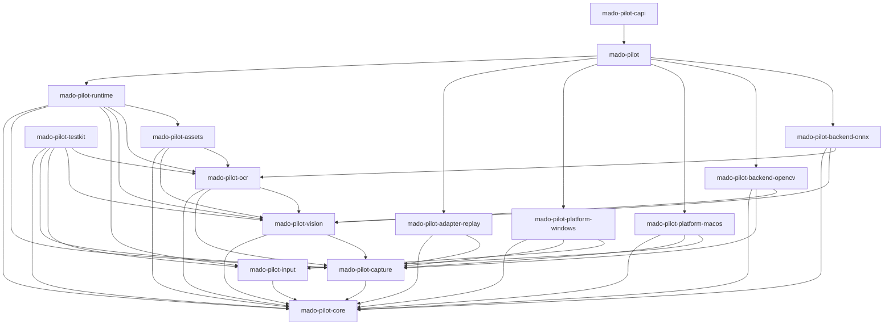

# MadoPilot architecture baseline

This document is the tracked architecture baseline for MadoPilot. It records the
repository structure, package responsibilities, dependency rules, public naming
reservations, release targets, licensing, verification baseline, and current
implementation status.

It is deliberately a repository baseline rather than a product specification.
Detailed frame, capture, OCR, input, runtime scheduling, callback, platform
behavior, and C ABI contracts are added here by the changes that implement and
test them, so that this document never describes behavior a reader cannot use.

**Status: Phase 1 complete — the first vertical slice ships end to end.** The
platform-neutral core contracts, the capture contracts with the deterministic
replay adapter, asset package loading, template matching through the OpenCV CPU
backend, runtime orchestration, the Rust facade, the C ABI frozen at 1.0, and the
header-only C++ wrapper are implemented and verified natively on both release
targets. Native window and display capture, OCR, input injection, watchers,
scheduling, diagnostics, and release packaging do not exist. See
[Implementation status](#implementation-status).

## Product definition

MadoPilot is a headless visual automation runtime for applications and agents.
When implemented, it discovers windows and displays, captures frame streams, maps
coordinate spaces, performs template matching and OCR, waits for visual
conditions, injects input through explicit platform capabilities, and reports
structured diagnostics.

MadoPilot does not own a GUI, tray, editor, overlay, updater, workflow catalog,
time-based scheduler, or general scripting DSL.

## Release targets

Version one targets two platforms, and each is verified natively:

| Release target | Native verification host |
|---|---|
| `x86_64-pc-windows-msvc` | `windows-2025` |
| `aarch64-apple-darwin` | `macos-15` |

A cross-compiled result never stands in for native verification of the other
target. The exact minimum supported Windows and macOS versions are unresolved; see
gate [`G-001`](validation-gates.md#g-001).

### Platform baseline

Each release target has its own adapter package with a distinct planned
responsibility and its own unresolved decisions. Neither adapter is implemented, so
what follows is the boundary each one will own — not a capability statement.

| | Windows | macOS |
|---|---|---|
| Adapter package | `mado-pilot-platform-windows` | `mado-pilot-platform-macos` |
| Planned capture ownership | Windows Graphics Capture streams and Direct3D 11 resource lifetime | ScreenCaptureKit streams and native frame lifetime |
| Planned input ownership | Explicit system and background delivery implementations | `CGEvent` input |
| Planned permission handling | Integrity and UIPI constraints reported as observable state or typed failures | Screen Recording and Accessibility probed and reported separately, without presenting permission UI |
| Native verification host | `windows-2025` | `macos-15` |
| Open gates | [`G-001`](validation-gates.md#g-001), [`G-002`](validation-gates.md#g-002) | [`G-001`](validation-gates.md#g-001), [`G-003`](validation-gates.md#g-003) |

The detailed capability set, permission outcome tables, coordinate transforms,
native resource ownership rules, and unsupported-system behavior for each platform
are added by the changes that implement and test them. Phase 0 verifies only that
the workspace builds and tests natively on each host.

## Integration surfaces

Three public surfaces are planned, in this dependency order:

1. An idiomatic Rust API through the `mado-pilot` facade package.
2. A separately versioned C ABI with opaque handles and explicit ownership.
3. A thin C++ RAII wrapper that consumes only the released C ABI.

The C++ wrapper is not a Cargo package. It links through the released C ABI, never
through Rust internals.

All three exist and Phase 1 is complete. [c-abi.md](c-abi.md) is the C boundary's
own contract document: handle lifetimes, structure-prefix rules, the status
vocabulary, panic containment, the build prerequisites on each release target,
and how the hand-written header is verified against the Rust definitions.
Semantic numeric values and frozen version/report fields use fixed-width C
integer types: structure sizes and reported table sizes are `uint32_t`, while row
strides and semantic result/package counts are `uint64_t`. `size_t` is limited to
ABI-native addressability quantities: pointer-view lengths, replay input counts
and element strides, target-list counts, accessor indexes, and the caller-known
table extent passed to negotiation. Those choices are frozen for ABI 1.0 on the
two 64-bit release targets.
[cpp-wrapper.md](cpp-wrapper.md) is the C++ adapter's: move-only owners,
explicit `clone` and `close`, the exception-free `Result`, borrowed views and
their owners, and the CMake targets.

The C++ wrapper is header-only and produces no artifact of its own, so the C ABI
remains the only ABI the project has; see
[ADR 0005](adr/0005-cpp-wrapper-shape-and-cmake-surface.md).

## Workspace layout

The repository root is a virtual Cargo workspace with `resolver = "3"` and
explicitly enumerated members. The root is not a product package.

```text
mado-pilot/
├── Cargo.toml                  # virtual workspace manifest
├── Cargo.lock                  # the single committed lockfile
├── rust-toolchain.toml         # pinned toolchain
├── rustfmt.toml                # formatting policy
├── deny.toml                   # dependency policy
├── crates/
│   ├── mado-pilot/             # public Rust facade
│   ├── automation/             # platform-neutral contracts and orchestration
│   │   ├── core/
│   │   ├── capture/
│   │   ├── input/
│   │   ├── vision/
│   │   ├── ocr/
│   │   ├── runtime/
│   │   └── assets/
│   ├── adapter/                # platform-neutral capture and input adapters
│   │   └── replay/
│   ├── platform/               # platform capture and input adapters
│   │   ├── windows/
│   │   └── macos/
│   ├── backend/                # vision and OCR backend adapters
│   │   ├── opencv/
│   │   └── onnx/
│   ├── bindings/
│   │   └── capi/
│   │       ├── CMakeLists.txt  # the MadoPilot::C and MadoPilot::Cpp targets
│   │       ├── include/        # the tracked C header and C++ wrapper
│   │       ├── examples/c/     # the C example
│   │       ├── examples/cpp/   # the C++ example
│   │       ├── tests/c/        # the C ABI layout probe
│   │       ├── tests/cpp/      # the C++ ownership probe
│   │       ├── tests/cmake/    # the CMake consumer project
│   │       └── tests/abi-compat/ # one frozen header per released ABI major
│   └── support/
│       └── testkit/
├── docs/
│   ├── architecture.md
│   ├── c-abi.md
│   ├── cpp-wrapper.md
│   ├── validation-gates.md
│   ├── performance.md
│   ├── third-party-dependencies.md
│   ├── adr/
│   ├── benchmarks/
│   └── evidence/               # measurements a resolved gate rests on
├── fixtures/                   # tracked test and evidence data
└── tools/
    └── dependency-check/       # named maintenance tool
```

Members are enumerated rather than matched by wildcard so that adding a package is
visible in review. Modules are organized by responsibility: a new module must state
what it binds, supports, automates, or adapts. There is no `utils` layer, and
"utility" is not an accepted responsibility.

`tools/` holds named executable maintenance programs only. It must never become a
library dependency or a home for miscellaneous code.

`fixtures/` holds test and evidence data that outlives the change that created
it, grouped by the subject it exercises. Data belongs here rather than beside one
package when more than one consumer needs it — a contract suite, an example, a
benchmark, and a gate's evidence can all refer to the same bytes. Every fixture
group records its provenance and license and pins its contents with a checksum
file, because a fixture that changes silently invalidates whatever was measured
against it. `docs/evidence/` holds the measurements themselves, so a number and
the data behind it are never separated.

## Package inventory and responsibilities

The workspace contains exactly fifteen product packages and one maintenance
package. Directory names are concise; Cargo package names carry the product
prefix.

| Path | Cargo package | Planned responsibility |
|---|---|---|
| `crates/mado-pilot` | `mado-pilot` | Public Rust facade, builders, default wiring, and curated re-exports |
| `crates/automation/core` | `mado-pilot-core` | Platform-neutral identities, geometry, time, capabilities, errors, and status types |
| `crates/automation/capture` | `mado-pilot-capture` | Capture, frame, mapping, and stream-policy contracts |
| `crates/automation/input` | `mado-pilot-input` | Input operation, delivery-mode, focus, receipt, and error contracts |
| `crates/automation/vision` | `mado-pilot-vision` | Template source, preprocessing, matching request, and result contracts |
| `crates/automation/ocr` | `mado-pilot-ocr` | OCR source, model, request, result, and text-normalization contracts |
| `crates/automation/runtime` | `mado-pilot-runtime` | Session, scheduling, watcher, cancellation, coalescing, and diagnostic orchestration |
| `crates/automation/assets` | `mado-pilot-assets` | Versioned manifest, validation, deterministic loading, and source-resolution contracts |
| `crates/adapter/replay` | `mado-pilot-adapter-replay` | Deterministic replay capture from file and memory sources |
| `crates/platform/windows` | `mado-pilot-platform-windows` | Planned Windows target, capture, input, permission, and capability adapter |
| `crates/platform/macos` | `mado-pilot-platform-macos` | Planned macOS target, capture, input, permission, and capability adapter |
| `crates/backend/opencv` | `mado-pilot-backend-opencv` | OpenCV CPU template matching |
| `crates/backend/onnx` | `mado-pilot-backend-onnx` | Planned ONNX Runtime OCR and execution-provider adapter |
| `crates/bindings/capi` | `mado-pilot-capi` | Separately versioned C ABI and ownership boundary, and the header-only C++ wrapper and CMake targets over it |
| `crates/support/testkit` | `mado-pilot-testkit` | Controlled capture and backend doubles, fake input, synthetic clock, and contract-fixture support |
| `tools/dependency-check` | `mado-pilot-dependency-check` | Repository maintenance: workspace inventory and dependency-direction checking |

Every package in this table is `publish = false`. Publication is enabled for an
individual package only by a change that implements, tests, and intends the
public stability of that package.

### Deferred packages

The following adapters are reserved conceptually and must not exist, not even as
an empty directory, because an empty reserved directory reads as a promised
adapter:

- `crates/platform/adb` — ADB capture and touch input
- `crates/platform/browser` — browser and CDP targets
- `crates/backend/apple-vision` — Apple Vision OCR

An adapter is added only when it has an owner, an implemented contract, tests, and
an explicit support statement. The architecture checker fails when one of these
packages or directories appears.

## Dependency rules

The workspace follows ports-and-adapters: contract packages define what an adapter
must provide, adapters implement those contracts, and only the facade names a
concrete adapter.



### The graph is an allowlist

The diagram above is not predeclared coupling. Phase 0 adds no path dependency at
all, because an unused dependency is shallow coupling that hides which packages
actually need each other. The rule is a subset rule: an actual dependency edge must
appear in this table, and an omitted future edge is always valid.

| Source package | Allowed MadoPilot dependencies |
|---|---|
| `mado-pilot-core` | none |
| `mado-pilot-capture` | `mado-pilot-core` |
| `mado-pilot-input` | `mado-pilot-core` |
| `mado-pilot-vision` | `mado-pilot-core`, `mado-pilot-capture` |
| `mado-pilot-ocr` | `mado-pilot-core`, `mado-pilot-capture`, `mado-pilot-vision` |
| `mado-pilot-assets` | `mado-pilot-core`, `mado-pilot-vision`, `mado-pilot-ocr` |
| `mado-pilot-runtime` | `mado-pilot-core`, `mado-pilot-capture`, `mado-pilot-input`, `mado-pilot-vision`, `mado-pilot-ocr`, `mado-pilot-assets` |
| `mado-pilot-adapter-replay` | `mado-pilot-core`, `mado-pilot-capture` |
| `mado-pilot-platform-windows` | `mado-pilot-core`, `mado-pilot-capture`, `mado-pilot-input` |
| `mado-pilot-platform-macos` | `mado-pilot-core`, `mado-pilot-capture`, `mado-pilot-input` |
| `mado-pilot-backend-opencv` | `mado-pilot-core`, `mado-pilot-capture`, `mado-pilot-vision` |
| `mado-pilot-backend-onnx` | `mado-pilot-core`, `mado-pilot-vision`, `mado-pilot-ocr` |
| `mado-pilot` | `mado-pilot-runtime`, `mado-pilot-adapter-replay`, `mado-pilot-platform-windows`, `mado-pilot-platform-macos`, `mado-pilot-backend-opencv`, `mado-pilot-backend-onnx` |
| `mado-pilot-capi` | `mado-pilot` |
| `mado-pilot-testkit` | `mado-pilot-core`, `mado-pilot-capture`, `mado-pilot-input`, `mado-pilot-vision`, `mado-pilot-ocr` |
| `mado-pilot-dependency-check` | none |

The rules the table encodes:

1. `mado-pilot-core` depends on no other MadoPilot package, and on no platform,
   backend, GUI, or async-executor crate. Platform-native handles are never added
   to it. The checker enforces the MadoPilot half of this rule; the external-crate
   half is a review rule, applied through
   [third-party-dependencies.md](third-party-dependencies.md) and `cargo deny` by
   the change that adds each dependency.
2. Contract packages do not depend on adapter packages.
3. `mado-pilot-runtime` orchestrates contracts and knows no concrete adapter type.
4. Adapter and platform packages implement the capture and input contracts only.
   `crates/adapter` holds adapters that are platform-neutral — the same source
   behaves identically on both release targets — while `crates/platform` holds
   the ones whose behavior is the operating system's.
5. Backend packages implement the vision or OCR contracts only.
6. Only `mado-pilot` names a concrete adapter, because default wiring is its
   responsibility.
7. `mado-pilot-capi` depends on `mado-pilot`, never the reverse.
8. C++ wrapper code consumes only the released C header and library. It is not a
   Cargo package and the dependency checker does not see it; the rule is enforced
   by the wrapper having nothing else to include and by the CMake consumer test
   linking `MadoPilot::Cpp` alone.

The facade's row lists no contract package. That is deliberate — default wiring is
the facade's only job — but it means every core, capture, input, vision, OCR, or
asset type the public Rust API exposes must reach callers through
`mado-pilot-runtime`'s re-exports. Phase 1 meets this: every contract type the
facade exposes is re-exported from runtime, and the facade's own dependency row
adds only `mado-pilot-adapter-replay` and `mado-pilot-backend-opencv`. Widening
that row is a normative change and needs an ADR, not a quiet allowlist edit.

Vision and OCR depend on the capture contract because their public operations
consume capture-owned frame views. That is a contract-to-contract dependency and
exposes no adapter type. The asset package may depend on both vision and OCR to
resolve validated manifest entries into source descriptors; vision and OCR never
depend on asset representations, so a caller may supply direct file or memory
sources without adopting the asset manifest.

### Test support and maintenance tooling

`mado-pilot-testkit` exists so that every adapter can be exercised against
contract doubles. Any product package may therefore depend on it as a
**development** dependency, and no package may depend on it as a normal or build
dependency: test support must never ship.

No package may depend on `mado-pilot-dependency-check` in any form. Repository
tooling is invoked, not linked.

### Enforcement

`tools/dependency-check` reads `cargo metadata` and the tracked manifests,
normalizes the package graph, and fails with the offending package names, paths, and
edges. The rules live in pure modules with synthetic tests, separately from the
Cargo process adapter, so every allowed adjacency group, every forbidden direction,
and every metadata rule is covered deterministically without running Cargo. The
adapter's own policies — path resolution, dependency source, `publish` decoding, and
reserved directories — are covered against synthetic Cargo output over temporary
directories.

It verifies:

- the package inventory — every required package present, at its documented
  directory, with no unrecognized and no deferred package;
- that no reserved adapter directory exists, including as a dangling symlink;
- the dependency allowlist above, for normal, build, and development edges;
- that a dependency claiming a member's name resolves to that member by path,
  rather than to a same-named or renamed crate from a registry or Git source. Cargo
  reports a `package = "..."` rename's real package separately from its
  manifest-visible alias, and both are checked, because the alias is what Rust
  source imports;
- that every path dependency resolves to a workspace member;
- that every member is non-publishable;
- the shared metadata contract recorded under [Toolchain and
  resolution](#toolchain-and-resolution);
- that every member opts into the workspace lint policy with
  `[lints] workspace = true`, since a missing opt-in silently disables the lints
  for that package and `-D warnings` cannot recover them. Only the root `[lints]`
  table counts: the same text written inside `[package]` sets an unrelated key and
  leaves the lints disabled.

```sh
cargo run --locked --package mado-pilot-dependency-check
```

Changing a dependency direction means changing the allowlist, its tests, and this
document together, with an architecture decision record.

## Toolchain and resolution

| Decision | Value |
|---|---|
| Cargo resolver | `3` |
| Rust edition | `2024` |
| Pinned toolchain and minimum supported Rust version | `1.97.1` |
| Package version | `0.1.0` |
| Package license | `Apache-2.0` |
| Repository | `https://github.com/pashifika/mado-pilot` |

`rust-toolchain.toml` pins the compiler with `rustfmt` and `clippy`, so a clean
checkout selects the tested toolchain. The pin is also the minimum supported Rust
version: it is a tested claim rather than an assumed one. It may be lowered later
only with CI evidence on both release targets against the dependency set that
exists at that time, recorded in an ADR. The architecture checker rejects a pin that
disagrees with `[workspace.package] rust-version`, so the two cannot drift apart.

Shared package fields are declared in `[workspace.package]` and explicitly
inherited by every member, which the architecture checker verifies against the
values in the table above. Lints are declared in `[workspace.lints]` and inherited
with `[lints] workspace = true` in every member.

The workspace keeps one committed lockfile at the repository root. No member has
its own lockfile, and verification runs with `--locked` so that a check fails
rather than silently changing resolution.

### Shared metadata contract

The architecture checker validates shared metadata in three layers, so that neither
one member nor the workspace as a whole can drift unnoticed:

1. The root `[workspace.package]` values are anchored to the contract values in the
   table above, and `rust-toolchain.toml` must pin the same Rust version. Checking
   members against each other is not enough on its own: every member can agree on a
   value that no longer matches the contract.
2. Every member's resolved `version`, `edition`, `rust-version`, `license`, and
   `repository` must equal the root declaration, so a member cannot override an
   inherited field. Because the root values must be present and non-empty, a
   workspace that drops `rust-version` or `repository` everywhere fails rather than
   agreeing on nothing.
3. Every member must inherit those five fields explicitly with
   `<field>.workspace = true`. Cargo reports resolved values, so only the manifest
   text distinguishes inheritance from a hard-coded literal that happens to agree
   today. `publish` is excluded from this layer: the requirement is that every member
   is non-publishable, which Cargo's resolved value already answers, so a member may
   state `publish = false` directly or inherit it from `[workspace.package]`.

Changing the version, the minimum supported Rust version, the license, or the
repository is therefore an intentional, visible edit: the root manifest, the
`REQUIRED_*` constants in `tools/dependency-check`, `rust-toolchain.toml` where
applicable, and this document move together in the same reviewed change.

## Lints and formatting

Formatting is standard stable `rustfmt` behavior with the edition, matching style
edition, and a Unix line ending configured, so results are identical on Windows and
macOS hosts.

Lints deny missing crate-level documentation and broken intra-doc links, and warn
on missing item documentation, missing `Debug` implementations, and unnecessary
qualifications. Verification promotes warnings to failures.

Unsafe code is permitted where a seam requires it, and is not globally forbidden.
The workspace denies unsafe operations outside an explicit `unsafe` block, and
warns on undocumented unsafe blocks: platform adapters and the C ABI will need
narrowly scoped unsafe code, and the correct response is to document and test the
safety contract at that seam rather than to weaken a workspace-wide rule later. A
platform-neutral package may adopt a stricter per-package unsafe policy in the
change that adds its first implementation.

The Clippy selection is narrow and each entry has a repository-specific reason —
FFI integer conversions, FFI ownership transfer, unsafe documentation, and the
absence of placeholder behavior. The pedantic and restriction groups are not
enabled wholesale.

## Verification baseline

[../CONTRIBUTING.md](../CONTRIBUTING.md) records the local verification sequence:
architecture check, formatting, lints with warnings denied, locked tests,
documentation with rustdoc warnings denied, and dependency policy.

Continuous integration separates fast repository policy from native target
verification, and reports three stable check names:

| Check | Host | Scope |
|---|---|---|
| `Repository policy` | `ubuntu-latest` | Package inventory, dependency directions, formatting, documentation, dependency policy |
| `Windows x86_64-pc-windows-msvc` | `windows-2025` | Native inventory, lint, test, and documentation checks |
| `macOS aarch64-apple-darwin` | `macos-15` | Native inventory, lint, test, and documentation checks |

Each job prints `rustc -vV` and the resolved package inventory, so the tested
environment and any accidental workspace member are observable in the log. Each
native job asserts its own host triple and fails rather than reporting a
cross-compiled result as native verification.

The native jobs name an operating-system version rather than a `-latest` label, so
moving to a new OS version is a reviewed change. A label pins only that version;
GitHub migrates the image behind it on its own schedule, so the label does not
freeze the image contents. The repository-policy job uses the moving
`ubuntu-latest` on purpose, because it verifies host-independent policy rather than
a release target. The pinned toolchain, not the runner label, is what makes compiler
results reproducible.

Workflows use GitHub-maintained actions pinned to a commit revision, and install
Rust with the `rustup` already present on hosted runners rather than adding a
third-party setup action.

## Licensing and third-party dependencies

The project and every Cargo package declare Apache-2.0, matching the root
`LICENSE` file.

[third-party-dependencies.md](third-party-dependencies.md) is the dependency
policy: approved licenses, approved sources, advisory handling, duplicate-version
review, the documented-exception process, and the review a native library or model
file requires before it is added or bundled. `deny.toml` is its machine-checked
form, and `cargo deny --locked check` enforces it.

Phase 0 has no product dependency. The policy and its configuration are committed
anyway, so the first dependency arrives into an enforced policy rather than
prompting one.

## Public naming baseline

These names are reserved so that the Rust, C, C++, Windows, macOS, CMake, and
pkg-config surfaces stay consistent. **They are reservations. Phase 0 produces
none of these headers, libraries, targets, or wrappers.**

| Artifact | Name |
|---|---|
| GitHub repository | `mado-pilot` |
| Rust facade package | `mado-pilot` |
| Rust import | `mado_pilot` |
| C header | `include/madopilot/madopilot.h` |
| C++ header | `include/madopilot/madopilot.hpp` |
| C symbol prefix | `madopilot_` |
| C++ namespace | `madopilot` |
| Windows ABI-major DLL | `madopilot-1.dll` |
| Windows import library | `madopilot-1.lib` |
| macOS ABI-major install name | `libmadopilot.1.dylib` |
| CMake package | `MadoPilot` |
| CMake C target | `MadoPilot::C` |
| CMake C++ wrapper target | `MadoPilot::Cpp` |
| pkg-config package | `madopilot-1` |

The loader names carry the ABI major version so that an incompatible ABI is a
different library rather than a silent breakage.

The public Rust item names were reviewed and settled under gate
[`G-009`](validation-gates.md#g-009) by
[ADR 0006](adr/0006-public-rust-names-and-compatibility-policy.md); they are the
`0.x` baseline rather than a stability promise, which begins at 1.0. The C
status codes, function-table prefix, and structure layouts are frozen at ABI 1.0
under gate [`G-010`](validation-gates.md#g-010) by
[ADR 0007](adr/0007-phase-1-c-abi-freeze.md), and are versioned separately from
the Rust names.

`mado-pilot-capi` now builds as a `cdylib` and exports `madopilot_get_api`, and
`include/madopilot/madopilot.h` exists as a tracked, hand-written header verified
against the Rust definitions by a cross-language layout probe; see
[ADR 0004](adr/0004-c-header-authorship-and-abi-verification.md) and
[c-abi.md](c-abi.md).

`include/madopilot/madopilot.hpp`, the namespace `madopilot`, and the CMake
targets `MadoPilot::C` and `MadoPilot::Cpp` now exist as well. The wrapper is
header-only, so `MadoPilot::Cpp` is an `INTERFACE` target and produces no
artifact; see [ADR 0005](adr/0005-cpp-wrapper-shape-and-cmake-surface.md) and
[cpp-wrapper.md](cpp-wrapper.md).

Three reservations above are still not produced. The `staticlib` kind is withheld
because [`G-008`](validation-gates.md#g-008) has not recorded which static
dependency combinations are supported; the ABI-major decorated loader names are
applied by release packaging, which Phase 1 does not implement, so what is built
today is the undecorated development artifact; and no pkg-config file is
generated, for the same packaging reason. The CMake project likewise has no
install or export set, so consumption is from the development tree with
`add_subdirectory` rather than with `find_package`.

## Version-one scope

Version one implements, in later phases:

- window and display discovery, and capability reporting;
- stream-first capture with immutable frames and explicit coordinate mapping;
- template matching and OCR with source-frame correlation;
- waiting for visual conditions through watchers with bounded, observable queues;
- input injection through explicit platform capabilities, with the operation kind
  and the delivery mechanism kept as separate axes;
- versioned asset manifests with deterministic, network-free, validated loading;
- structured diagnostics that exclude captured images and recognized text by
  default;
- the Rust facade, the separately versioned C ABI, and the C++ wrapper over it.

### Non-goals

Version one does not include a GUI, tray, editor, overlay, updater, workflow
catalog, time-based scheduler, or general scripting DSL. It does not add implicit
network access, automatic privilege escalation, or hidden permission behavior.

### Future work

ADB, browser and CDP, and Apple Vision adapters remain future work with no
promised delivery. Each requires an owner, an implemented contract, tests, and an
explicit support statement, and each must implement an existing contract or
introduce a focused new one rather than adding central type checks or platform
conditionals to the runtime.

### Unresolved decisions

Fourteen version-one decisions were deliberately deferred because the evidence
that settles them did not exist yet. [validation-gates.md](validation-gates.md)
records `G-001` through `G-014` with the decision, the required evidence, the due
phase, the blocking scope, the status, and the resolution rule for each. No gate
blocked Phase 0.

Thirteen remain open. `G-014` is resolved by
[ADR 0001](adr/0001-asset-archive-container-and-safety-ceilings.md), which fixes
the asset archive container, the manifest serialization, and six implementation
ceilings that bound what loading an untrusted archive may allocate and expand. A
caller may configure a limit below a ceiling and may not raise one above it.
`mado-pilot-assets` implements those ceilings and is verified against the
adversarial fixtures the gate was resolved with; see
[Asset packages](#asset-packages).

## Implementation status

Phase 0 established the repository and implemented no product behavior. Phase 1
delivered the first vertical slice and is complete. Only the rows marked
implemented below describe behavior a caller can use today; the rest name
responsibilities a later phase takes on.

| Area | Status |
|---|---|
| Workspace, package boundaries, dependency enforcement | Implemented |
| Toolchain pin, lockfile policy, lint and formatting policy | Implemented |
| Architecture baseline, gate registry, benchmark format, ADR process | Implemented |
| Licensing and dependency policy | Implemented |
| Repository-policy and native-target CI | Implemented |
| Identities, frame stamps, and frame ordering | Implemented in `mado-pilot-core` |
| Coordinate spaces, validated geometry, and frame-time transforms | Implemented in `mado-pilot-core` |
| Monotonic clock domain, operation deadlines, cancellation, terminal-outcome arbitration | Implemented in `mado-pilot-core` |
| Public statuses and structured errors | Implemented in `mado-pilot-core` |
| Native window and display discovery | Not implemented |
| Capture contracts, immutable frames, frame views, CPU mapping | Implemented in `mado-pilot-capture` |
| Deterministic replay capture from file and memory sources | Implemented in `mado-pilot-adapter-replay` |
| Native window and display capture | Not implemented |
| Template sources, prepared templates, requests, results, backend contract | Implemented in `mado-pilot-vision` |
| Deterministic result ordering, suppression, and limiting | Implemented in `mado-pilot-vision` |
| Template preprocessing descriptors | Not implemented |
| Template matching against a real image | Implemented in `mado-pilot-backend-opencv` for the Phase 1 profile |
| OpenCV matching profile, public score mapping, candidate extraction | Implemented; decided in [ADR 0003](adr/0003-opencv-matching-profile-and-public-score.md) |
| Template scaling, rotation, masked matching, GPU execution | Not implemented |
| OCR and model loading | Not implemented |
| Watchers, scheduling, diagnostics | Not implemented |
| Input injection | Not implemented |
| Asset manifests and directory, memory, and archive loading | Implemented in `mado-pilot-assets` |
| Asset archive container, manifest format, and safety ceilings | Implemented and conformance-tested; decided in [ADR 0001](adr/0001-asset-archive-container-and-safety-ceilings.md) |
| Asset resolution into OCR model sources | Not implemented |
| Deep search orchestration, result envelope, final operation commit | Implemented in `mado-pilot-runtime` |
| Watcher queues, coalescing, diagnostic events, scheduling | Not implemented |
| Public Rust operations for the deterministic replay workflow | Implemented in `mado-pilot` |
| Default adapter wiring and the required-backend rule | Implemented in `mado-pilot` |
| C ABI functions, C header, dynamic library | Implemented in `mado-pilot-capi` for the Phase 1 prefix; values and layouts frozen at ABI 1.0 by [ADR 0007](adr/0007-phase-1-c-abi-freeze.md) |
| C ABI static library and ABI-major release loader names | Not implemented; see [c-abi.md](c-abi.md) |
| C++ RAII wrapper, `MadoPilot::C` and `MadoPilot::Cpp` CMake targets | Implemented for the Phase 1 prefix as a header-only adapter; decided in [ADR 0005](adr/0005-cpp-wrapper-shape-and-cmake-surface.md) |
| CMake install and export set, pkg-config file | Not implemented; consumption is from the development tree |
| Numeric performance budgets | Set for the thirteen Phase 1 workloads on both release targets, across the Rust workflow and the C boundary; decided in [ADR 0008](adr/0008-phase-1-performance-budgets.md). Every later phase's are open under [`G-013`](validation-gates.md#g-013) |
| Native permission behavior | Not implemented |
| Release packaging | Not implemented |
| ABI compatibility testing | Implemented for the frozen ABI-1.0 header; a release artifact to test against is not |

The existence of a package is not evidence that its behavior exists. Each product
package documents its own planned responsibility, allowed seam, and implementation
status in its crate-level documentation.

Nothing in `mado-pilot-core` is a stability promise yet, and neither is anything
in the facade. Gate [`G-009`](validation-gates.md#g-009) is resolved: the Rust
example, the C ABI, and the C++ wrapper exercised the provisional names, the
interface review happened, and
[ADR 0006](adr/0006-public-rust-names-and-compatibility-policy.md) records the
six renames, the four additions, and the policy that now applies. A rename from
here needs an ADR and a version bump; the promise itself begins at 1.0.

### Core contracts

`mado-pilot-core` is the one package every later package agrees through, so the
rules that make its values trustworthy live there once instead of in each
adapter. Two of those rules are worth stating here because they constrain every
package that follows:

- **Frames are ordered only within one stream**, by epoch and then sequence.
  Geometry revision travels with a frame as correlation metadata and is never an
  ordering key, and comparing frames from different streams is refused rather
  than inferred from timestamps. A sequence that cannot advance without reuse
  terminates its stream instead of publishing an aliased identity.
- **A coordinate conversion the frame's own transform snapshot cannot represent
  fails.** There is no fallback to an identity transform and no consultation of
  host DPI, because a plausible guess about coordinates places input somewhere
  the caller did not ask for.

The package has no external dependency and adds none: it is `std` only. Later
packages do declare product dependencies, so the external-crate half of the
dependency rules is a review rule enforced through
[third-party-dependencies.md](third-party-dependencies.md) and `cargo deny`
rather than through the architecture checker.

### Asset packages

`mado-pilot-assets` loads a package from a local directory, from caller-owned
memory, or from a local ZIP archive, and commits an immutable package only after
every check has passed. Mutable filesystem sources establish identity through
verified retained handles: hard links and reparse/link entries are rejected,
Unix directory children are enumerated and opened relative to retained directory
handles, and Windows retained sources deny write and delete sharing. Archive and
entry handles are revalidated around metadata and byte reads, so path replacement
or in-place mutation cannot redirect or silently change the committed bytes. The
three sources are strategies behind one pipeline
rather than three loaders: they differ in what they can record and in what can go
wrong while reading them, and not in what makes a package valid. That is what
lets a package be developed as a directory and shipped as an archive without
becoming a different package, and it is the property the tracked `tiny` fixture
pair exists to pin.

Nothing in loading opens a network connection, resolves a URI, downloads missing
content, executes package content, or writes an entry to a filesystem location
that a later read would treat as trusted. Archive entries are read in place.

#### The manifest

A version-one manifest is strict UTF-8 JSON at the package-relative path
`madopilot-package.json`, parsed into a typed schema that rejects unknown fields.
It declares a schema version, a package identity and version, a license, optional
provenance, and a list of templates. Each template declares an identity, a
package-relative path, a pixel extent, the coordinate space that extent is
expressed in, a SHA-256 content digest, and the matching defaults it was authored
with.

Parsing happens in two passes. The first reads only the schema version, which is
what lets a missing version, an unsupported version, and a malformed document be
three different answers rather than one parse error. The second applies the typed
schema for that version. A manifest written for a later version therefore fails
on its version rather than by having half of it silently ignored, which is what
makes a schema-version bump a usable migration boundary: the container and the
manifest format are part of what a version-one package *is*, so changing either
is a schema-version migration and not an implementation detail.

#### Ordered enforcement

Every ceiling is checked before the allocation or expansion it bounds, and the
stage a package is refused at is part of the contract rather than an
implementation detail. A package refused later than its documented stage means an
earlier guard is missing, even though the package was refused.

| Stage | What it checks |
|---|---|
| `source` | Total source bytes, before anything is parsed. Directory traversal is handle-bound, operation-aware, and node-bounded here |
| `directory_pre_parse` | One unambiguous single-disk EOCD/ZIP64 trailer, its entry count, and a bounded no-allocation scan of the selected central-directory headers before the central directory is materialized |
| `directory_open` | The central directory, and the declared total expansion |
| `entry_metadata` | Compression method, encryption, name normalization, entry type, duplicate normalized names, declared sizes, and then the aggregate declared ratio |
| `manifest` | The manifest read under its byte cap, and parsed |
| `expansion` | Referenced entries streamed in 64 KiB chunks, size-checked on every chunk, hashed, and identified |
| `commit` | The final operation-context check before one immutable package becomes observable |

The trailer pre-parse exists because opening a central directory allocates in
proportion to the entry count, so an entry-count ceiling checked after the open is
checked too late. Count fields for a single disk must agree; ambiguous or fallback
trailers are rejected, and the bounded header scan proves that the trailer selected
under the ceiling is the directory the ZIP reader will open. Recorded metadata may
reject but never authorise: an entry is
cut off at its *declared* size even when a ceiling would have allowed more, so an
understated declaration is refused after one chunk rather than after a ceiling's
worth of expansion.

#### Safety ceilings

The six ceilings are fixed by
[ADR 0001](adr/0001-asset-archive-container-and-safety-ceilings.md) from the
measurements in [docs/evidence/g-014](evidence/g-014/). A caller may configure any
limit at or below its ceiling; a limit above one is rejected as an invalid
argument rather than clamped.

| Ceiling | Value | Applies to |
|---|---|---|
| `max_manifest_bytes` | 4 MiB | Every source |
| `max_entry_count` | 4,096 | Every source; files and structural directories consume the directory traversal budget |
| `max_entry_uncompressed_bytes` | 64 MiB | Every source |
| `max_total_uncompressed_bytes` | 512 MiB | Every source |
| `max_total_compressed_bytes` | 256 MiB | Archives |
| `max_compression_ratio` | 64 | Archives |

Two of the six describe archive structure, and an archive is the only source that
has them: a directory has no compressed representation to expand from. The other
four bound work or allocation the loader performs whatever the source is, so
directory and memory sources are held to them as well. Directory enumeration
consumes the entry budget before retaining each name, preventing wide or empty
subtrees from bypassing it. That is an implementation decision, not a
widening of ADR 0001, which fixes the ceilings for archives and leaves directory
and memory containment to their own rules.

#### What the fixtures pin

The 23 adversarial archives in
[fixtures/assets/g-014/adversarial](../fixtures/assets/g-014/adversarial/) each
cross exactly one rule and stay inside every other one. The conformance suite
asserts the failure category **and** the stage for every one of them, on both
release targets, and separately asserts that `SHA256SUMS` still pins every
tracked fixture and that every tracked fixture is pinned — a silent fixture edit
invalidates the gate resolution, so it has to be visible.

Two cases are built at test time rather than tracked, because an archive of *N*
entries is fully described by *N*: the entry-count boundary at 4,096 and 4,097,
and any package larger than `tiny`. Directory sources can also carry symbolic
links, hard links, and device nodes that no archive entry can express and that
Git cannot track portably, so those are created by the directory tests instead.

### Template matching

`mado-pilot-vision` owns what a match is. A backend compiles a template and
reports candidates; everything between a candidate and a published match is
applied once, in the vision package, for every backend:

| Rule | Applied by |
|---|---|
| Region resolution from the exact frame's transform snapshot, under an explicit clipping policy | `mado-pilot-vision` |
| Public score validation, thresholding | `mado-pilot-vision` |
| Canonical ordering, overlap suppression, result limit | `mado-pilot-vision`; a bounded backend extractor may emit only the same observable prefix, which vision revalidates |
| Result envelope with complete source correlation | `mado-pilot-vision` |
| Template compilation and bounded candidate extraction | the backend |

Two backends are what make this a seam rather than a description of one adapter.
`mado-pilot-testkit` supplies a controlled matcher whose candidates, latency,
and failures a test scripts, and `mado-pilot-backend-opencv` supplies real ones.
Both pass the same contract suite, unchanged — a suite that had to be adjusted for
the production backend would be a description of the double.

Candidates are reported to the vision package in coordinates relative to the
searched region's origin, and published in full-frame capture pixels. The
translation happens in one place, so no adapter can get the offset wrong. A
backend may bound dense-map work by emitting the request's canonical public
prefix only when it applies the same public-score ordering and suppression
policy; vision validates and reapplies those rules before publication.

Matches are ordered by descending score, then ascending top, left, bottom, and
right edges, then template identity. Every tie is broken by a value both release
targets compute identically, which is what lets two hosts agree on ordering
without agreeing on the last bit of a float. The result limit is applied only
after ordering and suppression.

Three outcomes that look like failures are successes with no matches: nothing
reached the threshold, the template is larger than the searched region, and a
clip-permitted region that misses the frame entirely. An explicitly empty ROI is
invalid instead; it is not the same request as a valid ROI clipped to no
intersection. A caller asked a
well-formed question, and the answer is that it is not there.

Compiled template state is backend-private. A prepared template carries an
opaque payload plus the backend that produced it, and submitting it to a
different backend is refused on that identity before anything touches the
payload.

A backend's own profile — what preprocessing it performs, which algorithm it runs,
and how its native scores become public ones — is its decision, and it is a
documented one rather than an implementation detail, because it determines what a
score means to a caller. The OpenCV CPU adapter's profile is recorded in
[ADR 0003](adr/0003-opencv-matching-profile-and-public-score.md): three-channel
BGR, `TM_CCOEFF_NORMED`, the negative half of the correlation range clamped to no
match, and suppression-aware bounded candidate extraction in canonical public
score order.

Public scores are compared against a tolerance rather than exactly, on one host as
well as across the two. OpenCV normalizes through integral images and correlates a
whole region at once, so a score carries rounding from arithmetic involving pixels
outside its own window: two byte-identical copies of one patch in one image were
measured at `1.0` and `1.0 - 3.6e-7`. No fixture asserts an ordering between
candidates whose scores differ by less than the tolerance. The measurements are in
[evidence/vision-opencv/](evidence/vision-opencv/).

The required OpenCV backend never silently falls back to another implementation.
It reports an unsupported runtime version as a typed unavailable outcome; an
absent library remains a process-load failure until gate
[`G-007`](validation-gates.md#g-007) settles the controlled library search paths,
which [third-party-dependencies.md](third-party-dependencies.md) records as a
stated gap rather than a satisfied contract.

### The public Rust workflow

`mado-pilot-runtime` composes the capture, asset, and vision contracts, and
`mado-pilot` chooses which adapters satisfy them. The split is what keeps the
composition root free of behavior and the orchestration free of adapters, and it
decides where each rule lives:

| Decision | Owned by |
|---|---|
| Which frame identity a result is about, and whether that frame is even this session's | `mado-pilot-runtime` |
| Acquiring a frame and searching it as one operation with one terminal outcome | `mado-pilot-runtime` |
| The result envelope that names the target and carries the searched frame | `mado-pilot-runtime` |
| Resolving a packaged template and compiling it under one operation | `mado-pilot-runtime` |
| Which capture adapter and which matching backend exist at all | `mado-pilot` |
| The curated public surface, and which contract types reach a caller | `mado-pilot` |

A deep search is one operation from admission to envelope, so the frame it
acquired, the search it ran, and the answer it commits cannot belong to three
different races. Each contract underneath also arbitrates its own terminal
outcome, which makes the engine's final commit the last guard rather than the
only one — deliberately, because the alternative is an orchestration layer that
trusts its dependencies to have checked.

The engine holds contracts only. It cannot observe which adapter is behind one,
so no orchestration rule can come to depend on a concrete adapter, and there is
no plugin registry or public adapter injection: `EngineWiring` exists for the
facade to fill in and Phase 1 stabilizes nothing about it.

The facade requires the OpenCV CPU backend and never substitutes another
implementation. There is no backend-selection argument, because Phase 1 has
exactly one production matching backend and a selection type would name a choice
no caller can make; a second backend arrives with its own constructor rather than
by changing the existing one. The backend is initialized before anything else is
wired, so an unusable OpenCV fails engine construction rather than the first
search, and leaves no half-configured engine behind.

The facade's dependency row still lists no contract package, so every core,
capture, vision, or asset type its public API exposes is re-exported by
`mado-pilot-runtime`. The one exception a reader will notice is
`mado_pilot::replay`, which re-exports the replay adapter's own configuration
types: those describe a concrete adapter the facade is entitled to name.

### Phase 0 completion contract

Phase 0 is complete when all of the following hold:

1. The explicitly enumerated workspace packages build on both release targets with
   responsibility documentation and no placeholder product behavior.
2. The actual package graph is a checked subset of the allowlist in this document.
3. The facade and C ABI packages expose only implemented behavior, which in Phase 0
   means no operation, no FFI symbol, and no generated header.
4. Every unresolved version-one decision appears in the gate registry with an
   explicit due phase, blocking scope, and resolution rule.
5. The benchmark profile and budget format can express hard, absolute, and relative
   gates, demonstrated by a tracked synthetic example, with no numeric product
   budget invented.
6. The project license and the third-party dependency policy are selected,
   documented, and enforced.

A compiling workspace alone does not satisfy this contract: a missing or incomplete
gate registry or benchmark format fails Phase 0 verification.

### Verification scope in Phase 0

Several classes of verification that later phases require are **not applicable**
in Phase 0, because the behavior they would check does not exist. They are recorded
here so that their absence is a stated scope boundary rather than an untested gap:

| Verification class | Phase 0 status | Becomes applicable |
|---|---|---|
| Numeric runtime performance budgets | Not applicable; no measurable workload exists | With the first performance-sensitive workload, under [`G-013`](validation-gates.md#g-013) |
| Native permission behavior and permission probes | Not applicable; no permission is requested or probed | With the platform adapters in Phase 2 |
| Native dependency packaging and clean-system loading | Not applicable; no native dependency is declared | With the backend adapters, under [`G-007`](validation-gates.md#g-007) |
| ABI layout and old-header compatibility | Implemented. The cross-language layout probe compares `rustc` against the platform C compiler field by field on both release targets, the structure-prefix tests cover inputs and outputs in both directions, and `crates/bindings/capi/tests/abi-compat/v1/` is the frozen ABI-1.0 header, compiled against every later library by `c-abi-check` | Resolved under [`G-010`](validation-gates.md#g-010) by [ADR 0007](adr/0007-phase-1-c-abi-freeze.md) |
| Capture, mapping, matching, OCR, watcher, and input contract suites | Not applicable; no contract is implemented | With each implementing change |

What Phase 0 does verify is the repository itself: the package inventory and
dependency directions, formatting, lints with warnings denied, the workspace test
run, documentation with rustdoc warnings denied, dependency policy against the
committed lockfile, and a native build and test on each release target.

## Documentation governance

Documentation is part of the implementation, not a follow-up. A change updates the
affected material in the same pull request:

- changing a package responsibility or dependency direction updates this document
  and the architecture checker;
- changing public Rust or C behavior updates the examples and the ownership rules;
- changing a capture or OCR default updates the policy and the performance
  rationale;
- adding a capability updates the capability definitions and platform support
  tables;
- adding an adapter updates scope, packaging, tests, and limitations;
- changing the asset schema or a safety ceiling updates the versioning, security,
  and migration documentation;
- changing a minimum operating-system version or permission behavior updates the
  platform support and permission tables;
- changing the C ABI updates the ownership, layout, status, compatibility-matrix,
  and migration documentation;
- changing a benchmark workload or budget updates the profile, the evidence, and
  the performance rationale;
- changing model, asset, OpenCV, ONNX Runtime, or native-library packaging updates
  the license and bundled-versus-host-provided inventories;
- resolving a gate adds an ADR and revises or removes the gate.

An ADR is required when a change replaces a normative decision in this document or
resolves a gate. [adr/0000-template.md](adr/0000-template.md) is the template and
records the full list of cases that require one.

Prefer a small explicit ADR over silently diverging from this document.
