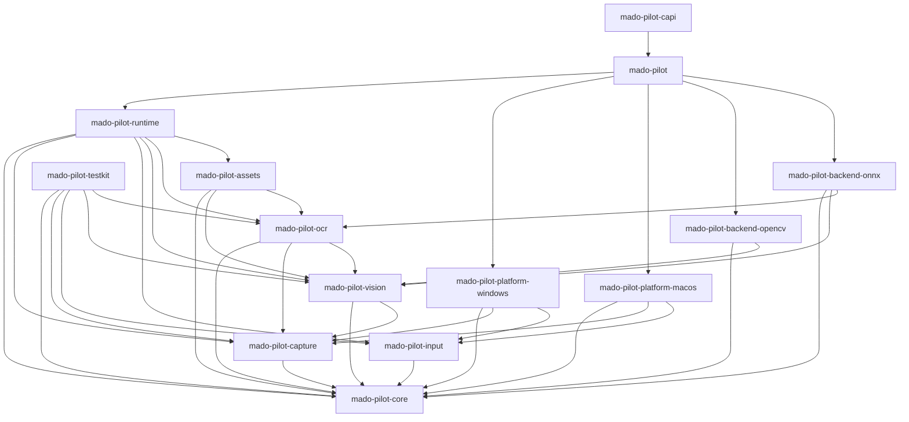

# MadoPilot architecture baseline

This document is the tracked architecture baseline for MadoPilot. It records the
repository structure, package responsibilities, dependency rules, public naming
reservations, release targets, licensing, verification baseline, and current
implementation status.

It is deliberately a repository baseline rather than a product specification.
Detailed frame, capture, OCR, input, runtime scheduling, callback, platform
behavior, and C ABI contracts are added here by the changes that implement and
test them, so that this document never describes behavior a reader cannot use.

**Status: Phase 0 — repository and decision baseline. No runtime behavior is
implemented.** See [Implementation status](#implementation-status).

## Product definition

MadoPilot is a headless visual automation runtime for applications and agents.
When implemented, it discovers windows and displays, captures frame streams, maps
coordinate spaces, performs template matching and OCR, waits for visual
conditions, injects input through explicit platform capabilities, and reports
structured diagnostics.

MadoPilot does not own a GUI, tray, editor, overlay, updater, workflow catalog,
time-based scheduler, or general scripting DSL.

## Release targets

Version one targets two platforms, and each is verified natively:

| Release target | Native verification host |
|---|---|
| `x86_64-pc-windows-msvc` | `windows-2025` |
| `aarch64-apple-darwin` | `macos-15` |

A cross-compiled result never stands in for native verification of the other
target. The exact minimum supported Windows and macOS versions are unresolved; see
gate [`G-001`](validation-gates.md#g-001).

### Platform baseline

Each release target has its own adapter package with a distinct planned
responsibility and its own unresolved decisions. Neither adapter is implemented, so
what follows is the boundary each one will own — not a capability statement.

| | Windows | macOS |
|---|---|---|
| Adapter package | `mado-pilot-platform-windows` | `mado-pilot-platform-macos` |
| Planned capture ownership | Windows Graphics Capture streams and Direct3D 11 resource lifetime | ScreenCaptureKit streams and native frame lifetime |
| Planned input ownership | Explicit system and background delivery implementations | `CGEvent` input |
| Planned permission handling | Integrity and UIPI constraints reported as observable state or typed failures | Screen Recording and Accessibility probed and reported separately, without presenting permission UI |
| Native verification host | `windows-2025` | `macos-15` |
| Open gates | [`G-001`](validation-gates.md#g-001), [`G-002`](validation-gates.md#g-002) | [`G-001`](validation-gates.md#g-001), [`G-003`](validation-gates.md#g-003) |

The detailed capability set, permission outcome tables, coordinate transforms,
native resource ownership rules, and unsupported-system behavior for each platform
are added by the changes that implement and test them. Phase 0 verifies only that
the workspace builds and tests natively on each host.

## Integration surfaces

Three public surfaces are planned, in this dependency order:

1. An idiomatic Rust API through the `mado-pilot` facade package.
2. A separately versioned C ABI with opaque handles and explicit ownership.
3. A thin C++ RAII wrapper that consumes only the released C ABI.

The C++ wrapper is not a Cargo package. It links through the released C ABI, never
through Rust internals.

## Workspace layout

The repository root is a virtual Cargo workspace with `resolver = "3"` and
explicitly enumerated members. The root is not a product package.

```text
mado-pilot/
├── Cargo.toml                  # virtual workspace manifest
├── Cargo.lock                  # the single committed lockfile
├── rust-toolchain.toml         # pinned toolchain
├── rustfmt.toml                # formatting policy
├── deny.toml                   # dependency policy
├── crates/
│   ├── mado-pilot/             # public Rust facade
│   ├── automation/             # platform-neutral contracts and orchestration
│   │   ├── core/
│   │   ├── capture/
│   │   ├── input/
│   │   ├── vision/
│   │   ├── ocr/
│   │   ├── runtime/
│   │   └── assets/
│   ├── platform/               # platform capture and input adapters
│   │   ├── windows/
│   │   └── macos/
│   ├── backend/                # vision and OCR backend adapters
│   │   ├── opencv/
│   │   └── onnx/
│   ├── bindings/
│   │   └── capi/
│   └── support/
│       └── testkit/
├── docs/
│   ├── architecture.md
│   ├── validation-gates.md
│   ├── performance.md
│   ├── third-party-dependencies.md
│   ├── adr/
│   └── benchmarks/
└── tools/
    └── dependency-check/       # named maintenance tool
```

Members are enumerated rather than matched by wildcard so that adding a package is
visible in review. Modules are organized by responsibility: a new module must state
what it binds, supports, automates, or adapts. There is no `utils` layer, and
"utility" is not an accepted responsibility.

`tools/` holds named executable maintenance programs only. It must never become a
library dependency or a home for miscellaneous code.

## Package inventory and responsibilities

The workspace contains exactly fourteen product packages and one maintenance
package. Directory names are concise; Cargo package names carry the product
prefix.

| Path | Cargo package | Planned responsibility |
|---|---|---|
| `crates/mado-pilot` | `mado-pilot` | Public Rust facade, builders, default wiring, and curated re-exports |
| `crates/automation/core` | `mado-pilot-core` | Platform-neutral identities, geometry, time, capabilities, errors, and status types |
| `crates/automation/capture` | `mado-pilot-capture` | Capture, frame, mapping, and stream-policy contracts |
| `crates/automation/input` | `mado-pilot-input` | Input operation, delivery-mode, focus, receipt, and error contracts |
| `crates/automation/vision` | `mado-pilot-vision` | Template source, preprocessing, matching request, and result contracts |
| `crates/automation/ocr` | `mado-pilot-ocr` | OCR source, model, request, result, and text-normalization contracts |
| `crates/automation/runtime` | `mado-pilot-runtime` | Session, scheduling, watcher, cancellation, coalescing, and diagnostic orchestration |
| `crates/automation/assets` | `mado-pilot-assets` | Versioned manifest, validation, deterministic loading, and source-resolution contracts |
| `crates/platform/windows` | `mado-pilot-platform-windows` | Planned Windows target, capture, input, permission, and capability adapter |
| `crates/platform/macos` | `mado-pilot-platform-macos` | Planned macOS target, capture, input, permission, and capability adapter |
| `crates/backend/opencv` | `mado-pilot-backend-opencv` | Planned OpenCV template-matching and CPU-preprocessing adapter |
| `crates/backend/onnx` | `mado-pilot-backend-onnx` | Planned ONNX Runtime OCR and execution-provider adapter |
| `crates/bindings/capi` | `mado-pilot-capi` | Planned separately versioned C ABI and ownership boundary |
| `crates/support/testkit` | `mado-pilot-testkit` | Replay, fake input, synthetic clock, backend double, and contract-fixture support |
| `tools/dependency-check` | `mado-pilot-dependency-check` | Repository maintenance: workspace inventory and dependency-direction checking |

Every package in this table is `publish = false`. Publication is enabled for an
individual package only by a change that implements, tests, and intends the
public stability of that package.

### Deferred packages

The following adapters are reserved conceptually and must not exist, not even as
an empty directory, because an empty reserved directory reads as a promised
adapter:

- `crates/platform/adb` — ADB capture and touch input
- `crates/platform/browser` — browser and CDP targets
- `crates/backend/apple-vision` — Apple Vision OCR

An adapter is added only when it has an owner, an implemented contract, tests, and
an explicit support statement. The architecture checker fails when one of these
packages or directories appears.

## Dependency rules

The workspace follows ports-and-adapters: contract packages define what an adapter
must provide, adapters implement those contracts, and only the facade names a
concrete adapter.



### The graph is an allowlist

The diagram above is not predeclared coupling. Phase 0 adds no path dependency at
all, because an unused dependency is shallow coupling that hides which packages
actually need each other. The rule is a subset rule: an actual dependency edge must
appear in this table, and an omitted future edge is always valid.

| Source package | Allowed MadoPilot dependencies |
|---|---|
| `mado-pilot-core` | none |
| `mado-pilot-capture` | `mado-pilot-core` |
| `mado-pilot-input` | `mado-pilot-core` |
| `mado-pilot-vision` | `mado-pilot-core`, `mado-pilot-capture` |
| `mado-pilot-ocr` | `mado-pilot-core`, `mado-pilot-capture`, `mado-pilot-vision` |
| `mado-pilot-assets` | `mado-pilot-core`, `mado-pilot-vision`, `mado-pilot-ocr` |
| `mado-pilot-runtime` | `mado-pilot-core`, `mado-pilot-capture`, `mado-pilot-input`, `mado-pilot-vision`, `mado-pilot-ocr`, `mado-pilot-assets` |
| `mado-pilot-platform-windows` | `mado-pilot-core`, `mado-pilot-capture`, `mado-pilot-input` |
| `mado-pilot-platform-macos` | `mado-pilot-core`, `mado-pilot-capture`, `mado-pilot-input` |
| `mado-pilot-backend-opencv` | `mado-pilot-core`, `mado-pilot-vision` |
| `mado-pilot-backend-onnx` | `mado-pilot-core`, `mado-pilot-vision`, `mado-pilot-ocr` |
| `mado-pilot` | `mado-pilot-runtime`, `mado-pilot-platform-windows`, `mado-pilot-platform-macos`, `mado-pilot-backend-opencv`, `mado-pilot-backend-onnx` |
| `mado-pilot-capi` | `mado-pilot` |
| `mado-pilot-testkit` | `mado-pilot-core`, `mado-pilot-capture`, `mado-pilot-input`, `mado-pilot-vision`, `mado-pilot-ocr` |
| `mado-pilot-dependency-check` | none |

The rules the table encodes:

1. `mado-pilot-core` depends on no other MadoPilot package, and on no platform,
   backend, GUI, or async-executor type. Platform-native handles are never added to
   it.
2. Contract packages do not depend on adapter packages.
3. `mado-pilot-runtime` orchestrates contracts and knows no concrete adapter type.
4. Platform packages implement the capture and input contracts only.
5. Backend packages implement the vision or OCR contracts only.
6. Only `mado-pilot` names a concrete adapter, because default wiring is its
   responsibility.
7. `mado-pilot-capi` depends on `mado-pilot`, never the reverse.
8. C++ wrapper code consumes only the released C header and library.

Vision and OCR depend on the capture contract because their public operations
consume capture-owned frame views. That is a contract-to-contract dependency and
exposes no adapter type. The asset package may depend on both vision and OCR to
resolve validated manifest entries into source descriptors; vision and OCR never
depend on asset representations, so a caller may supply direct file or memory
sources without adopting the asset manifest.

### Test support and maintenance tooling

`mado-pilot-testkit` exists so that every adapter can be exercised against
contract doubles. Any product package may therefore depend on it as a
**development** dependency, and no package may depend on it as a normal or build
dependency: test support must never ship.

No package may depend on `mado-pilot-dependency-check` in any form. Repository
tooling is invoked, not linked.

### Enforcement

`tools/dependency-check` reads `cargo metadata`, normalizes the package graph, and
validates it against the inventory and the allowlist above. It fails with the
offending package names, paths, and edges, and exits non-zero. The rules live in a
pure module with synthetic tests, separately from the Cargo process adapter, so
every allowed adjacency group and every forbidden direction is covered
deterministically without running Cargo.

```sh
cargo run --locked --package mado-pilot-dependency-check
```

Changing a dependency direction means changing the allowlist, its tests, and this
document together, with an architecture decision record.

## Toolchain and resolution

| Decision | Value |
|---|---|
| Cargo resolver | `3` |
| Rust edition | `2024` |
| Pinned toolchain and minimum supported Rust version | `1.97.1` |
| Package version | `0.1.0` |
| Package license | `Apache-2.0` |
| Repository | `https://github.com/pashifika/mado-pilot` |

`rust-toolchain.toml` pins the compiler with `rustfmt` and `clippy`, so a clean
checkout selects the tested toolchain. The pin is also the minimum supported Rust
version: it is a tested claim rather than an assumed one. It may be lowered later
only with CI evidence on both release targets against the dependency set that
exists at that time, recorded in an ADR.

Shared package fields are declared in `[workspace.package]` and explicitly
inherited by every member. Lints are declared in `[workspace.lints]` and inherited
with `[lints] workspace = true` in every member.

The workspace keeps one committed lockfile at the repository root. No member has
its own lockfile, and verification runs with `--locked` so that a check fails
rather than silently changing resolution.

## Lints and formatting

Formatting is standard stable `rustfmt` behavior with the edition, matching style
edition, and a Unix line ending configured, so results are identical on Windows and
macOS hosts.

Lints deny missing crate-level documentation and broken intra-doc links, and warn
on missing item documentation, missing `Debug` implementations, and unnecessary
qualifications. Verification promotes warnings to failures.

Unsafe code is permitted where a seam requires it, and is not globally forbidden.
The workspace denies unsafe operations outside an explicit `unsafe` block, and
warns on undocumented unsafe blocks: platform adapters and the C ABI will need
narrowly scoped unsafe code, and the correct response is to document and test the
safety contract at that seam rather than to weaken a workspace-wide rule later. A
platform-neutral package may adopt a stricter per-package unsafe policy in the
change that adds its first implementation.

The Clippy selection is narrow and each entry has a repository-specific reason —
FFI integer conversions, FFI ownership transfer, unsafe documentation, and the
absence of placeholder behavior. The pedantic and restriction groups are not
enabled wholesale.

## Verification baseline

[../CONTRIBUTING.md](../CONTRIBUTING.md) records the local verification sequence:
architecture check, formatting, lints with warnings denied, locked tests,
documentation with rustdoc warnings denied, and dependency policy.

Continuous integration separates fast repository policy from native target
verification, and reports three stable check names:

| Check | Host | Scope |
|---|---|---|
| `Repository policy` | `ubuntu-latest` | Package inventory, dependency directions, formatting, documentation, dependency policy |
| `Windows x86_64-pc-windows-msvc` | `windows-2025` | Native inventory, lint, test, and documentation checks |
| `macOS aarch64-apple-darwin` | `macos-15` | Native inventory, lint, test, and documentation checks |

Each job prints `rustc -vV` and the resolved package inventory, so the tested
environment and any accidental workspace member are observable in the log. Each
native job asserts its own host triple and fails rather than reporting a
cross-compiled result as native verification. Runner labels are pinned, so a
hosted-runner migration is a reviewed change.

Workflows use GitHub-maintained actions pinned to a commit revision, and install
Rust with the `rustup` already present on hosted runners rather than adding a
third-party setup action.

## Licensing and third-party dependencies

The project and every Cargo package declare Apache-2.0, matching the root
`LICENSE` file.

[third-party-dependencies.md](third-party-dependencies.md) is the dependency
policy: approved licenses, approved sources, advisory handling, duplicate-version
review, the documented-exception process, and the review a native library or model
file requires before it is added or bundled. `deny.toml` is its machine-checked
form, and `cargo deny --locked check` enforces it.

Phase 0 has no product dependency. The policy and its configuration are committed
anyway, so the first dependency arrives into an enforced policy rather than
prompting one.

## Public naming baseline

These names are reserved so that the Rust, C, C++, Windows, macOS, CMake, and
pkg-config surfaces stay consistent. **They are reservations. Phase 0 produces
none of these headers, libraries, targets, or wrappers.**

| Artifact | Name |
|---|---|
| GitHub repository | `mado-pilot` |
| Rust facade package | `mado-pilot` |
| Rust import | `mado_pilot` |
| C header | `include/madopilot/madopilot.h` |
| C++ header | `include/madopilot/madopilot.hpp` |
| C symbol prefix | `madopilot_` |
| C++ namespace | `madopilot` |
| Windows ABI-major DLL | `madopilot-1.dll` |
| Windows import library | `madopilot-1.lib` |
| macOS ABI-major install name | `libmadopilot.1.dylib` |
| CMake package | `MadoPilot` |
| CMake C target | `MadoPilot::C` |
| CMake C++ wrapper target | `MadoPilot::Cpp` |
| pkg-config package | `madopilot-1` |

The loader names carry the ABI major version so that an incompatible ABI is a
different library rather than a silent breakage.

Stable public Rust item names are deliberately not chosen yet; see gate
[`G-009`](validation-gates.md#g-009). The exact C status codes, function-table
prefix, and structure layouts are likewise unresolved; see gate
[`G-010`](validation-gates.md#g-010). `mado-pilot-capi` therefore builds as a plain
Rust library in Phase 0: the `cdylib` and `staticlib` artifact kinds, the loader
names above, and the generated header are produced by the change that implements
and tests the first C ABI functions.

## Version-one scope

Version one implements, in later phases:

- window and display discovery, and capability reporting;
- stream-first capture with immutable frames and explicit coordinate mapping;
- template matching and OCR with source-frame correlation;
- waiting for visual conditions through watchers with bounded, observable queues;
- input injection through explicit platform capabilities, with the operation kind
  and the delivery mechanism kept as separate axes;
- versioned asset manifests with deterministic, network-free, validated loading;
- structured diagnostics that exclude captured images and recognized text by
  default;
- the Rust facade, the separately versioned C ABI, and the C++ wrapper over it.

### Non-goals

Version one does not include a GUI, tray, editor, overlay, updater, workflow
catalog, time-based scheduler, or general scripting DSL. It does not add implicit
network access, automatic privilege escalation, or hidden permission behavior.

### Future work

ADB, browser and CDP, and Apple Vision adapters remain future work with no
promised delivery. Each requires an owner, an implemented contract, tests, and an
explicit support statement, and each must implement an existing contract or
introduce a focused new one rather than adding central type checks or platform
conditionals to the runtime.

### Unresolved decisions

Fourteen version-one decisions are deliberately unresolved because the evidence
that settles them does not exist yet. [validation-gates.md](validation-gates.md)
records `G-001` through `G-014` with the unresolved decision, the required
evidence, the due phase, the blocking scope, the status, and the resolution rule
for each. No gate blocks Phase 0.

## Implementation status

Phase 0 establishes the repository. It implements no product behavior.

| Area | Status |
|---|---|
| Workspace, package boundaries, dependency enforcement | Implemented |
| Toolchain pin, lockfile policy, lint and formatting policy | Implemented |
| Architecture baseline, gate registry, benchmark format, ADR process | Implemented |
| Licensing and dependency policy | Implemented |
| Repository-policy and native-target CI | Implemented |
| Window and display discovery | Not implemented |
| Capture, frames, coordinate mapping | Not implemented |
| Template matching | Not implemented |
| OCR and model loading | Not implemented |
| Watchers, scheduling, diagnostics | Not implemented |
| Input injection | Not implemented |
| Asset manifests and loading | Not implemented |
| Public Rust operations | Not implemented |
| C ABI functions, C header, native libraries | Not implemented |
| C++ wrapper | Not implemented |
| Numeric performance budgets | Not established; format only |
| Native permission behavior | Not implemented |
| Release packaging and ABI compatibility testing | Not implemented |

The existence of a package is not evidence that its behavior exists. Each product
package documents its own planned responsibility, allowed seam, and implementation
status in its crate-level documentation.

### Phase 0 completion contract

Phase 0 is complete when all of the following hold:

1. The explicitly enumerated workspace packages build on both release targets with
   responsibility documentation and no placeholder product behavior.
2. The actual package graph is a checked subset of the allowlist in this document.
3. The facade and C ABI packages expose only implemented behavior, which in Phase 0
   means no operation, no FFI symbol, and no generated header.
4. Every unresolved version-one decision appears in the gate registry with an
   explicit due phase, blocking scope, and resolution rule.
5. The benchmark profile and budget format can express hard, absolute, and relative
   gates, demonstrated by a tracked synthetic example, with no numeric product
   budget invented.
6. The project license and the third-party dependency policy are selected,
   documented, and enforced.

A compiling workspace alone does not satisfy this contract: a missing or incomplete
gate registry or benchmark format fails Phase 0 verification.

### Verification scope in Phase 0

Several classes of verification that later phases require are **not applicable**
in Phase 0, because the behavior they would check does not exist. They are recorded
here so that their absence is a stated scope boundary rather than an untested gap:

| Verification class | Phase 0 status | Becomes applicable |
|---|---|---|
| Numeric runtime performance budgets | Not applicable; no measurable workload exists | With the first performance-sensitive workload, under [`G-013`](validation-gates.md#g-013) |
| Native permission behavior and permission probes | Not applicable; no permission is requested or probed | With the platform adapters in Phase 2 |
| Native dependency packaging and clean-system loading | Not applicable; no native dependency is declared | With the backend adapters, under [`G-007`](validation-gates.md#g-007) |
| ABI layout and old-header compatibility | Not applicable; no C ABI symbol, header, or status code exists | With the first C ABI functions, under [`G-010`](validation-gates.md#g-010) |
| Capture, mapping, matching, OCR, watcher, and input contract suites | Not applicable; no contract is implemented | With each implementing change |

What Phase 0 does verify is the repository itself: the package inventory and
dependency directions, formatting, lints with warnings denied, the workspace test
run, documentation with rustdoc warnings denied, dependency policy against the
committed lockfile, and a native build and test on each release target.

## Documentation governance

Documentation is part of the implementation, not a follow-up. A change updates the
affected material in the same pull request:

- changing a package responsibility or dependency direction updates this document
  and the architecture checker;
- changing public Rust or C behavior updates the examples and the ownership rules;
- changing a capture or OCR default updates the policy and the performance
  rationale;
- adding a capability updates the capability definitions and platform support
  tables;
- adding an adapter updates scope, packaging, tests, and limitations;
- changing the asset schema or a safety ceiling updates the versioning, security,
  and migration documentation;
- changing a minimum operating-system version or permission behavior updates the
  platform support and permission tables;
- changing the C ABI updates the ownership, layout, status, compatibility-matrix,
  and migration documentation;
- changing a benchmark workload or budget updates the profile, the evidence, and
  the performance rationale;
- changing model, asset, OpenCV, ONNX Runtime, or native-library packaging updates
  the license and bundled-versus-host-provided inventories;
- resolving a gate adds an ADR and revises or removes the gate.

An ADR is required when a change replaces a normative decision in this document or
resolves a gate. [adr/0000-template.md](adr/0000-template.md) is the template and
records the full list of cases that require one.

Prefer a small explicit ADR over silently diverging from this document.
