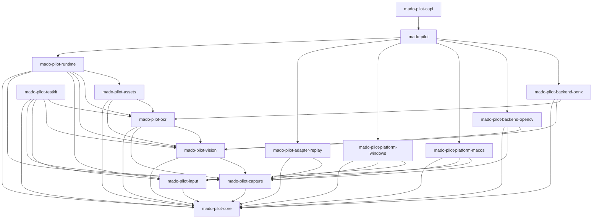

# MadoPilot architecture baseline

This document is the tracked architecture baseline for MadoPilot. It records the
repository structure, package responsibilities, dependency rules, public naming
reservations, release targets, licensing, verification baseline, and current
implementation status.

It is deliberately a repository baseline rather than a product specification.
Detailed frame, capture, OCR, input, runtime scheduling, callback, platform
behavior, and C ABI contracts are added here by the changes that implement and
test them, so that this document never describes behavior a reader cannot use.

**Status: Phase 1 complete; the Phase 2 native capture, input, and bounded
observation vertical slice reaches the Rust, C, and C++ surfaces.** The
platform-neutral core contracts, capture contracts with the deterministic replay
adapter, asset package loading, OpenCV CPU matching, runtime orchestration,
engine-scoped diagnostics, Rust facade, C ABI 1.2, and header-only C++ wrapper
are implemented. The picker-free Windows Adapter implements window/display
discovery, WGC/D3D11 capture, system input, and explicit exact-window
`WindowMessage` submission with separate ordinary queue and fixture
acknowledgement evidence. The macOS Adapter implements discovery,
ScreenCaptureKit capture,
and `CGEvent` system input. The post-review Windows interactive matrix, public
facade, ABI boundary, and 50-sample performance profile pass on the approved
development host; release-target CI remains a per-publication gate. OCR,
watchers, scheduling, and release packaging remain future work. The macOS shared
external-display matrix remains a release-acceptance gap.
See [Implementation status](#implementation-status).

## Product definition

MadoPilot is a headless visual automation runtime for applications and agents.
It discovers windows and displays, captures frame streams, maps coordinate
spaces, performs template matching, injects input through explicit platform
capabilities, and reports structured outcomes. OCR and visual-condition
watchers remain future work.

MadoPilot does not own a GUI, tray, editor, overlay, updater, workflow catalog,
time-based scheduler, or general scripting DSL.

## Release targets

Version one targets two platforms, and each is verified natively:

| Release target | Native verification host |
|---|---|
| `x86_64-pc-windows-msvc` | `windows-2025` |
| `aarch64-apple-darwin` | Apple Silicon macOS 26.5.2 (25F84), SDK 26.5 |

A cross-compiled result never stands in for native verification of the other
target. The Windows minimum remains unresolved; ADR 0014 fixes the macOS deployment
floor to the qualified host above. See gate [`G-001`](validation-gates.md#g-001).

### Platform baseline

Each release target has its own adapter package with distinct ownership and
unresolved decisions. Both Adapters implement picker-free discovery, native
capture, and input at the platform Rust boundary. The table records what each
owns and where they genuinely differ.

| | Windows | macOS |
|---|---|---|
| Adapter package | `mado-pilot-platform-windows` | `mado-pilot-platform-macos` |
| Capture ownership | Windows Graphics Capture streams and Direct3D 11 resource lifetime (implemented) | ScreenCaptureKit streams and Core Video frame lifetime (implemented) |
| Input ownership | System pointer/keyboard/text plus explicit exact-window `WindowMessage`: ordinary retained top-level windows are unknown-but-attemptable with target-queue evidence, while the dedicated fixture is supported with protocol acknowledgement (implemented in the platform package) | `CGEvent` system pointer/keyboard/text plus an implemented, explicitly gated owning-process `ProcessDirected` route. The corrected source has no release-qualified process-directed pair until its complete native topology matrix passes; no `WindowMessage` route exists |
| Permission handling | Capture presents no permission UI; no permission probe exists; input compares target integrity and reports proven UIPI at route preflight | Screen Recording and event-post access reported separately without permission UI; `PermissionKind::InputControl` maps to the public `CGPreflightPostEventAccess` decision re-read before every irreversible event, regardless of the Privacy & Security pane label, while legacy Accessibility trust is only a separate focus input and paired qualification fact (implemented) |
| Native verification host | `windows-2025` CI plus the ADR 0026 named interactive Core i7-12700KF / RTX 4080 Windows 11 Pro 26200 host | Apple Silicon macOS 26.5.2 (25F84), SDK 26.5 |
| Deployment floor | unresolved | macOS 26.5.2; older versions unsupported |
| Open gates | [`G-001`](validation-gates.md#g-001) minimum; [`G-013`](validation-gates.md#g-013) production-capture acceptance matrix and budgets; [ADR 0026](adr/0026-windows-native-and-diagnostic-performance-budgets.md) accepts diagnostic timing and the original `native-phase2` workload sets; [ADR 0028](adr/0028-windows-window-message-performance-budgets.md) accepts ordinary `WindowMessage` timing, memory, queue-pressure, and cleanup ceilings | [`G-013`](validation-gates.md#g-013) broader production-capture acceptance and final-source regression reruns; [ADR 0024](adr/0024-input-diagnostic-performance-budgets.md) accepts diagnostics, [ADR 0025](adr/0025-macos-native-input-performance-budgets.md) accepts the earlier native input/public-language costs, and accepted-design [ADR 0029](adr/0029-macos-process-directed-input.md) remains release-blocked on the corrected source because its exact single-display and same-scale qualification rows are unexecuted |

Detailed capabilities, permission outcomes, coordinate transforms, native
resource ownership, and unsupported-system behavior are added by the changes
that implement and test them. Both capture boundaries and both input boundaries
are documented below; see
[windows-input-verification.md](windows-input-verification.md) and
[macos-input-verification.md](macos-input-verification.md).

One limit on reading the macOS row applies to every macOS capture claim in this
document. macOS grants Screen Recording per application, and this Adapter will not
prompt, so a host that has neither granted nor denied it — a continuous-integration
runner, for instance — reaches the non-prompting refusal rather than the capture
path. The Adapter's controlled scenarios report a skip with that reason there
instead of a pass, so a green run on such a host is not evidence that capture ran.

#### The macOS native boundary

The language and containment rules of the macOS shim were settled ahead of the
adapter, because an exception or an unreleased native object crossing that boundary
is a defect the Rust side cannot see. Gate `G-003` is resolved by
[ADR 0012](adr/0012-macos-shim-language-and-containment.md) on the measurements in
[evidence/g-003/](evidence/g-003/README.md). `mado-pilot-platform-macos` now
implements that boundary and carries the tests ADR 0012 named.

The shim is **Objective-C with Automatic Reference Counting, compiled with
`-fobjc-arc-exceptions`**. Objective-C++ is not used and C++ is not admitted into
the boundary: with that one flag, Objective-C matched Objective-C++ on every
ownership and containment case measured except containing a C++ `throw`, which a
boundary with no C++ in it cannot raise, while Objective-C++ requires libc++ in
every process that loads MadoPilot — a requirement verified with every C++ construct
removed from the source, so it follows from the language mode rather than from the
prototype's C++ test. The flag is a correctness requirement: without it, ARC emits
no release on an exception's unwind edge, so an exception raised where a failing
stream start would raise one leaves the native object the session had already
retained alive.

The boundary is one internal C-callable surface with opaque handles,
size-versioned requests, and a status return on every entry point. No Objective-C
type appears in any Rust or public API. Its rules: a catch-all handler at every
entry point and callback trampoline maps native exceptions to typed statuses;
frames handed to a callback are borrowed for the duration of the call; each frame
work item wraps its body in `@autoreleasepool`; callback admission is fenced by
disable-and-drain before a caller may release registered state, and the host
callback is never invoked under an internal lock; close is idempotent and completes
its release even when it reports a failure; every Rust callback catches its own
panics, because an escaping one aborts the process; and the shim's own build owns
framework linkage and runtime surface validation, rather than inheriting a binding
crate's link attribute. The internal
surface is not a public ABI: it is not installed, and the compatibility policy in
[c-abi.md](c-abi.md) does not cover it. A test asserts that the compiled shim and
the Rust declarations that mirror it agree on version and structure sizes.

The implementation owns that last rule through **controlled dynamic loading**
rather than the weak framework linking ADR 0012 named, and the reason is a
property of the build system the `G-003` prototype could not observe: Cargo does
not propagate a dependency's `rustc-link-arg` to the binary that consumes the
dependency, so a build script in the Adapter package cannot put `-weak_framework`
on the final link — measured on a two-package workspace, where the flag produced no
load command at all. The shim therefore loads ScreenCaptureKit from its absolute
system location, resolves its classes by name and its exported attachment keys by
symbol, and gates every use behind `@available`. Every other framework it needs
is part of the 26.5.2 baseline and is linked normally. The tested property is now
restricted ambient resolution: a binary carries no ScreenCaptureKit load command,
and a missing required class or attachment key reports `Unsupported`. The final
artifact itself declares 26.5.2 and is not promised to load on an older host.

The macOS half of [`G-001`](validation-gates.md#g-001) is fixed by
[ADR 0014](adr/0014-macos-qualified-host-and-frame-placement.md): Apple Silicon
macOS 26.5.2 (25F84), SDK 26.5, is the qualified implementation and deployment
floor. Earlier macOS versions are unqualified and unsupported. The workspace Cargo
configuration places that version in final Rust artifact metadata and the shim
repeats it for native objects. The revision-bound permissioned current-display
suite and exact owned-window replacement oracle pass on that host. ADR 0014's
earlier cross-scale movement probe remains design evidence rather than a
substitute for the release candidate's shared external-display matrix. The
Windows minimum remains open.

## Integration surfaces

Three public surfaces exist, in this dependency order:

1. An idiomatic Rust API through the `mado-pilot` facade package.
2. A separately versioned C ABI with opaque handles and explicit ownership.
3. A thin C++ RAII wrapper that consumes only the released C ABI.

The C++ wrapper is not a Cargo package. It links through the released C ABI,
never through Rust internals.

[c-abi.md](c-abi.md) is the C boundary's own contract document: handle
lifetimes, structure-prefix rules, statuses and admitted receipts, panic and
native-exception containment, native capability and non-prompting permission
reporting, input submission, bounded diagnostic readers, build prerequisites,
and verification on each release target. Semantic numeric values and frozen
version/report fields use fixed-width C integer types: structure sizes and
reported table sizes are `uint32_t`, while row strides and semantic
result/package/receipt/diagnostic counts are `uint64_t`. `size_t` is limited to
ABI-native addressability quantities: pointer-view lengths, replay and input
event counts and element strides, target-list counts, accessor indexes, and the
caller-known table extent passed to negotiation. ABI 1.0 froze the complete
prefix under [ADR 0007](adr/0007-phase-1-c-abi-freeze.md). ABI 1.2 replaces the
unreleased 1.1 draft with the native input and bounded diagnostic suffix under
[ADR 0023](adr/0023-input-submission-observation-and-abi-1-2.md).

[cpp-wrapper.md](cpp-wrapper.md) is the C++ adapter's contract: move-only owners,
explicit `clone` and `close`, exception-free `Result` values, admitted input
receipts, borrowed views and their owners, typed requests, and the CMake targets.

The C++ wrapper is header-only and produces no artifact of its own, so the C ABI
remains the only ABI the project has; see
[ADR 0005](adr/0005-cpp-wrapper-shape-and-cmake-surface.md).

## Workspace layout

The repository root is a virtual Cargo workspace with `resolver = "3"` and
explicitly enumerated members. The root is not a product package.

```text
mado-pilot/
├── Cargo.toml                  # virtual workspace manifest
├── Cargo.lock                  # the single committed lockfile
├── rust-toolchain.toml         # pinned toolchain
├── rustfmt.toml                # formatting policy
├── deny.toml                   # dependency policy
├── crates/
│   ├── mado-pilot/             # public Rust facade
│   ├── automation/             # platform-neutral contracts and orchestration
│   │   ├── core/
│   │   ├── capture/
│   │   ├── input/
│   │   ├── vision/
│   │   ├── ocr/
│   │   ├── runtime/
│   │   └── assets/
│   ├── adapter/                # platform-neutral capture and input adapters
│   │   └── replay/
│   ├── platform/               # platform capture and input adapters
│   │   ├── windows/
│   │   └── macos/
│   ├── backend/                # vision and OCR backend adapters
│   │   ├── opencv/
│   │   └── onnx/
│   ├── bindings/
│   │   └── capi/
│   │       ├── CMakeLists.txt  # the MadoPilot::C and MadoPilot::Cpp targets
│   │       ├── include/        # the tracked C header and C++ wrapper
│   │       ├── examples/c/     # deterministic and native C common flows
│   │       ├── examples/cpp/   # deterministic and native C++ common flows
│   │       ├── tests/c/        # C ABI layout probe
│   │       ├── tests/cpp/      # C++ ownership and runtime probe
│   │       ├── tests/cmake/    # independent CMake consumer project
│   │       └── tests/abi-compat/ # one immutable fixture per released header
│   └── support/
│       └── testkit/
├── docs/
│   ├── architecture.md
│   ├── c-abi.md
│   ├── cpp-wrapper.md
│   ├── validation-gates.md
│   ├── performance.md
│   ├── third-party-dependencies.md
│   ├── adr/
│   ├── benchmarks/
│   └── evidence/               # measurements a resolved gate rests on
├── fixtures/                   # tracked test and evidence data
└── tools/
    └── dependency-check/       # named maintenance tool
```

Members are enumerated rather than matched by wildcard so that adding a package is
visible in review. Modules are organized by responsibility: a new module must state
what it binds, supports, automates, or adapts. There is no `utils` layer, and
"utility" is not an accepted responsibility.

`tools/` holds named executable maintenance programs only. It must never become a
library dependency or a home for miscellaneous code.

`fixtures/` holds test and evidence data that outlives the change that created
it, grouped by the subject it exercises. Data belongs here rather than beside one
package when more than one consumer needs it — a contract suite, an example, a
benchmark, and a gate's evidence can all refer to the same bytes. Every fixture
group records its provenance and license and pins its contents with a checksum
file, because a fixture that changes silently invalidates whatever was measured
against it. `docs/evidence/` holds the measurements themselves, so a number and
the data behind it are never separated.

## Package inventory and responsibilities

The workspace contains exactly fifteen product packages and one maintenance
package. Directory names are concise; Cargo package names carry the product
prefix.

| Path | Cargo package | Planned responsibility |
|---|---|---|
| `crates/mado-pilot` | `mado-pilot` | Public Rust facade, builders, default wiring, and curated re-exports |
| `crates/automation/core` | `mado-pilot-core` | Platform-neutral identities, geometry, time, capabilities, errors, and status types |
| `crates/automation/capture` | `mado-pilot-capture` | Capture, frame, mapping, and stream-policy contracts |
| `crates/automation/input` | `mado-pilot-input` | Input operation, route capability, focus, submission receipt, and error contracts |
| `crates/automation/vision` | `mado-pilot-vision` | Template source, preprocessing, matching request, and result contracts |
| `crates/automation/ocr` | `mado-pilot-ocr` | OCR source, model, request, result, and text-normalization contracts |
| `crates/automation/runtime` | `mado-pilot-runtime` | Session orchestration, cancellation, input-result arbitration, and bounded engine-scoped diagnostics |
| `crates/automation/assets` | `mado-pilot-assets` | Versioned manifest, validation, deterministic loading, and source-resolution contracts |
| `crates/adapter/replay` | `mado-pilot-adapter-replay` | Deterministic replay capture from file and memory sources |
| `crates/platform/windows` | `mado-pilot-platform-windows` | Picker-free Windows window/display discovery, WGC/D3D11 capture, system input, ordinary exact-window queue submission with unknown compatibility, and fixture-acknowledged exact-window submission, wired into the runtime and facade by `mado_pilot::windows_engine`; Windows exposes no separate capture/input authorization state, and receipts report integrity/UIPI failures without elevation |
| `crates/platform/macos` | `mado-pilot-platform-macos` | Non-prompting macOS target discovery, permission probes, ScreenCaptureKit capture, `CGEvent` system input, and gated process-directed input to the retained window's owning process, wired into the runtime and the facade by `mado_pilot::macos_engine` |
| `crates/backend/opencv` | `mado-pilot-backend-opencv` | OpenCV CPU template matching |
| `crates/backend/onnx` | `mado-pilot-backend-onnx` | Planned ONNX Runtime OCR and execution-provider adapter |
| `crates/bindings/capi` | `mado-pilot-capi` | Separately versioned C ABI and ownership boundary, and the header-only C++ wrapper and CMake targets over it |
| `crates/support/testkit` | `mado-pilot-testkit` | Controlled capture, storage, permission, backend, and input doubles, synthetic clock, and contract-fixture support |
| `tools/dependency-check` | `mado-pilot-dependency-check` | Repository maintenance: workspace inventory and dependency-direction checking |

Every package in this table is `publish = false`. Publication is enabled for an
individual package only by a change that implements, tests, and intends the
public stability of that package.

### Deferred packages

The following adapters are reserved conceptually and must not exist, not even as
an empty directory, because an empty reserved directory reads as a promised
adapter:

- `crates/platform/adb` — ADB capture and touch input
- `crates/platform/browser` — browser and CDP targets
- `crates/backend/apple-vision` — Apple Vision OCR

An adapter is added only when it has an owner, an implemented contract, tests, and
an explicit support statement. The architecture checker fails when one of these
packages or directories appears.

## Dependency rules

The workspace follows ports-and-adapters: contract packages define what an adapter
must provide, adapters implement those contracts, and only the facade names a
concrete adapter.



### The graph is an allowlist

The diagram above is not predeclared coupling. Phase 0 adds no path dependency at
all, because an unused dependency is shallow coupling that hides which packages
actually need each other. The rule is a subset rule: an actual dependency edge must
appear in this table, and an omitted future edge is always valid.

| Source package | Allowed MadoPilot dependencies |
|---|---|
| `mado-pilot-core` | none |
| `mado-pilot-capture` | `mado-pilot-core` |
| `mado-pilot-input` | `mado-pilot-core` |
| `mado-pilot-vision` | `mado-pilot-core`, `mado-pilot-capture` |
| `mado-pilot-ocr` | `mado-pilot-core`, `mado-pilot-capture`, `mado-pilot-vision` |
| `mado-pilot-assets` | `mado-pilot-core`, `mado-pilot-vision`, `mado-pilot-ocr` |
| `mado-pilot-runtime` | `mado-pilot-core`, `mado-pilot-capture`, `mado-pilot-input`, `mado-pilot-vision`, `mado-pilot-ocr`, `mado-pilot-assets` |
| `mado-pilot-adapter-replay` | `mado-pilot-core`, `mado-pilot-capture` |
| `mado-pilot-platform-windows` | `mado-pilot-core`, `mado-pilot-capture`, `mado-pilot-input` |
| `mado-pilot-platform-macos` | `mado-pilot-core`, `mado-pilot-capture`, `mado-pilot-input` |
| `mado-pilot-backend-opencv` | `mado-pilot-core`, `mado-pilot-capture`, `mado-pilot-vision` |
| `mado-pilot-backend-onnx` | `mado-pilot-core`, `mado-pilot-vision`, `mado-pilot-ocr` |
| `mado-pilot` | `mado-pilot-runtime`, `mado-pilot-adapter-replay`, `mado-pilot-platform-windows`, `mado-pilot-platform-macos`, `mado-pilot-backend-opencv`, `mado-pilot-backend-onnx` |
| `mado-pilot-capi` | `mado-pilot` |
| `mado-pilot-testkit` | `mado-pilot-core`, `mado-pilot-capture`, `mado-pilot-input`, `mado-pilot-vision`, `mado-pilot-ocr` |
| `mado-pilot-dependency-check` | none |

The table lists production edges. Every product package may additionally use
`mado-pilot-testkit` as a development dependency. One narrower exception exists:
`mado-pilot-capi` may use `mado-pilot-runtime` under `[dev-dependencies]` solely
to wire controlled engines for ABI admission, receipt, and concurrency tests.
The facade deliberately hides `EngineWiring`, so routing that fixture through
the facade would require a public adapter-injection API for private test code.
The checker accepts this exact development edge, still rejects it in production,
and rejects every other C-ABI bypass; see
[ADR 0018](adr/0018-c-abi-contract-test-runtime-wiring.md).

The rules the table encodes:

1. `mado-pilot-core` depends on no other MadoPilot package, and on no platform,
   backend, GUI, or async-executor crate. Platform-native handles are never added
   to it. The checker enforces the MadoPilot half of this rule; the external-crate
   half is a review rule, applied through
   [third-party-dependencies.md](third-party-dependencies.md) and `cargo deny` by
   the change that adds each dependency.
2. Contract packages do not depend on adapter packages.
3. `mado-pilot-runtime` orchestrates contracts and knows no concrete adapter type.
4. Adapter and platform packages implement the capture and input contracts only.
   `crates/adapter` holds adapters that are platform-neutral — the same source
   behaves identically on both release targets — while `crates/platform` holds
   the ones whose behavior is the operating system's.
5. Backend packages implement the vision or OCR contracts only.
6. Only `mado-pilot` names a concrete adapter, because default wiring is its
   responsibility.
7. Production `mado-pilot-capi` depends on `mado-pilot`, never the reverse.
8. C++ wrapper code consumes only the released C header and library. It is not a
   Cargo package and the dependency checker does not see it; the rule is enforced
   by the wrapper having nothing else to include and by the CMake consumer test
   linking `MadoPilot::Cpp` alone.

The facade's row lists no contract package. That is deliberate — default wiring is
the facade's only job — but it means every core, capture, input, vision, OCR, or
asset type the public Rust API exposes must reach callers through
`mado-pilot-runtime`'s re-exports. The facade meets this: every contract type it
exposes is re-exported from runtime, and beyond runtime it depends only on
adapter and backend packages — `mado-pilot-adapter-replay`,
`mado-pilot-backend-opencv`, and, per release target, one of
`mado-pilot-platform-windows` and `mado-pilot-platform-macos`.

The two platform edges are target-specific in the facade's manifest, under
`[target.'cfg(windows)'.dependencies]` and
`[target.'cfg(target_os = "macos")'.dependencies]`, so a macOS build resolves no
Windows package and a Windows build resolves no macOS package. The dependency
checker reads the whole manifest rather than one target's resolution, so both
edges are checked against the row on either host. The row's sixth entry,
`mado-pilot-backend-onnx`, is not implemented and the facade therefore does not
name it — the table is an allowlist and an omitted future edge is always valid,
as the subset rule above says. Widening the row itself is a normative change and
needs an ADR, not a quiet allowlist edit.

Vision and OCR depend on the capture contract because their public operations
consume capture-owned frame views. That is a contract-to-contract dependency and
exposes no adapter type. The asset package may depend on both vision and OCR to
resolve validated manifest entries into source descriptors; vision and OCR never
depend on asset representations, so a caller may supply direct file or memory
sources without adopting the asset manifest.

### Test support and maintenance tooling

`mado-pilot-testkit` exists so that every adapter can be exercised against
contract doubles. Any product package may therefore depend on it as a
**development** dependency, and no package may depend on it as a normal or build
dependency: test support must never ship.

It holds the doubles for what a real host cannot be asked to do on cue: a capture
provider whose publication a test drives, a producer with a finite pool and a
finite detached-storage budget whose conversions can be slow or fail, a permission
probe that answers from a script and records what it was asked, and an input
controller that fails at a chosen event and releases as much of what it pressed as
a test allows. The shared `capture_contract` and `input_contract` suites hold the
rules an Adapter can be held to unprompted; the rules about failing part-way are
exercised against the doubles, because nothing can make a working Adapter refuse
its third event on request, and a rule that is never reached is not verified.

No suite check depends on which of two concurrent operations a scheduler runs
first. Where a rule genuinely needs contention, it is verified where the contention
can be made deterministic — one thread holding the resource while the same thread
observes the refusal — and tests that need to know when a double is mid-operation
wait on an observation it publishes rather than sleeping for however long it is
guessed to take. A sleep long enough to be safe on a loaded runner is a slow test,
and one short enough to be fast fails there while naming a rule it never reached.

No package may depend on `mado-pilot-dependency-check` in any form. Repository
tooling is invoked, not linked.

### Enforcement

`tools/dependency-check` reads `cargo metadata` and the tracked manifests,
normalizes the package graph, and fails with the offending package names, paths, and
edges. The rules live in pure modules with synthetic tests, separately from the
Cargo process adapter, so every allowed adjacency group, every forbidden direction,
and every metadata rule is covered deterministically without running Cargo. The
adapter's own policies — path resolution, dependency source, `publish` decoding, and
reserved directories — are covered against synthetic Cargo output over temporary
directories.

It verifies:

- the package inventory — every required package present, at its documented
  directory, with no unrecognized and no deferred package;
- that no reserved adapter directory exists, including as a dangling symlink;
- the dependency allowlist above, for normal, build, and development edges;
- that a dependency claiming a member's name resolves to that member by path,
  rather than to a same-named or renamed crate from a registry or Git source. Cargo
  reports a `package = "..."` rename's real package separately from its
  manifest-visible alias, and both are checked, because the alias is what Rust
  source imports;
- that every path dependency resolves to a workspace member;
- that every member is non-publishable;
- the shared metadata contract recorded under [Toolchain and
  resolution](#toolchain-and-resolution);
- that every member opts into the workspace lint policy with
  `[lints] workspace = true`, since a missing opt-in silently disables the lints
  for that package and `-D warnings` cannot recover them. Only the root `[lints]`
  table counts: the same text written inside `[package]` sets an unrelated key and
  leaves the lints disabled.

```sh
cargo run --locked --package mado-pilot-dependency-check
```

Changing a dependency direction means changing the allowlist, its tests, and this
document together, with an architecture decision record.

## Toolchain and resolution

| Decision | Value |
|---|---|
| Cargo resolver | `3` |
| Rust edition | `2024` |
| Pinned toolchain and minimum supported Rust version | `1.97.1` |
| Package version | `0.2.1` |
| Package license | `Apache-2.0` |
| Repository | `https://github.com/pashifika/mado-pilot` |

`rust-toolchain.toml` pins the compiler with `rustfmt` and `clippy`, so a clean
checkout selects the tested toolchain. The pin is also the minimum supported Rust
version: it is a tested claim rather than an assumed one. It may be lowered later
only with CI evidence on both release targets against the dependency set that
exists at that time, recorded in an ADR. The architecture checker rejects a pin that
disagrees with `[workspace.package] rust-version`, so the two cannot drift apart.

Shared package fields are declared in `[workspace.package]` and explicitly
inherited by every member, which the architecture checker verifies against the
values in the table above. Lints are declared in `[workspace.lints]` and inherited
with `[lints] workspace = true` in every member.

The workspace keeps one committed lockfile at the repository root. No member has
its own lockfile, and verification runs with `--locked` so that a check fails
rather than silently changing resolution.

### Shared metadata contract

The architecture checker validates shared metadata in three layers, so that neither
one member nor the workspace as a whole can drift unnoticed:

1. The root `[workspace.package]` values are anchored to the contract values in the
   table above, and `rust-toolchain.toml` must pin the same Rust version. Checking
   members against each other is not enough on its own: every member can agree on a
   value that no longer matches the contract.
2. Every member's resolved `version`, `edition`, `rust-version`, `license`, and
   `repository` must equal the root declaration, so a member cannot override an
   inherited field. Because the root values must be present and non-empty, a
   workspace that drops `rust-version` or `repository` everywhere fails rather than
   agreeing on nothing.
3. Every member must inherit those five fields explicitly with
   `<field>.workspace = true`. Cargo reports resolved values, so only the manifest
   text distinguishes inheritance from a hard-coded literal that happens to agree
   today. `publish` is excluded from this layer: the requirement is that every member
   is non-publishable, which Cargo's resolved value already answers, so a member may
   state `publish = false` directly or inherit it from `[workspace.package]`.

Changing the version, the minimum supported Rust version, the license, or the
repository is therefore an intentional, visible edit: the root manifest, the
`REQUIRED_*` constants in `tools/dependency-check`, `rust-toolchain.toml` where
applicable, and this document move together in the same reviewed change.

## Lints and formatting

Formatting is standard stable `rustfmt` behavior with the edition, matching style
edition, and a Unix line ending configured, so results are identical on Windows and
macOS hosts.

Lints deny missing crate-level documentation and broken intra-doc links, and warn
on missing item documentation, missing `Debug` implementations, and unnecessary
qualifications. Verification promotes warnings to failures.

Unsafe code is permitted where a seam requires it, and is not globally forbidden.
The workspace denies unsafe operations outside an explicit `unsafe` block, and
warns on undocumented unsafe blocks: platform adapters and the C ABI will need
narrowly scoped unsafe code, and the correct response is to document and test the
safety contract at that seam rather than to weaken a workspace-wide rule later. A
platform-neutral package may adopt a stricter per-package unsafe policy in the
change that adds its first implementation.

The Clippy selection is narrow and each entry has a repository-specific reason —
FFI integer conversions, FFI ownership transfer, unsafe documentation, and the
absence of placeholder behavior. The pedantic and restriction groups are not
enabled wholesale.

## Verification baseline

[../CONTRIBUTING.md](../CONTRIBUTING.md) records the local verification sequence:
architecture check, formatting, lints with warnings denied, locked tests,
documentation examples, documentation with rustdoc warnings denied, dependency
policy, and the C and C++ surfaces.

Continuous integration separates fast repository policy from native target
verification, and reports three stable check names:

| Check | Host | Scope |
|---|---|---|
| `Repository policy` | `ubuntu-latest` | Package inventory, dependency directions, formatting, dependency policy |
| `Windows x86_64-pc-windows-msvc` | `windows-2025` | Native inventory, lint, test, doctest, and documentation checks, and the C ABI and C++ wrapper check |
| `macOS aarch64-apple-darwin` | `macos-26` | Native inventory, lint, test, doctest, and documentation checks, and the C ABI and C++ wrapper check |

That split is not incidental, so the rule behind it is recorded here rather than
inferred from the table. The `Repository policy` job builds no product package,
which is what places every check that needs a compiled product in the two native
jobs. `mado-pilot-backend-opencv` generates its bindings at build time, so
building any product package needs an OpenCV 4 installation and a loadable
libclang, and that installation is provisioned on the two release targets rather
than on a host that is neither. The repository-policy steps read manifests,
metadata, and source text; the one thing that job compiles is the maintenance
checker, which depends on no product package. Documentation, lints, tests, and
the C and C++ boundary are verified in both native jobs, where the compiler that
reports a broken link or a layout mismatch is the one the product is verified
with.

Each job prints `rustc -vV` and the resolved package inventory, so the tested
environment and any accidental workspace member are observable in the log. Each
native job asserts its own host triple and fails rather than reporting a
cross-compiled result as native verification.

The native jobs name an operating-system version rather than a `-latest` label, so
moving to a new OS version is a reviewed change. A label pins only that version;
GitHub migrates the image behind it on its own schedule, so the label does not
freeze the image contents. The repository-policy job uses the moving
`ubuntu-latest` on purpose, because it verifies host-independent policy rather than
a release target. The pinned toolchain, not the runner label, is what makes compiler
results reproducible.

Workflows use GitHub-maintained actions pinned to a commit revision, and install
Rust with the `rustup` already present on hosted runners rather than adding a
third-party setup action.

## Licensing and third-party dependencies

The project and every Cargo package declare Apache-2.0, matching the root
`LICENSE` file.

[third-party-dependencies.md](third-party-dependencies.md) is the dependency
policy: approved licenses, approved sources, advisory handling, duplicate-version
review, the documented-exception process, and the review a native library or model
file requires before it is added or bundled. `deny.toml` is its machine-checked
form, and `cargo deny --locked check` enforces it.

The policy and its configuration were committed in Phase 0, before there was a
product dependency to check, so the first one arrived into an enforced policy
rather than prompting one. Phase 1 has dependencies —
[third-party-dependencies.md](third-party-dependencies.md) records the resolved
closure and the OpenCV build-time set — and they were added under it.

## Public naming baseline

These names are reserved so that the Rust, C, C++, Windows, macOS, CMake, and
pkg-config surfaces stay consistent. A name is reserved whether or not the
artifact behind it exists yet, so each row states which it is: an artifact the
tree produces today, or a reservation a later phase fills.

| Artifact | Name | State |
|---|---|---|
| GitHub repository | `mado-pilot` | Exists |
| Rust facade package | `mado-pilot` | Exists |
| Rust import | `mado_pilot` | Exists |
| C header | `include/madopilot/madopilot.h` | Exists, tracked and hand-written |
| C++ header | `include/madopilot/madopilot.hpp` | Exists, header-only |
| C symbol prefix | `madopilot_` | Exists — `madopilot_get_api` is the one exported symbol |
| C++ namespace | `madopilot` | Exists |
| Windows ABI-major DLL | `madopilot-1.dll` | Reserved; the development build produces the undecorated artifact |
| Windows import library | `madopilot-1.lib` | Reserved, on the same terms |
| macOS ABI-major install name | `libmadopilot.1.dylib` | Reserved, on the same terms |
| CMake package | `MadoPilot` | Exists, for development-tree consumption |
| CMake C target | `MadoPilot::C` | Exists |
| CMake C++ wrapper target | `MadoPilot::Cpp` | Exists as an `INTERFACE` target |
| pkg-config package | `madopilot-1` | Reserved; not generated |

The loader names carry the ABI major version so that an incompatible ABI is a
different library rather than a silent breakage.

The public Rust item names were reviewed and settled under gate
[`G-009`](validation-gates.md#g-009) by
[ADR 0006](adr/0006-public-rust-names-and-compatibility-policy.md); they are the
`0.x` baseline rather than a stability promise, which begins at 1.0. The
complete C ABI 1.0 prefix is frozen under gate
[`G-010`](validation-gates.md#g-010) by
[ADR 0007](adr/0007-phase-1-c-abi-freeze.md). ABI 1.2 preserves that prefix and
replaces the unreleased 1.1 draft with the native input and bounded diagnostic
suffix under
[ADR 0023](adr/0023-input-submission-observation-and-abi-1-2.md). The C ABI is
versioned separately from the Rust names.

`mado-pilot-capi` now builds as a `cdylib` and exports `madopilot_get_api`, and
`include/madopilot/madopilot.h` exists as a tracked, hand-written header verified
against the Rust definitions by a cross-language layout probe; see
[ADR 0004](adr/0004-c-header-authorship-and-abi-verification.md) and
[c-abi.md](c-abi.md).

`include/madopilot/madopilot.hpp`, the namespace `madopilot`, and the CMake
targets `MadoPilot::C` and `MadoPilot::Cpp` now exist as well. The wrapper is
header-only, so `MadoPilot::Cpp` is an `INTERFACE` target and produces no
artifact; see [ADR 0005](adr/0005-cpp-wrapper-shape-and-cmake-surface.md) and
[cpp-wrapper.md](cpp-wrapper.md).

What the table marks reserved is withheld for three reasons. The `staticlib`
kind is withheld because [`G-008`](validation-gates.md#g-008) has not recorded
which static dependency combinations are supported; the decorated loader names are
applied by release packaging, which is not implemented, so what is built
today is the undecorated development artifact; and no pkg-config file is
generated, for the same packaging reason. The CMake project likewise has no
install or export set, so consumption is from the development tree with
`add_subdirectory` rather than with `find_package`.

## Version-one scope

Version one implements, in later phases:

- window and display discovery, and capability reporting;
- stream-first capture with immutable frames and explicit coordinate mapping;
- template matching and OCR with source-frame correlation;
- waiting for visual conditions through watchers with bounded, observable queues;
- input submission through explicit platform capabilities, with the operation kind
  and native route kept as separate axes;
- versioned asset manifests with deterministic, network-free, validated loading;
- structured diagnostics that exclude captured images and recognized text by
  default;
- the Rust facade, the separately versioned C ABI, and the C++ wrapper over it.

### Non-goals

Version one does not include a GUI, tray, editor, overlay, updater, workflow
catalog, time-based scheduler, or general scripting DSL. It does not add implicit
network access, automatic privilege escalation, or hidden permission behavior.

### Future work

ADB, browser and CDP, and Apple Vision adapters remain future work with no
promised delivery. Each requires an owner, an implemented contract, tests, and an
explicit support statement, and each must implement an existing contract or
introduce a focused new one rather than adding central type checks or platform
conditionals to the runtime.

### Unresolved decisions

Fourteen version-one decisions were deliberately deferred because the evidence
that settles them did not exist yet. [validation-gates.md](validation-gates.md)
records `G-001` through `G-014` with the decision, the required evidence, the due
phase, the blocking scope, the status, and the resolution rule for each. No gate
blocked Phase 0.

Eight remain open, one is deferred, and five are resolved. The deferred one is
[`G-011`](validation-gates.md#g-011), native-frame extension discovery, which
sits on the future roadmap and does not block version one. `G-009` is resolved by
[ADR 0006](adr/0006-public-rust-names-and-compatibility-policy.md) and `G-010` by
[ADR 0007](adr/0007-phase-1-c-abi-freeze.md); both are recorded under
[Public naming baseline](#public-naming-baseline).

`G-002` is resolved by
[ADR 0013](adr/0013-windows-capture-frame-detachment.md), whose production
ownership constraints are recorded under
[Windows native capture ownership](#windows-native-capture-ownership).
`G-014` is resolved by
[ADR 0001](adr/0001-asset-archive-container-and-safety-ceilings.md), which fixes
the asset archive container, the manifest serialization, and six implementation
ceilings that bound what loading an untrusted archive may allocate and expand. A
caller may configure a limit below a ceiling and may not raise one above it.
`mado-pilot-assets` implements those ceilings and is verified against the
adversarial fixtures the gate was resolved with; see
[Asset packages](#asset-packages).

`G-003` is resolved by
[ADR 0012](adr/0012-macos-shim-language-and-containment.md), which selects
Objective-C with ARC and `-fobjc-arc-exceptions` for the macOS shim and fixes the
containment, ownership, autorelease, fence, teardown, panic, and linkage rules of
that boundary. `mado-pilot-platform-macos` implements it and carries the tests the
ADR named, with the linkage rule met by controlled dynamic loading rather than the
weak framework linking the record described; see
[The macOS native boundary](#the-macos-native-boundary) and
[macOS native capture ownership](#macos-native-capture-ownership).

## Implementation status

Phase 0 established the repository and implemented no product behavior. Phase 1
delivered the first vertical slice and is complete. Only the rows marked
implemented below describe behavior a caller can use today; the rest name
responsibilities a later phase takes on.

| Area | Status |
|---|---|
| Workspace, package boundaries, dependency enforcement | Implemented |
| Toolchain pin, lockfile policy, lint and formatting policy | Implemented |
| Architecture baseline, gate registry, benchmark format, ADR process | Implemented |
| Licensing and dependency policy | Implemented |
| Repository-policy and native-target CI | Implemented |
| Identities, frame stamps, and frame ordering | Implemented in `mado-pilot-core` |
| Coordinate spaces, validated geometry, and frame-time transforms | Implemented in `mado-pilot-core` |
| Monotonic clock domain, operation deadlines, cancellation, terminal-outcome arbitration | Implemented in `mado-pilot-core` |
| Public statuses and structured errors | Implemented in `mado-pilot-core` |
| Target kind, capability, permission, and redacted-diagnostic vocabulary | Implemented in `mado-pilot-core`; both capture Adapters report window/display capture and coordinate capabilities, and the macOS Adapter reports the authorization capture needs |
| Non-prompting permission probe contract | Implemented in `mado-pilot-core`; the macOS Adapter implements it for Screen Recording and event-post access separately, and no Windows probe exists yet |
| Native window and display discovery | Implemented on both targets with picker-free, deterministically ordered enumeration and provider-qualified identities |
| Capture contracts, immutable frames, frame views, CPU mapping | Implemented in `mado-pilot-capture` |
| Adapter-facing opaque frame storage, storage publication, terminal stream faults | Implemented in `mado-pilot-capture`; Windows adds independently retained D3D11 storage and macOS detached Core Video storage, each with lazy CPU mapping |
| Deterministic replay capture from file and memory sources | Implemented in `mado-pilot-adapter-replay` |
| Windows native capture ownership policy | Implemented for the production Adapter's two-frame WGC pool, extent-derived process-shared retained maximum capped at 40, 128 MiB surface / 2 GiB session / 4 GiB process safety ceilings, lease-safe reuse, resize retirement, callback fence, and teardown. [ADR 0026](adr/0026-windows-native-and-diagnostic-performance-budgets.md) accepts the `native-phase2` capture/transition profiles, while the separate revision-bound 1280×720/dual-4K acceptance matrix and callback-copy/staging/resident budgets remain open under `G-013` |
| macOS shim language and containment rules | Decided in [ADR 0012](adr/0012-macos-shim-language-and-containment.md) on the retained `G-003` measurements, and implemented in `mado-pilot-platform-macos` with the containment, ownership, autorelease, fence, teardown, panic, and linkage tests the record named. The containment and ownership cases need a host that has granted Screen Recording and report a skip elsewhere |
| macOS native capture ownership policy | Implemented for the production Adapter's fixed-depth producer queue, finite eight-buffer detached budget, off-queue reconfiguration, callback fence, reference-counted native session lifetime, and idempotent teardown. The lifetime is verified by running the ownership scenarios with the shim compiled under AddressSanitizer, which is step 10 of the [contributing](../CONTRIBUTING.md) sequence and needs the same granted host those scenarios do. The detached budget remains a reviewed bound; ADR 0021 invalidated the historical native performance acceptance, and accepted-design [ADR 0029](adr/0029-macos-process-directed-input.md) carries corrected-source controlled-stimulus replacement measurements without qualifying the incomplete topology matrix |
| macOS input route and focus authority | Decided in [ADR 0016](adr/0016-macos-input-delivery-surface-and-focus-authority.md), refined by [ADR 0023](adr/0023-input-submission-observation-and-abi-1-2.md), and extended by [ADR 0029](adr/0029-macos-process-directed-input.md): separate `System` and explicit owning-process `ProcessDirected` routes with no exact-window pair on any macOS target; the public `CGPreflightPostEventAccess` decision is re-read before every irreversible event with the legacy Accessibility observation retained as a paired qualification-only fact; `System` alone uses application activation and bounded public Accessibility read-back; process-directed posting revalidates the retained window and original process lifetime without rejecting additional same-process windows. The corrected source's release publication remains blocked until exact single-display and same-scale qualification rows pass |
| Native window and display capture | Implemented on both targets, and reachable from the public composition root through the target-specific facade constructors |
| Template sources, prepared templates, requests, results, backend contract | Implemented in `mado-pilot-vision` |
| Deterministic result ordering, suppression, and limiting | Implemented in `mado-pilot-vision` |
| Template preprocessing descriptors | Not implemented |
| Template matching against a real image | Implemented in `mado-pilot-backend-opencv` for the Phase 1 profile |
| OpenCV matching profile, public score mapping, candidate extraction | Implemented; decided in [ADR 0003](adr/0003-opencv-matching-profile-and-public-score.md) |
| Template scaling, rotation, masked matching, GPU execution | Not implemented |
| OCR and model loading | Not implemented |
| OCR, watchers, and scheduling | Not implemented |
| Bounded engine-scoped diagnostic observation | Implemented in `mado-pilot-runtime` and the facade with allocation-free `Off`, finite `Normal`/`Debug` streams, strict record order, exact loss counts, immutable owned batches, independent reader lifetime, and privacy-reviewed payloads; exposed through C ABI 1.2 and the C++ wrapper |
| Input request, route capability, submission receipt, cleanup bounds, provider, and controller contracts | Implemented in `mado-pilot-input` |
| Input injection | Implemented in `mado-pilot-platform-windows` for system pointer/keyboard/text, ordinary exact-window `WindowMessage` submission with unknown compatibility and target-queue evidence, and fixture-class acknowledged `WindowMessage` submission. Implemented but release-gated in `mado-pilot-platform-macos` for `CGEvent` system pointer/keyboard/text and process-directed pointer/keyboard/text with owning-process scope, unknown compatibility, and invocation-only evidence; the corrected source currently has no release-qualified process-directed pair, and no window-message route exists. Both implementations are reached through `mado-pilot-runtime`, the facade, the ABI 1.2 C table, and the C++ wrapper |
| Asset manifests and directory, memory, and archive loading | Implemented in `mado-pilot-assets` |
| Asset archive container, manifest format, and safety ceilings | Implemented and conformance-tested; decided in [ADR 0001](adr/0001-asset-archive-container-and-safety-ceilings.md) |
| Asset resolution into OCR model sources | Not implemented |
| Deep search orchestration, result envelope, final operation commit | Implemented in `mado-pilot-runtime` |
| Input composition: same-provider adapter pairing, required-versus-optional input admission with bounded release of committed capture, per-controller sequence serialization, the one-terminal-receipt rule, and two-sided close | Implemented in `mado-pilot-runtime`. Selecting a permitted route, arbitrating focus, resolving a coordinate against live geometry, revalidating before each irreversible event, and releasing what a stopped sequence pressed stay in `mado-pilot-input` and the Adapter implementing it |
| Watcher queues, coalescing, and scheduling | Not implemented |
| Public Rust operations for the deterministic replay workflow | Implemented in `mado-pilot` |
| Public Rust operations for the native workflow: discovery, permission reads, capture, mapping, matching, input submission, receipt description, diagnostics, and close | Implemented in `mado-pilot` for the release target a build was compiled for, in platform-neutral vocabulary only |
| Default adapter wiring and the required-backend rule | Implemented in `mado-pilot` for replay and for each release target's native adapters, through one constructor per target |
| C ABI functions, C header, dynamic library | Implemented in `mado-pilot-capi` through ABI 1.2. The complete 1.0 prefix remains frozen by [ADR 0007](adr/0007-phase-1-c-abi-freeze.md); ABI 1.2 replaces the unreleased 1.1 draft with explicit route/evidence receipts, owned receipt handles, bounded diagnostic readers and batches, and operation activity correlation under [ADR 0023](adr/0023-input-submission-observation-and-abi-1-2.md) |
| C ABI static library and ABI-major release loader names | Not implemented; see [c-abi.md](c-abi.md) |
| C++ RAII wrapper, `MadoPilot::C` and `MadoPilot::Cpp` CMake targets | Implemented through ABI 1.2 as a header-only adapter, including typed native capability, permission, input policy, owned receipt/attempt views, diagnostics, and partial-failure values; decided in [ADR 0005](adr/0005-cpp-wrapper-shape-and-cmake-surface.md) and extended without a second ABI |
| CMake install and export set, pkg-config file | Not implemented; consumption is from the development tree |
| Numeric performance budgets | Set for all Phase 1 workloads on both release targets by [ADR 0008](adr/0008-phase-1-performance-budgets.md). [ADR 0021](adr/0021-invalidate-phase-2-native-performance-evidence.md) keeps the historical macOS input-stimulus capture and transition profiles non-normative after source and oracle drift. [ADR 0024](adr/0024-input-diagnostic-performance-budgets.md) accepts macOS Phase 2.2 diagnostics, [ADR 0025](adr/0025-macos-native-input-performance-budgets.md) accepts the earlier macOS native input/public-language costs, and accepted-design [ADR 0029](adr/0029-macos-process-directed-input.md) carries corrected-source controlled-stimulus capture/transition and owning-process route measurements while its release qualification remains blocked on missing topology rows. [ADR 0026](adr/0026-windows-native-and-diagnostic-performance-budgets.md) accepts Windows diagnostics plus the original `native-phase2` workload sets, and [ADR 0028](adr/0028-windows-window-message-performance-budgets.md) accepts ordinary exact-window submission latency/memory plus queue-pressure and cleanup ceilings. Broader production-capture acceptance and final-source regression reruns outside these lineages stay open under [`G-013`](validation-gates.md#g-013) |
| Native permission behavior | Implemented on macOS as non-prompting probes. Windows has no permission probe; its input path performs non-prompting integrity comparison and reports proven UIPI without elevation |
| Release packaging | Not implemented |
| ABI compatibility testing | Implemented for the frozen ABI 1.0 header and current ABI 1.2 surface. The ABI 1.0 caller compiles against its immutable header, negotiates only its declared table extent, and runs against the current library. The unreleased 1.1 fixture is removed; current-header C and Rust checks refuse minimum minor 1 and oversized minor-zero extents |

The existence of a package is not evidence that its behavior exists. Each product
package documents its own planned responsibility, allowed seam, and implementation
status in its crate-level documentation.

Nothing in `mado-pilot-core` is a stability promise yet, and neither is anything
in the facade. Gate [`G-009`](validation-gates.md#g-009) is resolved: the Rust
example, the C ABI, and the C++ wrapper exercised the provisional names, the
interface review happened, and
[ADR 0006](adr/0006-public-rust-names-and-compatibility-policy.md) records the
six renames, the four additions, and the policy that now applies. A rename from
here needs an ADR and a version bump; the promise itself begins at 1.0.

### Core contracts

`mado-pilot-core` is the one package every later package agrees through, so the
rules that make its values trustworthy live there once instead of in each
adapter. Two of those rules are worth stating here because they constrain every
package that follows:

- **Frames are ordered only within one stream**, by epoch and then sequence.
  Geometry revision travels with a frame as correlation metadata and is never an
  ordering key, and comparing frames from different streams is refused rather
  than inferred from timestamps. A sequence that cannot advance without reuse
  terminates its stream instead of publishing an aliased identity.
- **A coordinate conversion the frame's own transform snapshot cannot represent
  fails.** There is no fallback to an identity transform and no consultation of
  host DPI, because a plausible guess about coordinates places input somewhere
  the caller did not ask for.

Capability and permission vocabulary lives here for a structural reason rather
than a conceptual one: a discovered target reports what input it accepts, an input
request is admitted against the same description, and neither the capture package
nor the input package may depend on the other. Three rules that vocabulary
carries:

- **An authorization state is not a prediction.** Only `Granted` is
  authorization; `Unavailable` says the platform has no such authorization to
  grant and `Unknown` says a non-prompting probe could not read it, and neither
  promises that an operation will succeed. A probe never calls a
  permission-request API, presents a dialog, opens settings, shows a picker, or
  elevates the process, and the `PermissionProbe` contract offers no operation
  that could.
- **A target kind is optional.** A provider that serves prepared frames knows of
  no window or display behind them, and answering `Window` on its behalf would be
  an invention a caller could filter on.
- **A redacted diagnostic cannot carry desktop content.** Its context is a
  `&'static str`, so it exists in the Adapter's source and can be reviewed once;
  an owned string would let a window title, a recognized line, or an
  operating-system message reach a log by accident. A numeric platform code
  carries its own namespace, because `0x80070005` means nothing without one.

One Phase 1 consequence of the coordinate rule is worth stating, because a later
phase changes it. A frame covers exactly its target here — nothing captures part
of one — so a target-normalized coordinate and a frame-normalized coordinate
address the same point and convert to the same pixels. The first phase that
captures a sub-region of a target makes the two differ, and that is when the
distinction between them begins to carry information. The record is
[ADR 0009](adr/0009-phase-1-normalized-coordinate-spaces.md), which also states
why a snapshot stores no second extent and why a declared placement is now
validated against the frame it describes.

The package has no external dependency and adds none: it is `std` only. Later
packages do declare product dependencies, so the external-crate half of the
dependency rules is a review rule enforced through
[third-party-dependencies.md](third-party-dependencies.md) and `cargo deny`
rather than through the architecture checker.

### Capture publication and replay ownership

`mado-pilot-capture` owns authoritative stream identity and geometry. An Adapter
submits an owned `Publication`; `StreamState` validates lifecycle, continuity,
candidate identity, transform, descriptor, and pixel length before committing
the cursor, geometry revision, and current immutable `Frame` together. The
ordinary `publish` operation consumes refused input as it always has.
`publish_recoverable` is the additive ownership-aware form: on refusal it
returns the same `Publication` allocation with the same public `Error`, after
committing none of that candidate state. `RefusedPublication` diagnostics expose
status and shape metadata but never captured pixel content.

The replay Adapter uses that seam as a finite-source transaction. It removes the
exact head `ReplayFrame` into one exclusive reservation, releases the queue
mutex, performs final operation arbitration, and publishes without copying the
frame-sized pixel allocation. Success consumes the reservation once.
Cancellation, deadline expiry, or stream refusal moves the exact frame back to
the queue head before releasing the reservation. Queue removal/restoration and
stream publication are separate critical sections: the queue and stream mutexes
are never nested, and caller-supplied clock or cancellation code runs outside
both.

This is an additive Rust-only contract. It changes no facade behavior, C
function table, C layout, header, or C++ wrapper. The decision and its native
performance acceptance conditions are recorded in
[ADR 0011](adr/0011-recoverable-stream-publication.md).

### The opaque frame-storage seam

A `Frame` retains `FrameStorage` rather than pixel bytes. The interface an Adapter
implements asks two things — whether the pixels are already CPU-readable, and how
to obtain them under the caller's operation context — and exposes no downcast, no
type tag, and no extension table. That is what separates deepening the frame's
implementation from publishing a native-frame interface: a caller that could ask
whether a frame is a D3D11 texture would freeze that type into backend-neutral
code and preempt the deferred [`G-011`](validation-gates.md#g-011) design.

Storage is immutable, answers the CPU-readability question the same way for its
whole lifetime, and must be independent of whatever produced it. Retaining a
published frame may not retain a producer-pool slot whose reuse capture needs,
which is the platform-neutral form of the rule
[ADR 0013](adr/0013-windows-capture-frame-detachment.md) settled for Windows. A
`CpuMapping` retains the CPU pixels it read rather than the frame, so mapped bytes
outlive the frame, the session, and any Adapter lease behind it; a mapping of
native storage is never shared, because obtaining CPU bytes from it is a copy.

`publish_storage` is the storage-shaped publication, with the same identity,
continuity, geometry, validation, and atomic-commit rules as `publish`. Its
refusal returns `RefusedStorage`, carrying the unchanged storage back so an
Adapter that leases or pools it can retire or reuse it; every rule is applied
before the storage is taken, so a refusal never consumes what it refused.
`StreamState::terminate` records a typed terminal fault into the same ordered
state, so a caller waiting for a frame is told that the target was lost or the
device failed rather than that the session closed. Session close remains
idempotent after one. A session description's `QueuePolicy` reports its handoff
capacity and, when the Adapter has selected one, a separate non-zero
`retained_storage` count plus `RetainedStoragePolicy`. `Guaranteed` means other
sessions cannot reduce the declared capacity. `ProcessShared` means the count is
a session-local maximum and another session may consume its process-wide backing
first; an absent count and policy mean that the Adapter has not declared that
platform policy. `CaptureFault::StorageBudgetExhausted` is the observable bounded
outcome when a retaining caller has consumed a guaranteed finite storage budget.

### Input contracts

`mado-pilot-input` defines one `execute` operation over a typed `InputRequest`
rather than a method per primitive: route selection, admission, geometry
resolution, deadline arbitration, partial submission receipts, and cleanup are
identical for a click, a keystroke, and a phrase.

The operation kind and input route are separate axes. Version one names
`System`, `WindowMessage`, and `ProcessDirected`; these say how a native API
addresses work, not whether an application consumed it. A capability advertises
an operation/route pair with independent compatibility support, address scope,
focus policy, permission, coordinate spaces, and strongest truthful submission
evidence. `Supported` requires positive contract evidence. An exact-window route
that is safe to attempt but whose application compatibility is unknown remains
`Unknown`, rather than becoming supported because a queue accepted one message.

`InputDescriptor::admit` is the single admission rule every Adapter shares. It
selects the first caller-permitted route that may attempt every operation in the
sequence, refuses an unsupported pair, an unaccepted pointer coordinate space, a
sequence past its bound, and a route whose focus requirement a `Preserve` policy
withholds. Nothing substitutes a route the caller did not permit. A one-route
`DeliveryPlan` permits no fallback, so a required window-message request that is
unavailable fails without activating the target or sending system input.
A delay-only sequence performs no input operation but still preflights the
explicit route it selected: its submission evidence is derived from that
route's actual first attemptable operation pair, and a selected route with no
attemptable pair is refused rather than granted invented evidence.

Sequences are bounded, and one controller executes one sequence at a time:
`Admission` implements that serialization with the caller's operation context as
the only wait bound and no internal queue. Waiting sequences are deliberately
unordered; preserving their order would require the backlog the bound prevents.

Every admitted sequence produces exactly one `InputReceipt`. Each refused or
attempted route has an immutable `InputAttempt`; the terminal receipt names the
selected route and address scope, strongest submission evidence, and how many
complete logical events were submitted to that route's native API. `Complete`
means every logical event reached the advertised submission threshold, not that
an application consumed it or changed visual state. `Partial` may carry zero
submitted events when part of the first event's native representation may have
taken effect. `Unexecuted` is the only claim that no native unit could have had
an effect. Receipt accounting and visual observation are deliberately separate;
the caller may correlate a later, strictly newer frame and search under its own
operation context without MadoPilot synthesizing causality.

Cleanup releases only state that sequence pressed, newest first, and reports its
exact terminal state and released/owed counts. Those releases run under the
request's own `CleanupBudget` — an event ceiling and a duration — and not under
the operation context that governed the sequence. Cleanup usually runs because
that context was cancelled or expired; using it would decline to release pressed
state at the moment releasing matters. `CleanupBudget::context` derives a fresh
context from the request clock domain, with the budget deadline and no
cancellation. `Incomplete` is a release the platform refused; `Exhausted` is a
release not attempted before the budget ended. ADR 0015 records partial-effect
and cleanup accounting, and
[ADR 0023](adr/0023-input-submission-observation-and-abi-1-2.md) records the route,
evidence, and submission-observation cutover.

### Bounded diagnostic observation

Diagnostics are optional, engine-scoped, pull-based structured records.
`DiagnosticOptions::off()` is the default and allocates no queue and issues no
diagnostic operation or template identities. Enabled `Normal` and `Debug` levels
require a caller-selected capacity in `1..=65,536`. `Normal` retains terminal
search, input, permission, and lifecycle summaries; `Debug` additionally retains
operation admission, copied frame acquisition and mapping facts, and per-route
attempt detail.
Losing the capture target during a direct frame acquisition is a lifecycle
fact rather than `Debug` acquisition detail: it emits a terminal `Normal`
target-loss lifecycle record.

Every record carries a strict engine-local commit sequence, a monotonic-domain
timestamp, a checked engine-local operation identity, and the caller's optional
opaque `ActivityTag`. The sequence is the only total order. Timestamps and
activity tags are observational correlation and never change admission,
scheduling, identity, deadlines, cancellation, or result semantics.

Activity tags are non-secret metadata. The macOS `ProcessDirected` adapter copies
a nonzero tag to its per-sequence Core Graphics event source so the addressed
process can correlate native observations; that field remains outside admission,
authority, posting, and receipt semantics.

Producers never wait for capacity, call host code, or format a log line. A full or
contended stream discards the record and accounts for the exact normal/debug loss
in the next committed immutable batch. Draining reports `Batch`, `OpenEmpty`, or
`EndOfStream`; a batch can contain only loss counts. Final engine and session
producer release seals production, while an independently retained reader
continues to drain already committed data before observing end of stream.

Diagnostic template metadata is bounded to 65,536 entries per engine. At that
ceiling template preparation and search succeed unchanged; a terminal `Normal`
record that cannot name its template is omitted and counted once as `Normal`
loss. Diagnostic bookkeeping never changes the outcome of an otherwise
successful public operation.

The payload vocabulary is closed and privacy-reviewed. It may carry public
target/frame identities, coordinate spaces, the exact coordinate-qualified
`PixelRect` a search covered after clipping, statuses, permission states,
route and submission evidence, result counts, cleanup counts, and opaque
engine-local identities. It carries no pixels, OCR text, input event values,
window titles, platform namespaces, backend names, paths, signing identifiers,
or free-form native messages. Diagnostics observe independent capture, search,
and input facts; they do not merge them into an action result.

Facade mapping is the observation seam: `Session::map_frame` emits the copied
mapping fact, and public native workflows use it instead of calling `Frame::map`
directly. Retained C frames carry only a weak mapping observer, so they can report
mapping after the engine handle is released without retaining the diagnostic
stream or delaying its seal. Raw capture-contract frames remain usable without a
runtime observer.

### Windows native input submission

`mado-pilot-platform-windows` implements `InputProvider` over the same retained
target registry used by discovery and capture. Its capability matrix keeps
delivery route, address scope, compatibility support, and evidence separate:

| Target | `System` | `WindowMessage` |
|---|---|---|
| Retained ordinary top-level window | Pointer, keyboard, and text; focus required; system-stream admission evidence | Pointer, keyboard, and text; exact-window and focus-preserving; `Unknown` compatibility with target-queue-admission evidence |
| Exact `MadoPilotInputFixture` window | Pointer, keyboard, and text; focus required; system-stream admission evidence | Pointer, keyboard, and text; exact-window and focus-preserving; `Supported` with target-protocol acknowledgement |
| Display | Pointer only; no focusable target implied | Unsupported |

Child windows, lost/replaced targets, and windows whose retained authority cannot
be revalidated do not expose or execute `WindowMessage`. A caller must explicitly
select or order the route. The Adapter never substitutes `System`, and ordered
fallback can advance only after a separately reported retry-safe preflight
refusal. Once native event submission starts, fallback closes even when the first
post is refused.

[ADR 0022](adr/0022-windows-ordinary-background-input-qualification.md)
remains the historical qualification of the stronger application-acknowledged
claim. Its negative Raw Input/state-consumer matrix and synchronous late-effect
evidence still apply. [ADR 0027](adr/0027-windows-window-message-queue-submission.md)
supersedes its system-only product consequence for the narrower ABI 1.2 contract:
ordinary compatibility is `Unknown`, successful `PostMessageW` proves only
target-queue admission, and application or visual effect is evaluated separately
on a strictly newer frame.

Ordinary production delivery uses asynchronous `PostMessageW` only. Immediately
before and after every normal or cleanup post, the Adapter revalidates the
retained handle, owner process creation identity, owning thread, root
relationship, class, provider identity, capture-item liveness, operation bound,
integrity, and geometry required by the event. Title and geometry describe a
target but never grant authority. The pre/post fence is the strongest observable
identity check Win32 offers; it cannot make handle validation and posting atomic.
A destroyed window can therefore be replaced by a same-value `HWND` during the
final interval. An accepted post followed by missing or changed authority is
settled as a possible partial native effect, never as proof of the retained
target.

The ordinary route translates only a conservative documented profile:

- pointer move is one `WM_MOUSEMOVE` with checked signed client coordinates;
- every primary, secondary, or middle button event is an unconditional
  positioning `WM_MOUSEMOVE` followed by the matching down/up message; the public
  vocabulary has no X-button event;
- vertical and horizontal wheel components are posted in that order with signed
  screen coordinates and checked `WHEEL_DELTA` multiples, and require a prior
  pointer position;
- key down/up uses the target thread's keyboard layout and carries scan,
  extended, previous-state, and transition bits;
- text is ordered `WM_CHAR` UTF-16, bounded to 8,192 units for the public 4,096
  scalar limit; and
- delay waits within the operation bound and posts no message.

Every packed client or screen coordinate must fit the signed 16-bit Win32 message
field. Values are refused rather than clamped, wrapped, or truncated. The route
does not synthesize Raw Input, change asynchronous key state, activate a window,
move the physical cursor, call `SendInput` or `BlockInput`, attach queues, alter
message filters, broadcast, install hooks, inject helpers, or elevate.

`PostMessageW` access denial maps to `PolicyRefused`, an invalid window to
`TargetLost`, and queue quota or another posting failure to `SubmissionFailed`.
`submitted` counts complete logical events whose complete native representation
was queue-admitted. Accepted partial units, or uncertainty in the post-identity
fence, produce `Partial`/possible-effect settlement and close fallback. Pressed
buttons and keys are owned by the sequence and released newest first on the same
route and authority, with no more than 256 cleanup events and no new release
after 250 milliseconds. Fixture delivery retains the same public receipt shape
but raises the evidence ceiling to versioned target-protocol acknowledgement.

The separate `System` route still requires the selected window to be foreground
before every irreversible event. `ActivateIfRequired` makes one ordinary
foreground request and verifies the result; denial is `FocusRefused`. System
pointer input uses signed virtual-desktop coordinates and absolute virtual-screen
injection. A proven higher-integrity target is `PolicyRefused`; a zero
`SendInput` return without that proof remains `DeliveryFailed`, because the API
does not identify UIPI through its return or last-error value.

Every published WGC frame records its stamp and authoritative transform in the
target's bounded live-stream geometry ledger. `ReprojectCurrent` reads live
placement, `RequireUnchanged` compares the source transform with current
authority, and `UseFrameSnapshot` requires that exact stream/epoch/geometry
revision to remain retained. No route reconstructs an evicted revision from
current DPI.

The repository-owned ordinary and acknowledged fixtures verify the production
route without taking foreground or moving the real cursor. The accepted native
matrix covers ordinary/game-like legacy consumers, negative Raw Input and
state-polling consumers, target replacement/loss, queue pressure, partial and
cleanup outcomes, a hung target, single-display, same-DPI, and mixed-DPI
signed-origin topology, unrelated foreground activity, and separate facade
visual/no-visual observations. A supplemental native `H-07` row independently
confirmed a medium-integrity caller and high-integrity ordinary target, then
observed `Unexecuted`, zero submitted, `PolicyRefused` before posting.
Generation-atomic same-value-handle exclusion remains unproved; a bounded
4,096-attempt reuse stress pass observed no recurrence but cannot remove the
documented ABA risk. Commands, redaction rules, and exact limitations are in
[windows-input-verification.md](windows-input-verification.md).

This implementation is reached through runtime composition, the Rust facade,
the ABI 1.2 C table, and the C++ wrapper. The Rust and native-language examples
require `WindowMessage`, preserve focus, inspect the receipt, then evaluate a
strictly newer visual condition as an independent success oracle.

### macOS native input submission

`mado-pilot-platform-macos` implements `InputProvider` over the same retained
target records capture uses, so an input request and a capture session name the
same snapshot-scoped identity. A window advertises pointer, keyboard, and text
over `InputDelivery::System` and requires focus; a display advertises pointer only
and requires none. On the topic branch, a retained, currently eligible window
additionally reports pointer, keyboard, and text over explicit
`InputDelivery::ProcessDirected` with `InputAddressScope::OwningProcess`,
`CapabilitySupport::Unknown`, and `SubmissionEvidence::InvocationOnly`. The
route imposes no focus requirement by default, but a caller-selected
`RequireFocused` predicate is honored without activation. Additional windows in
the same process do not revoke that process-scoped capability. This is
implemented candidate behavior, not current release support: the corrected
source has no release-qualified process-directed pair until its exact
single-display and same-scale rows pass.
No macOS target advertises `WindowMessage`, because macOS exposes no exact-window channel. A
request that requires an unavailable route fails admission before any event, and
nothing substitutes system input for it: `System` is attempted only when the
caller explicitly listed that ordered fallback, its focus policy permits it, and
no process-directed native unit may have had an effect.

The system route invokes `CGEventPost` at the HID event tap; the process route
invokes `CGEventPostToPid` against the owning process. macOS discards a
synthesized event from an unauthorized process rather than failing the call, so
the public non-prompting `CGPreflightPostEventAccess` decision is read again
immediately before every irreversible event on both routes, together with target
liveness, route authority, any caller-selected focus predicate, and — for a
pointer event — the geometry the coordinate was resolved against. The contract
name `InputControl` denotes that post-event authority even when macOS groups the
grant under an Accessibility-labelled settings pane. Legacy
`AXIsProcessTrusted` is not post authority; it remains a paired qualification
fact and is consulted separately only when focus must be established. A
revocation observed mid-sequence stops submission with the count already
invoked.

`ProcessDirected` truthfully addresses a process, not one exact window. Before
every irreversible ordinary post, the adapter re-joins the retained logical
`SCWindow`, the original process lifetime retained at discovery, and a fresh
bounded shareable-content snapshot. The retained window must still be present,
equal, on screen, open, unminimized, layer zero, and finite; its owner must still
be the original retained process lifetime. Numeric PID and window metadata only
narrow the lookup and cannot authorize a replacement. Additional windows owned
by the same process, including fixture or ScreenCaptureKit auxiliary windows, do
not revoke process scope and may receive or otherwise react to the event; callers
that require exact-window consumption reject this capability before input.
Cleanup revalidates the original process lifetime, route, and authorization but
does not require ordinary target visibility or pointer geometry. A missing,
duplicate, replaced, minimized, or unavailable retained-target observation
refuses before ordinary posting, and a reused PID cannot satisfy the retained
lifetime token. The route never activates or raises the target, never reads or
moves the physical cursor, and returns invocation-only evidence: a returned void
call closes fallback and proves neither queue admission nor application
consumption, so a caller verifies intended effect on strictly newer frames from
the retained capture stream. Publication is governed by
[ADR 0029](adr/0029-macos-process-directed-input.md).

The accepted controlled-fixture profile measures roughly 229–230 ms p95 for one
authority/preflight/post workload. It is a regression ceiling, not a real-time
latency or general game-compatibility claim; applications with a stricter input
latency requirement must treat that use case as unqualified.

Coordinates resolve into the global point plane `CGEvent` accepts, which is the
same top-left-origin plane macOS capture publishes placement in, so a Retina or
signed multi-display coordinate is posted without rounding. Pointer scroll
events carry the sequence's last resolved global pointer location as well as
their wheel deltas; they do not inherit an ambient or stale Core Graphics
location. Input first queries current shareable content, narrows by the discovery
PID and window number, and requires logical equality with the `SCWindow`
retained by the discovery filter.

Focus is mandatory for `System` windows and is evaluated for
`ProcessDirected` when the caller selects `RequireFocused`. The owning
application's public Accessibility object must be frontmost and its focused
window must correspond one-to-one with the freshly verified frame through
`kAXPositionAttribute` and `kAXSizeAttribute`. The shareable-content identity
and frame are read again after the Accessibility snapshot; missing authority or
attributes, changed geometry, an unequal window, or zero or multiple matches
fail before posting. Numeric metadata and geometry only narrow and join live
observations; neither can select a replacement. `ActivateIfRequired` activates
the owning application only for the `System` route and repeats that bounded
read-back, reporting `FocusRefused` when the exact retained window cannot be
established as focused. `ProcessDirected` never activates. Neither route passes
`NSApplicationActivateIgnoringOtherApps`, uses a private Accessibility window
identifier, or moves another application's windows. A same-process replacement
that recycles the number makes the old public `TargetId` report `TargetLost`.

Pressed buttons and keys belong only to the sequence that pressed them, and a
synthesized event carries exactly the modifiers that sequence holds rather than
merging the user's live state. Cleanup releases newest first under the shared
bound and deliberately revalidates neither focus nor geometry, because a window
that stopped being frontmost is when a held button matters most.

The dedicated `mado-pilot-macos-input-fixture` publishes an exact
process-qualified title, one flat fill colour, and a bounded report of event kinds
and UTF-16 unit counts; it never retains characters. Its reproducible OSS bundle
mode uses an ad-hoc signature with the stable signing identifier
`dev.mado-pilot.macos-input-fixture` and no certificate identity. The generated
bundle is structurally verified without a keychain. A private version-10 control
protocol drives bounded deterministic window, foreground, recorder, and
termination transitions and an opt-in game-like OpenGL renderer mode reported
as an explicit ready fact, so capture evidence never depends on focus, ambient
redraws, or product input. `System` submission remains an explicit user-focused
check. Each `ProcessDirected` renderer matrix first runs a target-only launch
that proves `RequireFocused` succeeds while that retained window is already
focused, then terminates it. The main lifecycle starts the independently
identified foreground bundle before an inactive target; its focus-policy row
proves `RequireFocused` refuses without effect. No input request activates either
target. Receipt, bounded fixture observation, and newer-frame visual result
remain separate facts.
Structural signature validity proves neither a TCC decision nor an application
input.
The capability matrix, commands, privacy limits, bundling/signing step, and manual
procedure are in [macos-input-verification.md](macos-input-verification.md).

Input adds no crate and no eager framework: AppKit, HIToolbox, and the public
Security.framework code-signing API are opened from absolute system paths on
first use, exactly as ScreenCaptureKit is; `CGEventPostToPid` and
`CGPreflightPostEventAccess` are resolved by symbol from the absolute
CoreGraphics path so their availability is a typed result; and the fixture's
window, control protocol, and event recorder are compiled into a separate
archive no released artifact links.

The system route, per-event authorization rule, activation authority, and linkage
arrangement are recorded in
[ADR 0016](adr/0016-macos-input-delivery-surface-and-focus-authority.md); the
process-directed route, its owning-process authority, its authorization truth
source, and its per-pair publication gate are recorded in
[ADR 0029](adr/0029-macos-process-directed-input.md); ADR 0023 defines the
current route and evidence vocabulary.

### Windows native capture ownership

Gate [`G-002`](validation-gates.md#g-002) governs the production
`mado-pilot-platform-windows` Adapter. Its free-threaded WGC producer pool has
two frames, and no public frame owns a `Direct3D11CaptureFrame` or WGC producer
surface. The WGC callback copies publishable content into an Adapter-owned
D3D11 texture, releases the WGC frame, and only then enqueues detached
ownership.

Private textures are lease-aware and finite. A texture can be reused only after
public-frame, mapping, and backend leases all release it. Exhaustion produces an
observable sequence gap rather than callback blocking, overwrite, or unbounded
allocation. Drop debt and contended lease release are recorded without waiting
for the stream or texture-pool mutex. Mapping, matching, waits, and host
callbacks remain outside the WGC callback.

Count and bytes are separate bounds. The detached pool retains at most 40
textures, while every BGRA surface is checked before allocation against D3D11's
16,384-per-axis limit and a 128 MiB surface limit. The byte limit admits 8K UHD
and therefore the dual-4K acceptance workload, without admitting the roughly
1 GiB 16,384-square surface D3D11's independent axis limits otherwise allow.
Producer-pool surfaces, detached textures, staging textures, and CPU mappings
also hold non-blocking byte leases under a 2 GiB session ceiling and a shared
4 GiB process ceiling. One 4K BGRA surface is 33,177,600 bytes, so the required
two producer surfaces plus 30 retained frames plus one staging texture and one
CPU output consume 1,128,038,400 bytes; two such workloads fit globally.
Mapping carries its lease with the returned immutable CPU pixels, so bytes that
outlive their frame or session remain accounted. The staging-plus-output lease
is deliberately conservative: it remains charged until the mapped bytes release
even though staging itself is shorter lived.

The public retained-storage count is derived from the opening extent after
reserving two-producer and one staging-plus-output mapping headroom, then capped
at 40. It reports 40 at 4K and 12 at 8K UHD, and the detached pool enforces that
derived count. Windows declares `RetainedStoragePolicy::ProcessShared`: the
number is the session-local maximum, while other Windows sessions may consume
the shared 4 GiB backing and cause pressure before it is reached. After a first
publication, callback-side shared pressure publishes no invented frame. A
resize discontinuity still begins its new epoch at sequence `FIRST`, so that
publication cannot represent earlier pressure and does not consume its debt.
One or more consecutive discontinuities preserve all accumulated debt; the
first later successful non-discontinuous publication applies the stream's
checked sequence skip and consumes only the debt represented by that committed
gap. Counter or sequence exhaustion never wraps or consumes unrepresented debt.
Explicit mapping may return `ResourceLimitExceeded`. The queue policy remains
fixed after open, so resize refuses a larger extent before recreation when that
extent could not preserve the advertised local maximum. Open and resize also
report `ResourceLimitExceeded` before allocation when a shape or byte
reservation cannot be admitted. These are reviewed safety ceilings, not the
still-open Phase 2 `G-013` performance budgets.

The session handoff is capacity one and truthfully reports `LatestWins`: when two
frames publish before observation, the newer frame is returned with its own next
sequence and the older pending frame is superseded. A producer/storage-pressure
drop remains distinct and advances a later successful non-discontinuous
publication across an observable sequence gap.

Resize discards the size-transition frame, recreates the two-frame producer
pool, and lets detached old-revision frames complete from old-generation
resources. A callback already queued against the old pool can still expose a
surface smaller than its new `ContentSize`; that clipped transition frame is
dropped until the recreated pool supplies a covering surface, while a different
pixel format remains a terminal unsupported-format fault. This follows the
[WGC surface-size contract](https://learn.microsoft.com/windows/apps/develop/media-authoring-processing/screen-capture):
the surface has the pool size and content larger than it is clipped. The
replacement producer reservation is acquired before `Recreate`; native failure
keeps the old reservation, while success swaps and releases it only after native
ownership changes.
The producer reservation and frame pool live in one native-owner allocation. The
core holds only a weak link,
so queued teardown and process-lifetime quarantine remain charged, while native
close releases the producer bytes even if a closed session handle remains.
Both WinRT handlers capture lifetime-independent shared callback
state rather than a raw Adapter owner. Close detaches the owner under the
callback-admission mutex, unregisters `FrameArrived`, drains admitted callbacks,
and publishes the fence before native teardown starts. The capture-item
`Closed` handler keeps only its independent terminal latch active through the
native session-close decision and is then unregistered. Native WGC objects move
to a fixed shared worker pool with a finite non-blocking job queue. Every worker
initializes its WinRT apartment before a session can open; worker-start or
apartment failure is a typed, retryable open failure rather than a `Drop` panic.
Executor-slot acquisition and worker-readiness polling both checkpoint the
caller's operation, so cancellation or deadline expiry also bounds initial
startup and restart. The slot retains one in-flight startup generation when a
caller stops waiting; later retries observe that same generation, and a failed
generation cannot be replaced until all of its worker threads have exited.
One global permit is reserved before each session creates native resources, so
live sessions, running jobs, queued jobs, and any apartment-safe quarantine
share one finite ownership bound. A job closes the session before the pool and
releases the item last. Explicit close polls the pool under the caller's
operation deadline and can be retried; implicit destruction lets it finish an
uninterruptible callback drain without blocking `Drop`. Whether WGC has already
ended is sampled after that callback drain. The capture-item `Closed` delegate
records its lifetime-independent terminal latch even when owner admission has
already stopped, so the latch is not lost to the callback fence. A delegate
invoked after detachment otherwise avoids the owner. An ordinary local close is
not mistaken for authoritative capture-item closure, while an actually closed
item remains a kind-specific target-loss outcome even if its HWND or monitor
still exists. An already-closed native result during idempotent teardown is
absorbed rather than replacing the public close outcome. The implemented
Adapter does not claim device recovery continuity: device removal or reset,
including one first observed during lazy mapping, terminates the stream with the
corresponding typed capture fault. A lock-free terminal latch lets the WGC
callback publish that outcome
without waiting for mapping; mapping checks it before and after cache assignment
while still holding the mapping mutex, and removes any late assignment before
it becomes observable. If a later Change proves recovery and adds a fresh
device and stream epoch, leased old-generation storage still cannot be
repurposed.

WGC supplies no distinct positive provenance for an external explicit-stop
outcome when an item or frame reports `RO_E_CLOSED`. The Adapter therefore
preserves the kind-specific target-loss result in that ambiguous path rather
than inferring `ExplicitlyStopped` from a still-present HWND or monitor. The
owner's own explicit `CaptureSession::close` remains the ordinary idempotent
close lifecycle, not a terminal capture fault.

Every successful discovery snapshot mints fresh identities and retains its own
`GraphicsCaptureItem` selections. The provider keeps only the current and
immediately previous generations openable; an older unopened identity reports
`TargetLost`, while an already-open session owns its item independently. This
bounded lease replaces PID, UI-thread, class-name, title, and raw HWND/HMONITOR
matching as incarnation authority. Native-key absence may prove loss, but key
presence never proves identity because Windows may recycle a handle. A record's
retained item and its `Closed` event remain the lifetime authority, so identical
raw keys in two snapshots still receive different `TargetId` values and the old
identity cannot select the replacement item.

Candidates, event handlers, identities, descriptions, and a complete next
registry are staged under the discovery-order gate. Final operation arbitration
then occurs before any live-registry mutation, and success installs the staged
registry with one allocation-free swap. A cancellation or deadline that wins at
that boundary therefore changes no membership, metadata, lost flag, generation
order, or openable mapping. Concurrent discoveries still commit in query order.
An item's independent `Closed` signal may of course mark its own record lost at
any time; that authoritative native event is not a discovery result. Lost records
remain only for their finite generation lease rather than being accumulated as
lifetime tombstones.

Frame timestamps come from WGC `SystemRelativeTime`, calibrated once into the
project monotonic clock from a QPC sample bracketed by project-clock samples
before capture starts; callback delivery latency therefore does not shift the
frame timeline. Placement is sampled while that WGC frame is still held.
Window client points are converted to physical per-monitor coordinates, and
visible frame bounds supply the origin. Target-logical extents use the target's
per-monitor scale. Desktop-logical origins follow the independent signed Windows
virtual-screen coordinate plane, so adjacent monitors share one seam even when
their target scales differ. On a movement boundary the
Adapter drops the transition and any already-queued older WGC frames before
publishing the first stable frame with `GeometryChanged`.

Version-sensitive DPI, WinRT activation, and WinRT-D3D interop exports are
resolved only after the operation-time availability boundary. The loader builds
an absolute path from the actual system directory, uses
`LOAD_LIBRARY_SEARCH_SYSTEM32`, and verifies the loaded module's parent before
resolving an export. The Windows loader
regression test also parses its own PE import table and rejects those exports if
a binding change makes them eager imports again.

The decision is
[ADR 0013](adr/0013-windows-capture-frame-detachment.md), its retained prototype
record is [evidence/g-002/](evidence/g-002/), and its production acceptance
suite is [windows-capture-contract-tests.md](windows-capture-contract-tests.md).
The Adapter now implements picker-free window/display discovery, stable
engine/provider-qualified identities, WGC capture, lazy exact-stride BGRA CPU
mapping, frame-time signed-origin DPI geometry, resize discontinuities, typed
target/device failures, and retryable idempotent close. Construction touches no
native API; discovery and open perform runtime availability checks, and each
thread that touches WinRT is initialized by the Adapter first.

This is an implementation claim, not release acceptance. The controlled unit
and synthetic-window tests are linked from the acceptance suite, while its
revision-bound 600-frame, dual-4K host matrix and the affected Phase 2
[`G-013`](validation-gates.md#g-013) budgets remain open. The Adapter is
reachable from the public composition root through `mado_pilot::windows_engine`.

### macOS native capture ownership

`mado-pilot-platform-macos` owns non-prompting authorization probes,
shareable-content discovery, ScreenCaptureKit streams, Core Video frame lifetime,
Retina and same-frame signed multi-display transforms, the Objective-C shim, and
bounded teardown. No Objective-C, Core Video, or ScreenCaptureKit type reaches a
Rust seam.

One native precondition is the shim's to satisfy rather than to report, and it is
recorded because the distinction matters. The capture framework's shareable-content
query requires this process to have a Core Graphics window-server connection and
does not check: in a process that has made no earlier Core Graphics window or
display call — an ordinary command-line tool, or a test binary — the query fails an
internal assertion and aborts. An abort is not an exception, so no handler on either
side of the boundary can contain it, which leaves satisfying the precondition as the
only available answer. The shim establishes the connection before it loads the
framework. This was found by the Adapter's own scenarios once they ran on an
authorized host, and it is the one case where the containment rules ADR 0012 fixed
are not enough on their own.

Authorization comes first because it decides whether anything else may run.
Screen Recording and event-post access are read through separate non-prompting
checks and reported as separate outcomes; neither stands in for the other, and
the request-capable variants that can prompt are never called. The framework's own
shareable-content query presents the system dialog when a process has no decision
yet, so discovery and open preflight the capture authorization and refuse with a
typed access-denied outcome before reaching it. An unauthorized host therefore gets
a refusal rather than an empty target list, and the presence of this package never
changes what the operating system asks the user. Each probe carries the signing and
launch context it was read in because macOS authorization evidence is specific to
the executing code. Bundle launch (`Bundled`, `Unbundled`, or `Unknown`) and code
signature (`Unsigned`, `Invalid`, structurally valid `AdHoc`, structurally valid
`CertificateBacked`, or `PlatformFailure`) are reported as independent axes. The
public Security.framework `SecCode` API supplies the signature classification and
signing identifier through controlled loading. Only the dedicated fixture evidence
reports that identifier; ordinary diagnostics use reviewed static text and cannot
interpolate it. A held authorization carries no diagnostic category: neither
native permission check returns an error code, so inventing one would make the
report look as though it had consulted something it had not.

Discovery is picker-free and deterministic: windows and displays are ordered by
kind, then lowercased name, then native key. Determinism applies to snapshot order,
not public identity: every successful discovery pass mints fresh `TargetId` values.
While that pass still owns the native inventory, each candidate is converted
transactionally into an `SCContentFilter` for the selected `SCWindow` or `SCDisplay`.
Capture carries that filter directly into `SCStream`; window number, owner process,
title, bounds, and Objective-C pointer address never re-resolve a capture target.

Input has a stricter pre-commit liveness requirement because `CGEventPost` cannot
be recalled. A retained filter's `includedWindows` object is a snapshot: qualified-
host replacement probing showed that its `isOnScreen` and `frame` properties remain
unchanged after the source window closes. Each window-input observation therefore
queries current shareable content within the caller's budget, narrows by PID and
window number, and accepts the candidate only when its logical `SCWindow` is equal
to the retained object. The current snapshot supplies bounds. Missing, ambiguous,
off-screen, layer-changing, or logically unequal matches report target loss before
input; a same-process replacement cannot be authorized by recycled metadata alone.

The provider keeps only the current and immediately previous discovery generations
openable. This finite lease lets a caller discover and then open even if one newer
snapshot committed concurrently; an older unopened identity reports target loss.
Candidates, filters, identities, and descriptions are staged first; a generation is
installed and an older lease evicted only after the discovery operation's final
deadline/cancellation arbitration commits success. A caller that receives a late
interruption therefore cannot silently change which identities remain openable.
An opened capture session owns its filter independently and is unaffected by
registry eviction or later discovery. Pointer inequality across snapshots is not
loss: qualified-host evidence shows that ScreenCaptureKit returns distinct wrapper
objects for the same live window, while their logical equality remains true.
Fresh discovery alone therefore cannot retire an open capture target. Capture loss
is reported only from explicit ScreenCaptureKit no-source/no-list outcomes or
stream-stop outcomes whose meaning the framework defines; geometry and visibility
from a later inventory never enter an open session or a frame publication. The
fresh logical-window comparison described above is confined to input liveness and
does not retarget or relabel capture.

A window still carries its owning process alongside its window number as descriptive
metadata repeated at the native boundary. The framework reports that owner as
optional, and a window without one is not listed. On the verification host every
on-screen, layer-zero window the framework reported had a named owner. A display
carries its captured extent rather than its placement because the extent supplies
the opening producer size while placement belongs to each frame. Every later
discovery mints a fresh identity regardless of movement or mode. No vendor, model,
or serial number is read: those describe the user's hardware and cannot strengthen
the retained-filter selection.

A producer surface belongs to a queue of fixed depth, so no public frame owns one.
The first producer callback validates the frame and copies its content into one
capacity-one Adapter-owned Core Video staging slot. After that callback returns,
native delivery completes every remaining throwing step and invokes a separate
contained commit callback as its last fallible operation. Only that callback takes
the staged buffer, accounts for the transition, and publishes it. A native exception
before commit terminalizes the session, whose stopped callback releases the staged
buffer before publishing the terminal state; a later or duplicate commit then sees
an empty slot. A retained public frame therefore pins nothing capture needs to make
progress. Neither callback performs a shareable-content query, native wait, CPU
mapping, matching, input, or host callback. Reconfiguration is offered to a separate
finite latest-wins worker, and contention, coalescing, or shutdown rejection is an
observable sequence gap. What a public frame does keep
alive is the session's own bookkeeping allocation, because returning its lease reads
that state — not a producer surface, not the pool, and not the stream, all of which
close releases whether or not a frame is still held. The pool is
non-blocking in both directions: exhaustion and lock contention both produce an
observable sequence gap rather than a wait, an overwrite, or an unbounded
allocation. What a surface may cost is bounded in bytes and not only per axis, because
the two are far apart — an extent inside the per-axis limit on both sides is four
gibibytes of BGRA — and a target beyond the byte ceiling is refused when it is
discovered rather than when it is opened. Refusing it there means the oversized
target receives no identity in that snapshot; an identity from the immediately
previous generation remains usable only for its finite lease, while an already-open
session is unaffected. No window a host can present approaches the ceiling, so which
of the two refusal points serves a caller better is left to real use rather than
set here. Eight buffers is a reviewed bound rather than a measured one —
these are full-frame CPU allocations rather than the GPU textures the Windows
Adapter budgets. ADR 0020 recorded macOS capture, mapping, lifecycle, and Rust
input/common-flow costs for an earlier tree. Source drift and repaired liveness
and benchmark oracles invalidated those numbers under
[ADR 0021](adr/0021-invalidate-phase-2-native-performance-evidence.md).
[ADR 0025](adr/0025-macos-native-input-performance-budgets.md) accepts the
earlier native input and public-language profile. Accepted-design
[ADR 0029](adr/0029-macos-process-directed-input.md) carries remeasured
controlled-stimulus capture/transition and owning-process route profiles for
corrected source commit `850b7b26dde49035dd5759685ab6f0c7d996167f`.
Those performance gates pass, but they do not substitute for the unexecuted
single-display and same-scale native rows, so release qualification remains
blocked. The broader production-capture matrix and final-source regression
reruns outside that lineage remain open under Phase 2
[`G-013`](validation-gates.md#g-013).

CPU conversion is not part of the detach. The detached buffer keeps the native row
padding, and a mapping produces the caller's bytes at exactly the packed stride the
published descriptor declares, under that caller's own operation context. One
conversion runs at a time and the rest wait for its result rather than each copying
the same buffer; a conversion that finishes after it may no longer commit releases
its bytes instead of caching them.

Every published macOS frame takes extent, content rectangle, effective scale, and
onscreen placement from that sample buffer's frame-information dictionary.
`SCStreamFrameInfoScreenRect` is the same-frame placement authority; the shim
requires it, validates finite signed origin and positive size, and checks its logical
size against content extent divided by `scaleFactor × contentScale`. Missing or a
full logical-point contradiction advances observable drop accounting and publishes
nothing. Session and target descriptors report
`CoordinateSupport::with_target_placement()`, so capture-pixel, normalized,
target-logical, and desktop-logical conversions all use immutable metadata attached
to their own frame.

No shareable-content snapshot is acquired for a frame. Snapshot placement and scale
never enter a publication or transition, and no wrapper comparison attempts to infer
identity or loss. The shim keeps two same-sample scale facts distinct:
`scaleFactor × contentScale` is the effective scale that describes the current
pixels, while `screenRect.size × scaleFactor` is rounded and bounded into an optional
source-resolution producer-capacity recommendation. The latter has no publication
authority. It can only ask the finite reconfiguration worker to enlarge a future
surface; no later inventory geometry is assigned to earlier pixels.

Orientation is normalized by not mixing conventions rather than by converting
between them. macOS has two: AppKit measures a window's frame from the bottom-left
of the main display, while Core Graphics window bounds, display bounds, the capture
framework's own frames, and Core Video buffer rows all measure from the top-left.
The Adapter reads only the second, so there is no vertical flip anywhere in it, and
an AppKit rectangle entering later would be a defect rather than a conversion to
add.

A content extent that changes is a discontinuity: the transition frame is dropped
and the next frame carries it under a new epoch. For a window, the shim derives a
prospective surface recommendation from the current sample's validated `screenRect`
and raw display-resolution `scaleFactor`. It accepts only finite factors in the SDK's
`[1, 4]` range and recommendations inside both the 32,768-per-axis and 256 MiB BGRA
pair limits. A surface grows when either recommended axis exceeds its capacity; an
oversized surface is retained as a high-water envelope, so moving back to 1x does not
immediately discard the capacity needed for a later 2x move. A recommendation that
cannot satisfy the limits is omitted and capture continues at its self-consistent
reduced extent without shrinking an existing window surface. Display capture alone
retains the prior same-frame content-extent reconfiguration path when no window hint
exists.

The request is carried out by a worker rather than by the callback, because the
framework's reconfiguration is asynchronous and completing it on the sample queue
would stall delivery. The callback publishes the latest requested extent through one
atomic slot and a capacity-one non-blocking wake channel; bursts coalesce to the
newest extent, and coalescing or shutdown rejection advances observable drop
accounting. The session retains the worker join handle. Close first refuses new
requests and drains or joins any request already in flight; bounded Drop quarantines
the session state on
a helper thread when that drain cannot finish immediately, so native teardown never
overtakes reconfiguration work. If the worker cannot start, the session keeps
publishing the content that fits the surface it already has rather than failing.
Movement carried by a frame's `screenRect` is a geometry change; an extent change is
a discontinuity. A later inventory snapshot neither validates nor annotates that
frame and cannot terminate the retained-filter session. Frame timestamps
come from the producer's own clock, calibrated once into the project monotonic
clock from a host-clock sample bracketed by project-clock samples, so callback
delivery latency does not shift the frame timeline. The framework reports that clock
in mach absolute units, which the shim converts to nanoseconds at the boundary so
every timestamp crossing it carries the unit the boundary declares. What it reports
is a frame's *display* time, so a frame handed over before the refresh it was
scheduled for carries a timestamp shortly ahead of its delivery.

Callback-boundary failures are terminal and one-shot. A native exception around
frame delivery or a non-success status returned by the contained Rust trampoline
stops admission and enters the same atomic terminal-report gate as a producer stop.
The resulting typed stopped callback runs exactly once and without an admission,
native-slot, pool, transition, or close mutex held; a later producer stop or close
cannot replace or duplicate that first outcome. Detach and publication are split so
an exception after the first Rust callback cannot race a staged frame into a waiter:
terminal cleanup owns discard, and publication starts only after that exception site.

Teardown is retryable and idempotent. Close stops admitting callbacks, shuts down
and drains the reconfiguration worker, joins a capture start still in flight,
removes the stream output, stops the producer, fences until no callback is in flight,
clears any staged frame, and releases native state in explicit resumable phases. A dedicated close claim
allows only one caller to advance those phases, but its mutex is released before
every native wait; another close waits only within its own deadline. Joining the start is what keeps its outcome
reportable: a start can outlive the wait its own caller gave it, and settling after
teardown had finished would leave that outcome with nowhere to go, since open has
returned and a successful fence has already released the state a callback would reach.
Close therefore reads a settled result and reports it as its own. Start, stop, and
fence gates remain pending when one wait expires, and the saved phase is resumed by
the same caller or a later close rather than restarted. Each wait is bounded by a
slice of the caller's remaining budget, and expiry becomes the caller's own deadline
or cancellation rather than a fault. Release completes even when close reports a
non-timeout failure, and that failure is reported once rather than by every later
close. The strong reference the shim
holds as its callback context is reclaimed only after a fence proves no callback can
reach it; if a fence never succeeds, that one reference stays quarantined rather
than being freed under a live callback. That fence covers the producer's terminal
stop report as well as its frames, which is what makes the reference safe to reclaim
at all — a stop arriving after a successful fence is dropped rather than delivered,
because by then the state it would report to may be gone and the caller is being told
the outcome of its own close instead.

An open that is interrupted before it returns tears down whatever it had reached. The
registration handed to the shim, and the native session once there is one, are owned
for the whole window in which an open can still fail, so a caller whose deadline
expires mid-open is not told the open failed while capture continues behind it. One
bounded drop attempt drains auxiliary work and advances teardown; if either cannot
settle in that budget, a quarantined helper retains both the native session and the
callback-visible Rust state and resumes the same phases. A late start therefore
cannot escape teardown or perform an unreported orphan stop.

The session's own native allocation is reference counted rather than owned by the
handle, because a retained frame, a producer callback, and the handle can each be the
last to let go of it in orders none of them can predict.
[ADR 0012](adr/0012-macos-shim-language-and-containment.md) records the rule and its
two load-bearing consequences: close is what breaks the ownership cycle between a
session and its stream output, and the output's session pointer is never cleared
because clearing a pointer another thread has already read protects nothing.

A producer that stops on its own is classified from what the framework names, and
this is where the macOS Adapter differs from the Windows one. Windows Graphics
Capture reports one closed result for several paths, so the Windows Adapter cannot
separate an external stop from a target that went away and conservatively reports
the loss. ScreenCaptureKit names them: a user stopping the stream through a system
control and the system ending it are distinct codes from the ones that mean the
source is no longer listable or that a call found the stream already in the state it
asked for. So a user stop is reported as an explicit stop, an absent source as the
kind-specific target loss, and a call that found nothing to do as the success it is.
The error codes are transcribed from the SDK header rather than recalled, and a test
asserts the mapping per code, because a wrong value there reports a deliberate stop
as a failure with nothing in the type system to catch it.

A system-initiated stop is the one case the framework leaves unexplained: it says
the system ended the stream and not why. Revoked Screen Recording is one cause and
the one a caller can act on, so the Adapter establishes it by reading the
authorization again with the same non-prompting probe discovery uses, and reports
an authorization outcome only when that read shows the authorization gone. Any other
system stop is reported as the stream having ended, which is what is known.

This is an implementation claim, not release acceptance. Its enforceability is
uneven and the tables above say which cases run where: the scenarios that drive a
real stream need a host that has granted Screen Recording, and they report a skip
with that reason rather than a pass anywhere else. Earlier authorized-host runs
measured signed origins and mixed-scale seams from shareable-content snapshots. The
current suite additionally compares each produced display frame's attached
`screenRect` origin, logical size, and scale against that inventory and exercises
signed window conversion when such a window exists. It also verifies that a fresh
discovery snapshot does not terminate an already-producing session. A host that
skips these for missing Screen Recording has verified neither the placement plane
nor the live retained-filter path. The 2026-08-01 qualified-host ASan run exercised
those live paths and passed all 95 library tests with no sanitizer finding. Two
pre-fix manual runs then kept producing while the window moved fully onto a 2x
display, but the old surface filled with reduced 1x-effective content and never
requested growth; fresh discovery after close alone saw 2x. The SDK contract and
code path identified the lost raw-scale distinction, although those two raw values
were not printed by the probe. That evidence motivated the distinct same-sample
capacity recommendation above.

The hardened permissioned probe subsequently passed 2/2 on the repaired tree. Over
4,097 frames and 3,401 observed transitions it recorded 3,371 same-scale moves and
30 cross-scale moves, with epochs advancing exactly from 0 through 30. Both scale-1
1718x1108 and scale-2 3436x2216 frames were published, the stream did not stall, and
the final frame agreed with the post-close placement reading. Cross-scale movement
acceptance is therefore closed on the qualified host. A fresh post-repair ASan build
also passed all 101 library tests with live capture scenarios running and no
sanitizer finding; the manual movement probe itself used the ordinary debug build.
The later qualified-host
[owned-window replacement probe](evidence/g-001/macos-owned-window-replacement.md)
destroyed the selected fixture window and created a same-process, same-title
successor with distinct content. The retained filter published no successor
content during the bounded observation, while a fresh session captured the
successor and the retained original mapping stayed unchanged. ScreenCaptureKit
reported no explicit loss event, so frame requests remained quiescent rather
than being relabeled `TargetLost`. This closes the replacement release oracle
while preserving the explicit-loss rule above.

The complete one-display Phase 2 acceptance matrix was rerun at commit
`a1faf04505c8471deb4de8c136fddcc7f76105e7` and is
[retained separately](evidence/phase-2-native/macos-current-display.md). It
includes permissioned Rust, C, and C++ native flows plus all 160 library cases
under AddressSanitizer. Its single built-in Retina topology does not substitute
for the shared external-display matrix.

Two properties of that verification are worth stating, because they decide what a
green run means. A scenario whose subject is what happens *as frames arrive*
establishes that its display is producing before it asserts anything: the framework
publishes on content change and not otherwise, so a display nobody is touching
produces one frame and then nothing, and a scenario that assumed otherwise would
either fail for the wrong reason or pass without having run. And the two
containment cases whose exception fires inside the producer callback assert the
observable that proves it fired — a raise before the callback must stop any frame
reaching a caller, and a raise after it must still deliver one — rather than only
that no native object leaked, which held either way.

The macOS Adapter's input path is described under
[macOS native input delivery](#macos-native-input-delivery); it shares this
Adapter's retained target records and per-frame transforms. Both are reachable
from the public composition root through `mado_pilot::macos_engine`.

### Asset packages

`mado-pilot-assets` loads a package from a local directory, from caller-owned
memory, or from a local ZIP archive, and commits an immutable package only after
every check has passed. Mutable filesystem sources establish identity through
verified retained handles: hard links and reparse/link entries are rejected,
Unix directory children are enumerated and opened relative to retained directory
handles, and Windows retained sources deny write and delete sharing. Archive and
entry handles are revalidated around metadata and byte reads, so path replacement
cannot redirect what is read, and an in-place write is refused as a changed source
whenever the filesystem records it — a guarantee whose one residual is stated with
the mechanism, under [ordered enforcement](#ordered-enforcement). The
three sources are strategies behind one pipeline
rather than three loaders: they differ in what they can record and in what can go
wrong while reading them, and not in what makes a package valid. That is what
lets a package be developed as a directory and shipped as an archive without
becoming a different package, and it is the property the tracked `tiny` fixture
pair exists to pin.

Nothing in loading opens a network connection, resolves a URI, downloads missing
content, executes package content, or writes an entry to a filesystem location
that a later read would treat as trusted. Archive entries are read in place.

#### The manifest

A version-one manifest is strict UTF-8 JSON at the package-relative path
`madopilot-package.json`, parsed into a typed schema that rejects unknown fields.
It declares a schema version, a package identity and version, a license, optional
provenance, and a list of templates. Each template declares an identity, a
package-relative path, a pixel extent, the coordinate space that extent is
expressed in, a SHA-256 content digest, and the matching defaults it was authored
with.

Parsing happens in two passes. The first reads only the schema version, which is
what lets a missing version, an unsupported version, and a malformed document be
three different answers rather than one parse error. The second applies the typed
schema for that version. A manifest written for a later version therefore fails
on its version rather than by having half of it silently ignored, which is what
makes a schema-version bump a usable migration boundary: the container and the
manifest format are part of what a version-one package *is*, so changing either
is a schema-version migration and not an implementation detail.

#### Ordered enforcement

Every ceiling is checked before the allocation or expansion it bounds, and the
stage a package is refused at is part of the contract rather than an
implementation detail. A package refused later than its documented stage means an
earlier guard is missing, even though the package was refused.

| Stage | What it checks |
|---|---|
| `source` | Total source bytes, before anything is parsed. An archive file is then copied once, under that ceiling, into the immutable bytes every later stage reads, with the retained handle re-proved after the copy; an archive supplied in memory is read where it already is. Directory traversal is handle-bound, operation-aware, and node-bounded here |
| `directory_pre_parse` | One unambiguous single-disk EOCD/ZIP64 trailer, its entry count, and a bounded no-allocation scan of the selected central-directory headers before the central directory is materialized |
| `directory_open` | The central directory, and the declared total expansion |
| `entry_metadata` | Compression method, encryption, name normalization, entry type, duplicate normalized names, declared sizes, and then the aggregate declared ratio |
| `manifest` | The manifest read under its byte cap and parsed, including every declared template extent against the vision contract's pixel ceiling |
| `expansion` | Referenced entries streamed in 64 KiB chunks, size-checked on every chunk, hashed, and identified |
| `commit` | The final operation-context check before one immutable package becomes observable |

The trailer pre-parse exists because opening a central directory allocates in
proportion to the entry count, so an entry-count ceiling checked after the open is
checked too late. Count fields for a single disk must agree; ambiguous or fallback
trailers are rejected, and the bounded header scan proves that the trailer selected
under the ceiling is the directory the ZIP reader will open.

That proof is about a sequence of bytes, so the loader reads one. A retained
handle keeps a path from being redirected and does not stop a writer holding the
same inode from rewriting the file in place, which would leave the pre-parse
describing a directory the reader no longer opens — and the reader's own
reservation is made before any later check could refuse it. An archive file is
therefore copied once, after the source-size gate that bounds the copy and with
the handle re-proved after it, and the pre-parse, the reader, and every entry then
read that copy.

What that guarantees is worth stating exactly, and the exact statement has two
halves. One load reads one sequence of bytes: the pre-parse, the reader and every
entry all read the copy, and a committed package is assembled from that one
sequence. That the sequence is also one temporal version of the file is what the
retained handle is compared for — identity, change stamp, length and link count,
before the copy and again after it.

How much that second half proves depends on the platform, so it is documented per
platform rather than as one average. On Windows the comparison is a backstop and
not the mechanism: a retained source denies write and delete sharing, so a
concurrent writer is refused by the operating system and never reaches the file.
On Unix there is no mandatory exclusion to hold, and detection stands in for it —
an in-place write cannot leave the change stamp where it found it, so any write the
filesystem records refuses the load as a changed source.

The residual is therefore narrow, and it is named rather than implied: a
filesystem whose change-stamp granularity cannot separate a write from the checks
around it could leave the copy holding bytes from two versions of the file. A
change that lands after the last check is not that case — the bytes it would have
affected were already read, and a package commits what it read.

An archive a caller supplies in memory needs none of this. Those bytes are the
caller's, they are read where they are for the length of one call, and keeping them
readable and unchanged for that call is the caller's half of the contract. No
whole-archive copy is made, which is deliberate: such a copy would be sized by the
caller's own declared length, up to the source ceiling, and the reference-counted
form a retained source needs cannot be allocated fallibly on stable Rust, so a
host that could not satisfy it would be terminated rather than told.

That removes the whole-archive allocation from the C load path and does not empty
the path of infallible allocation. ZIP metadata work allocates under bounded
metadata: an EOCD search window of at most 65,557 bytes, and central-directory and
raw-entry storage sized from the validated entry count and bounded ZIP fields.
Reading package content also allocates — both the buffer content is read into and
the reference-counted copy the package keeps — for every entry under
`max_entry_uncompressed_bytes` and `max_total_uncompressed_bytes`, and for the
manifest under `max_manifest_bytes`. The content buffer grows as bytes arrive
rather than reserving an entry's declared size. The precise claim is therefore
that the borrowed C path makes no whole-archive allocation proportional to
`madopilot_bytes_t.len`; allocation failure at the bounded metadata and content
sites remains an abort. See
[ADR 0010](adr/0010-asset-source-snapshot-and-archive-ownership.md).

Recorded metadata may reject but never authorise: an entry is
cut off at its *declared* size even when a ceiling would have allowed more, so an
understated declaration is refused after one chunk rather than after a ceiling's
worth of expansion.

#### Safety ceilings

The six ceilings are fixed by
[ADR 0001](adr/0001-asset-archive-container-and-safety-ceilings.md) from the
measurements in [docs/evidence/g-014](evidence/g-014/). A caller may configure any
limit at or below its ceiling; a limit above one is rejected as an invalid
argument rather than clamped.

| Ceiling | Value | Applies to |
|---|---|---|
| `max_manifest_bytes` | 4 MiB | Every source |
| `max_entry_count` | 4,096 | Every source; files and structural directories consume the directory traversal budget |
| `max_entry_uncompressed_bytes` | 64 MiB | Every source |
| `max_total_uncompressed_bytes` | 512 MiB | Every source |
| `max_total_compressed_bytes` | 256 MiB | Archives |
| `max_compression_ratio` | 64 | Archives |

Two of the six describe archive structure, and an archive is the only source that
has them: a directory has no compressed representation to expand from.
`max_total_compressed_bytes` is also what bounds the resident copy an archive file
is read through, and the length a caller-supplied archive may declare before the C
boundary reads the view behind it, so tightening it tightens both that copy and the
largest view that boundary accepts. It does not bound entry expansion, whose
allocations answer to the two uncompressed ceilings instead. The other
four bound work or allocation the loader performs whatever the source is, so
directory and memory sources are held to them as well. Directory enumeration
consumes the entry budget before retaining each name, preventing wide or empty
subtrees from bypassing it. That is an implementation decision, not a
widening of ADR 0001, which fixes the ceilings for archives and leaves directory
and memory containment to their own rules.

#### What the fixtures pin

The 23 adversarial archives in
[fixtures/assets/g-014/adversarial](../fixtures/assets/g-014/adversarial/) each
cross exactly one rule and stay inside every other one. The conformance suite
asserts the failure category **and** the stage for every one of them, on both
release targets, and separately asserts that `SHA256SUMS` still pins every
tracked fixture and that every tracked fixture is pinned — a silent fixture edit
invalidates the gate resolution, so it has to be visible.

Two cases are built at test time rather than tracked, because an archive of *N*
entries is fully described by *N*: the entry-count boundary at 4,096 and 4,097,
and any package larger than `tiny`. Directory sources can also carry symbolic
links, hard links, and device nodes that no archive entry can express and that
Git cannot track portably, so those are created by the directory tests instead.

### Template matching

`mado-pilot-vision` owns what a match is. A backend compiles a template and
reports candidates; everything between a candidate and a published match is
applied once, in the vision package, for every backend:

| Rule | Applied by |
|---|---|
| Region resolution from the exact frame's transform snapshot, under an explicit clipping policy | `mado-pilot-vision` |
| Public score validation, thresholding | `mado-pilot-vision` |
| Canonical ordering, overlap suppression, result limit | `mado-pilot-vision`; a bounded backend extractor may emit only the same observable prefix, which vision revalidates |
| Result envelope with complete source correlation | `mado-pilot-vision` |
| Template compilation and bounded candidate extraction | the backend |

A template's declared extent is metadata rather than a measurement, and a
backend allocates its decoded image from it, so `mado-pilot-vision` bounds the
declaration: at most 67,108,864 pixels, which is 8,192 by 8,192. That covers a
full-frame template on any display through 8K UHD and admits at most 192 MiB of
three-channel pixels — inside the total expansion one package may already ask
for — while refusing the class of declaration that asks for gigabytes out of a
compact file. The ceiling is applied where the extent is declared:
`TemplateSource::new` refuses it, and an asset manifest refuses it while parsing,
before the entry it names is expanded or hashed. The OpenCV adapter checks the
same ceiling again in its own decoded bytes before `imdecode`, because that
allocation is the adapter's and a bound that lives only in its caller is a bound
the next caller does not have.

Two backends are what make this a seam rather than a description of one adapter.
`mado-pilot-testkit` supplies a controlled matcher whose candidates, latency,
and failures a test scripts, and `mado-pilot-backend-opencv` supplies real ones.
Both pass the same contract suite, unchanged — a suite that had to be adjusted for
the production backend would be a description of the double.

Candidates are reported to the vision package in coordinates relative to the
searched region's origin, and published in full-frame capture pixels. The
translation happens in one place, so no adapter can get the offset wrong. A
backend may bound dense-map work by emitting the request's canonical public
prefix only when it applies the same public-score ordering and suppression
policy; vision validates and reapplies those rules before publication.

Matches are ordered by descending score, then ascending top, left, bottom, and
right edges, then template identity. Every tie is broken by a value both release
targets compute identically, which is what lets two hosts agree on ordering
without agreeing on the last bit of a float. The result limit is applied only
after ordering and suppression.

Three outcomes that look like failures are successes with no matches: nothing
reached the threshold, the template is larger than the searched region, and a
clip-permitted region that misses the frame entirely. An explicitly empty ROI is
invalid instead; it is not the same request as a valid ROI clipped to no
intersection. A caller asked a
well-formed question, and the answer is that it is not there.

Compiled template state is backend-private. A prepared template carries an
opaque payload plus the backend that produced it, and submitting it to a
different backend is refused on that identity before anything touches the
payload.

A backend's own profile — what preprocessing it performs, which algorithm it runs,
and how its native scores become public ones — is its decision, and it is a
documented one rather than an implementation detail, because it determines what a
score means to a caller. The OpenCV CPU adapter's profile is recorded in
[ADR 0003](adr/0003-opencv-matching-profile-and-public-score.md): three-channel
BGR, `TM_CCOEFF_NORMED`, the negative half of the correlation range clamped to no
match, and suppression-aware bounded candidate extraction in canonical public
score order.

Public scores are compared against a tolerance rather than exactly, on one host as
well as across the two. OpenCV normalizes through integral images and correlates a
whole region at once, so a score carries rounding from arithmetic involving pixels
outside its own window: two byte-identical copies of one patch in one image were
measured at `1.0` and `1.0 - 3.6e-7`. No fixture asserts an ordering between
candidates whose scores differ by less than the tolerance. The measurements are in
[evidence/vision-opencv/](evidence/vision-opencv/).

The required OpenCV backend never silently falls back to another implementation.
It reports an unsupported runtime version as a typed unavailable outcome; an
absent library remains a process-load failure until gate
[`G-007`](validation-gates.md#g-007) settles the controlled library search paths,
which [third-party-dependencies.md](third-party-dependencies.md) records as a
stated gap rather than a satisfied contract.

### The public Rust workflow

`mado-pilot-runtime` composes the capture, asset, and vision contracts, and
`mado-pilot` chooses which adapters satisfy them. The split is what keeps the
composition root free of behavior and the orchestration free of adapters, and it
decides where each rule lives:

| Decision | Owned by |
|---|---|
| Which frame identity a result is about, and whether that frame is even this session's | `mado-pilot-runtime` |
| Acquiring a frame and searching it as one operation with one terminal outcome | `mado-pilot-runtime` |
| The result envelope that names the target and carries the searched frame | `mado-pilot-runtime` |
| Resolving a packaged template and compiling it under one operation | `mado-pilot-runtime` |
| Whether a capture adapter and an input adapter may be wired together at all | `mado-pilot-runtime` |
| Whether an unavailable input capability fails the open, and what a refused open releases | `mado-pilot-runtime` |
| Which answer a sequence commits when the caller's operation and the controller's receipt race | `mado-pilot-runtime` |
| Selecting a permitted mechanism, arbitrating focus, resolving a coordinate, revalidating before each irreversible event, and releasing what a stopped sequence pressed | `mado-pilot-input` and the Adapter implementing it |
| Which capture adapter, input adapter, permission probe, and matching backend exist at all | `mado-pilot` |
| The curated public surface, and which contract types reach a caller | `mado-pilot` |

A deep search is one operation from admission to envelope, so the frame it
acquired, the search it ran, and the answer it commits cannot belong to three
different races. Each contract underneath also arbitrates its own terminal
outcome, which makes the engine's final commit the last guard rather than the
only one — deliberately, because the alternative is an orchestration layer that
trusts its dependencies to have checked.

The engine holds contracts only. It cannot observe which adapter is behind one,
so no orchestration rule can come to depend on a concrete adapter, and there is
no plugin registry or public adapter injection: `EngineWiring` exists for the
facade to fill in and nothing about it is stabilized yet.

That constraint is also what decides how much of input orchestration the runtime
can own. An engine cannot ask a native window whether it moved, so per-event
work — the route used, focus arbitration, coordinate resolution, revalidation
before each irreversible event, and releases after a partial failure — belongs
to the Adapter holding the target, with shared rules in `mado-pilot-input`.
What is genuinely the composition's is what no single contract can decide: that
one capture provider is paired with an input provider and a permission probe of
the same provider identity; that a required input capability which cannot be
established closes the capture session already committed for it while an
optional one opens a truthful capture-only session; that a request naming
another target or another stream's frame is refused before an event exists; and
that one sequence commits exactly one terminal outcome. An admitted receipt is
never replaced by a racing interruption, because it records irreversible native
submission evidence the caller must inspect. Only a sequence whose controller
committed no receipt loses to an operation that is already interrupted.

Exactly one capture provider, because a target identity is what every other
operation is addressed to. Input and permission are optional, because a
capture-only engine is an ordinary engine — replay is one — and because a
platform that grants no separate authorization should say so rather than have an
answer invented for it.

The facade requires the OpenCV CPU backend and never substitutes another
implementation. There is no backend-selection argument, because there is exactly
one production matching backend and a selection type would name a choice no
caller can make; a second backend arrives with its own constructor rather than by
changing an existing one. The backend is initialized before anything else is
wired, so an unusable OpenCV fails engine construction rather than the first
search, and leaves no half-configured engine behind.

Native construction is target-specific and is one constructor per release
target, present only in a build for that target. Which platform is therefore not
a runtime argument and cannot name a platform the build does not contain. The
same ordering applies: the backend is the one step that can fail on its own and
it runs first, and nothing constructed after it holds a native resource, so a
refused construction yields no engine rather than a half-configured one. What the
platforms do not share is reported rather than smoothed over — an engine reports
whether it can read an authorization at all, and macOS is the only target where
that is true today.

The facade's dependency row still lists no contract package, so every core,
capture, input, vision, or asset type its public API exposes is re-exported by
`mado-pilot-runtime`. The one exception a reader will notice is
`mado_pilot::replay`, which re-exports the replay adapter's own configuration
types: those describe a concrete adapter the facade is entitled to name. No
platform-native type is re-exported at all, and neither are the platform
packages' documentation-hidden fixture-protocol modules — the facade names a
platform package in exactly three places, all of them local adapter constructions
inside the two target-gated constructors. The native workflow is therefore
written once in platform-neutral vocabulary, and a host that compiles for both
targets writes it once too.

### The ABI 1.2 native input and diagnostic slice

Production `mado-pilot-capi` depends only on the public facade and translates no
platform type. Engine capability and non-prompting permission reads, route-pair
capability, input-aware session open, immutable session descriptor, bounded input
submission, owned terminal receipts and attempts, and bounded diagnostic readers
cross the boundary in the same platform-neutral vocabulary as Rust. The platform
Adapter remains the authority for target liveness, focus, geometry, per-event
authorization, native submission, and cleanup.

C target and stream scalars are the engine-local Rust identity ordinals
projected directly, so the boundary retains no second identity registry whose
lifetime would grow with discovery and capture. The values are engine-scoped,
not globally comparable: two engines may hand out the same numbers, and a
scalar correlates targets, receipts, frame stamps, and diagnostic records only
within the engine that issued it.

Input-aware open remains a separate entry rather than a field inserted into the
frozen `madopilot_open_request_t`. A caller that negotiates ABI 1.0 still sees its
424-byte function table and runs unchanged. ABI 1.2 replaces the unreleased 1.1
draft after that prefix and appends 21 entries, ending at 592 bytes on both
release targets. Every new record is size-versioned; every owned receipt,
diagnostic reader, and diagnostic batch has retain/release entries; borrowed
views are tied to the owning handle. Minimum minor 1 is explicitly unsupported.

The C boundary initializes every output before reading inputs. Refusal before
input admission returns an owned error and no receipt. An admission that returns
normally commits exactly one immutable receipt, so partial native effect,
fallback, submission evidence, route attempts, and bounded cleanup are successful
result data rather than a second failure channel. A contained boundary panic
leaves outputs in their documented failure states and does not prove no native
input took effect.

Every C entry contains Rust panic unwinding. The macOS shim contains selected
Objective-C exceptions before returning to Rust. The C++ header owns and copies
only according to C lifetimes, gates every 1.2 call on the negotiated table
extent, and adds no platform, diagnostic, or execution logic. ADR 0023 records
the replacement and migration contract.

The source-defined diagnostic benchmark measures capture/mapping, input
submission, and explicit close/drain with diagnostics `Off`, `Normal`, `Debug`,
and under four-slot pressure. ADR 0024 accepts the `aarch64-apple-darwin`
diagnostic regression ceilings; release-target CI runs the correctness and
bounded-growth smoke plan. ADR 0025 accepts the earlier revision-bound macOS
native input and Rust/C/C++ public-language profile. Accepted-design ADR 0029
carries passing corrected-source controlled-stimulus capture/transition and
owning-process route profiles at commit
`850b7b26dde49035dd5759685ab6f0c7d996167f`; its release pair decisions remain
blocked by unexecuted single-display and same-scale rows. The
production-capture matrix and final-source reruns outside that lineage remain
explicit `G-013` gaps.

### Phase 0 completion contract

Phase 0 is complete when all of the following hold:

1. The explicitly enumerated workspace packages build on both release targets with
   responsibility documentation and no placeholder product behavior.
2. The actual package graph is a checked subset of the allowlist in this document.
3. The facade and C ABI packages expose only implemented behavior, which in Phase 0
   means no operation, no FFI symbol, and no generated header.
4. Every unresolved version-one decision appears in the gate registry with an
   explicit due phase, blocking scope, and resolution rule.
5. The benchmark profile and budget format can express hard, absolute, and relative
   gates, demonstrated by a tracked synthetic example, with no numeric product
   budget invented.
6. The project license and the third-party dependency policy are selected,
   documented, and enforced.

A compiling workspace alone does not satisfy this contract: a missing or incomplete
gate registry or benchmark format fails Phase 0 verification.

### Verification scope by class

Each class of verification a released MadoPilot needs is recorded here with where
it stands, so that an absence is a stated scope boundary rather than an untested
gap. The column that matters is the middle one; the Phase 0 column is kept
because "not applicable then" is why several of these have no history to compare
against.

| Verification class | Status | Phase 0 |
|---|---|---|
| Numeric runtime performance budgets | Implemented for Phase 1 by [ADR 0008](adr/0008-phase-1-performance-budgets.md): four committed profiles carry both-target measurements and the two `kind = "hard"` predicates are enforced in-process on `cargo bench` and `cargo test`. [ADR 0024](adr/0024-input-diagnostic-performance-budgets.md) accepts macOS Phase 2.2 diagnostics, [ADR 0025](adr/0025-macos-native-input-performance-budgets.md) accepts current macOS native input/public-language costs, [ADR 0026](adr/0026-windows-native-and-diagnostic-performance-budgets.md) accepts Windows diagnostics and the original `native-phase2` capture/transition/input profiles, and [ADR 0028](adr/0028-windows-window-message-performance-budgets.md) accepts ordinary `WindowMessage` latency, memory, queue-pressure, and cleanup budgets. Historical macOS capture/transitions remain non-normative under [ADR 0021](adr/0021-invalidate-phase-2-native-performance-evidence.md); Windows production-capture acceptance, current macOS capture/transitions, and final-source Phase 1 reruns remain open | Not applicable; no performance-sensitive implementation existed |
| ABI layout and old-header compatibility | Implemented. The cross-language layout probe compares `rustc` against the platform C compiler field by field; structure-prefix tests cover inputs and outputs in both directions; and the immutable `tests/abi-compat/v1/` caller compiles against its released header, negotiates only that table extent, and runs against the current ABI 1.2 library. The unreleased `v1.1` fixture is removed, while current-header C and Rust checks prove minimum minor 1 is rejected. ABI 1.0 was resolved under [`G-010`](validation-gates.md#g-010) by [ADR 0007](adr/0007-phase-1-c-abi-freeze.md); ABI 1.2 is recorded by [ADR 0023](adr/0023-input-submission-observation-and-abi-1-2.md) | Not applicable; no ABI existed |
| Capture, mapping, and matching contract suites | Implemented for the contracts Phase 1 has. Both capture adapters pass the shared capture contract suite, and the vision contract suite covers the matching backend | Not applicable; no contract was implemented |
| OCR, watcher, input, and diagnostic contract suites | Input contracts, controlled input doubles, diagnostic concurrency/loss/privacy cases, and facade action-correlation tests are implemented. Both platform Adapters add deterministic controller cases and native integration procedures; OCR and watcher suites remain not applicable | Not applicable |
| Native permission behavior and permission probes | Implemented on macOS and enforceable: Screen Recording and event-post access are read separately through non-prompting checks, discovery and open preflight capture authorization, macOS input re-reads the public `CGPreflightPostEventAccess` decision before every irreversible event on both routes and treats an unavailable or unreadable state as unauthorized, the legacy Accessibility observation is retained only as a paired qualification fact, and no permission-request API is called. The facade, C ABI, and C++ wrapper expose the same non-prompting states. Windows advertises no permission-probe capability; its input path compares integrity non-promptingly, proves the same-integrity dedicated fixture path and higher-integrity ordinary refusal path natively, and retains controlled-driver coverage for receipt edge cases | Not applicable; no permission was requested or probed |
| Windows capture ownership and native resource lifetime | Implemented and enforceable in `mado-pilot-platform-windows` for staged current/previous discovery generations, two-frame WGC detachment, an extent-derived process-shared retained maximum capped at 40, checked 128 MiB surfaces and 2 GiB session / 4 GiB process retained-byte ceilings, deterministic multi-session contention/release behavior, producer leases bound to queued/quarantined native ownership, lock-free drop debt, lazy mapping, resize generations, callback admission fencing, apartment-safe asynchronous native teardown, typed terminal loss, runtime-resolved optional exports, and retryable close. Controlled common and Windows-native tests are linked from [windows-capture-contract-tests.md](windows-capture-contract-tests.md). The revision-bound 600-frame/dual-4K acceptance report and Phase 2 `G-013` performance budgets remain open, so release support is not yet claimed | Not applicable; no native capture existed |
| Windows input submission and cleanup | Implemented and enforceable in `mado-pilot-platform-windows` for separate `System` and explicit exact-window `WindowMessage` routes, ordinary `Unknown` compatibility with target-queue evidence, fixture `Supported` compatibility with protocol acknowledgement, retained-authority pre/post fences, conservative message translation, focus and signed-coordinate policies, system native-record accounting, integrity/UIPI classification, non-fallback after native submission begins, bounded sequence-owned same-route cleanup, target loss, cancellation/deadline races, and close. [ADR 0027](adr/0027-windows-window-message-queue-submission.md) supersedes ADR 0022's ordinary system-only consequence without claiming application consumption or generation-atomic `HWND` safety. Native ordinary/fixture, negative-consumer, queue-pressure, lifecycle, single-display, same-DPI and mixed-DPI topology, unrelated-foreground, visual/no-visual, and higher-integrity/UIPI refusal rows are recorded; same-value recurrence remains an explicit unproved row |
| macOS input submission and cleanup | Implemented and enforceable in `mado-pilot-platform-macos` for the target-kind capability matrix, system-stream admission evidence, release-gated process-directed candidates with owning-process scope, unknown compatibility, and invocation-only evidence, absence of any window-message pair, retained-window plus original-process-lifetime revalidation per ordinary process-directed event without rejecting additional same-process windows, release-purpose cleanup that revalidates the original process lifetime and authorization without requiring ordinary visibility or geometry, focus outcomes, Retina and signed multi-display point mapping, layout-resolved keys and refused modifier-only characters, sequence-owned modifier flags, surrogate-safe text chunking, non-fallback after possible effect, bounded sequence-owned cleanup, target loss, cancellation/deadline races, and close. Exact-window focus joins current shareable-content identity to a public read-only Accessibility focused-window snapshot and never raises an Accessibility window; successful submission is not presented as application consumption. The corrected source currently has no release-qualified process-directed pair because exact single-display and same-scale rows remain unexecuted |
| macOS shim containment and native ownership | Implemented in `mado-pilot-platform-macos` for exception containment at every entry point and callback trampoline, panic containment on the Rust side of every callback, per-work-item autorelease pooling, disable-and-drain callback fencing, detached Core Video storage from a finite budget, lazy CPU mapping at an exact stride, frame-authoritative Retina and signed multi-display geometry, and retryable idempotent teardown. Enforceability is uneven and stated rather than averaged: the surface-layout, status, geometry, panic-containment, and linkage cases run anywhere, while the containment, ownership-on-failure, autorelease, fence, and teardown cases need a host that has granted Screen Recording and report a skip with that reason elsewhere. The linkage rule is met by controlled dynamic loading rather than the weak framework linking [ADR 0012](adr/0012-macos-shim-language-and-containment.md) described, because Cargo does not propagate a dependency's `rustc-link-arg` to the final link | Not applicable; no native shim existed |
| Native dependency packaging and clean-system loading | Partly applicable. Phase 1 declares one native dependency, OpenCV, and records its licence and deployment requirements; clean-system loading and packaging remain open under [`G-007`](validation-gates.md#g-007) | Not applicable; no native dependency was declared |

Underneath all of it, what Phase 0 established and every phase still verifies is
the repository itself: the package inventory and dependency directions,
formatting, lints with warnings denied, the workspace test run, documentation
with rustdoc warnings denied, dependency policy against the committed lockfile,
and a native build and test on each release target.

## Documentation governance

Documentation is part of the implementation, not a follow-up. A change updates the
affected material in the same pull request:

- changing a package responsibility or dependency direction updates this document
  and the architecture checker;
- changing public Rust or C behavior updates the examples and the ownership rules;
- changing a capture or OCR default updates the policy and the performance
  rationale;
- adding a capability updates the capability definitions and platform support
  tables;
- adding an adapter updates scope, packaging, tests, and limitations;
- changing the asset schema or a safety ceiling updates the versioning, security,
  and migration documentation;
- changing a minimum operating-system version or permission behavior updates the
  platform support and permission tables;
- changing the C ABI updates the ownership, layout, status, compatibility-matrix,
  and migration documentation;
- changing a benchmark workload or budget updates the profile, the evidence, and
  the performance rationale;
- changing model, asset, OpenCV, ONNX Runtime, or native-library packaging updates
  the license and bundled-versus-host-provided inventories;
- resolving a gate adds an ADR and revises or removes the gate.

An ADR is required when a change replaces a normative decision in this document or
resolves a gate. [adr/0000-template.md](adr/0000-template.md) is the template and
records the full list of cases that require one.

Prefer a small explicit ADR over silently diverging from this document.
