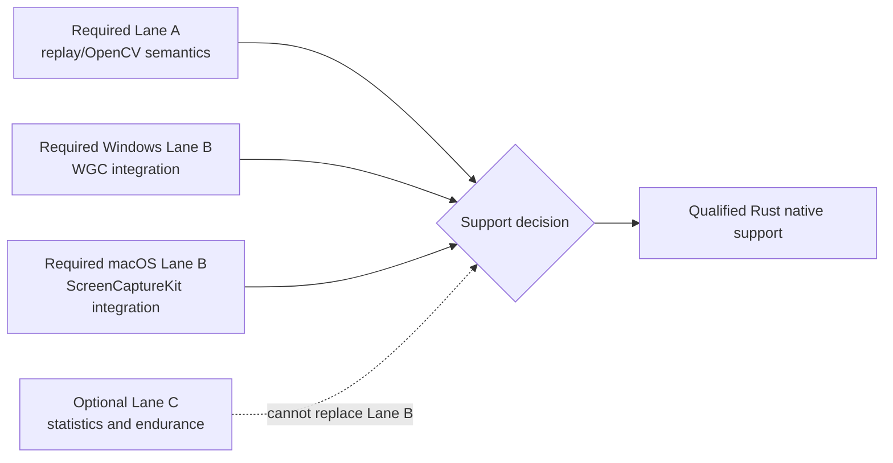
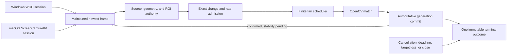

# Native template watching from Rust

MadoPilot can wait for stable template presence on maintained Windows Graphics Capture or ScreenCaptureKit sessions through the Rust facade. The caller starts one bounded query and receives one immutable terminal outcome; no caller frame-polling loop, target activation, input injection, host callback, or permission prompt is involved.

This page documents a Rust native boundary supported on the named release
targets. [ADR 0064](adr/0064-token-driven-native-template-watch-qualification-v2.md)
defines token-driven Qualification V2 without rewriting the historical two-host
evidence or the consumed builders retained by ADRs 0057 and 0060–0063. Source
`318ad1c` passed the required Apple Silicon Lane B contract, Windows execution
source `3e3079f` passed the required approved-host contract, and test-only
successor `53608af` pins the earlier-deadline clamp. Reviewed target-isolated
applicability joins those results at the current V2 boundary.

## Current boundary

| Surface | State |
|---|---|
| Rust `Session::start_template_watch` over replay/OpenCV | Supported and budget-qualified |
| Rust `Session::start_template_watch` over Windows WGC window/display sessions | Supported on the qualified Windows 11 25H2 floor; V2 execution source `3e3079f` passed all eight semantic and cleanup scenarios on the approved mixed-DPI host, including exact-token geometry progress and acknowledged `TargetLost` termination; test-only successor `53608af` pins the earlier caller deadline |
| Rust `Session::start_template_watch` over macOS ScreenCaptureKit window/display sessions | Supported on the qualified macOS floor; V2 source `318ad1c` passed all eight semantic and cleanup scenarios on the approved Apple M1 Pro, macOS 26.6.2, SDK 26.5 host, including captured 2× token scale and exact fixture finalization, and reviewed Windows-only runtime-diff applicability carries the result through `53608af` |
| Non-blocking `TemplateQuery::poll`, blocking `wait`, explicit `cancel`, and immutable terminal results | Supported for replay/OpenCV and the qualified native sessions |
| OCR predicates or wait-for-text | Not implemented |
| Watcher callbacks or subscriptions | Not implemented |
| C ABI or C++ watcher start/query APIs | Not implemented; ABI 1.5 remains unchanged |
| Automatic input, target activation, or watcher-triggered actions | Not implemented |
| Tokio/futures integration or real-time guarantees | Not implemented |
| Packaged libraries, crates.io publication, static artifacts, installers, tags, or a `v0.4.0` release | Not available |

The V2 native matrices use repository-owned token fixtures to prove exact producer progress, source/frame correlation, geometry generation, retained ownership, lifecycle outcomes, and bounded cleanup. The current Apple report is bound to commit `318ad1c49102d9fcd33448d12ee75d739bf04336`, tree `00fe097cb4b1ea4eaf58abc87f496584f50d3ae8`, runner SHA-256 `7a4720f3ca8b756b0f2757988921c901983a13ef6e67fd86926860e3d5e6ea87`, fixture SHA-256 `d7fe848cccaf2db829dafd538b36460d1c015d33d666ac4158e015d4e700e307`, codec SHA-256 `8b59a9cbc375e21ca39514a6c2f2ca16ebdaec47b82126d7c7d36c7809dc8f10`, and report SHA-256 `9518c00ec118b1e2f21027fd1c7bd811a3f176f79ef89752714ef27c65ce6289`. Earlier V1 Windows passes, Apple terminal failures, repairs, and consumed builders remain historical facts only; V2 neither relabels them nor claims a cause for the historical ScreenCaptureKit suspension. These fixtures are qualification apparatus, not a compatibility claim for arbitrary applications or caller content.

The accepted Windows report is bound to commit
`3e3079f2d71243d1b25d5bda79e3672c0cd3df07`, tree
`77f127c281e35b4475cb5e931ae10b969b6f1a64`, runner SHA-256
`bd827d1be2114145a1f7c436ef70adbe0a6047d4e1e1f5bfdfcbc66bcf92b714`,
fixture SHA-256
`5a50466c3fbf420df3d56ae466a6ae233254705f340098bca677a574ae9e8957`,
codec SHA-256
`8b59a9cbc375e21ca39514a6c2f2ca16ebdaec47b82126d7c7d36c7809dc8f10`,
and report SHA-256
`a4b6800217f1f96872d7f25f0614c1ff2a3a6f1942293267f990193557a92fbe`.
The complete product diff from the accepted Apple source through test-only
successor `53608af` contains runtime changes only for Windows; documentation
changes carry no execution authority.

## Qualification V2 protocol and migration

Qualification authority is split rather than inferred across jobs:



Lane A runs the deterministic scheduler/query contract. It owns deadlines,
stability, change/rate admission, coalescing, saturation, fairness, stale
generations, terminal outcomes, diagnostics, retained ownership, and complete
work accounting. Ordinary
`cargo bench --locked --package mado-pilot --bench template-watch-query` runs
the short required semantic plan. Target-specific statistical ceilings require
the explicit optional `--lane-c-evidence --enforce-budgets` path.

Lane B runs the same eight compact scenarios once on each approved host: target
and non-prompting permission admission, post-open synchronization, correlated
watcher match, fair two-session progress, geometry generation, retained native
frame and CPU-mapping ownership with fresh-session progress, exact
session/engine/target termination, and explicit cleanup baseline. Invoke the
release benchmark executable with `--native-contract`; do not combine it with
Lane C, workload, diagnostic, or budget flags. Its JSON schema is
`mado-pilot.native-template-watch-contract.v2`. Exit `0` means `PASS`, exit `1`
means product `FAIL`, exit `2` means `INFRA`, and exit `3` means `UNSUPPORTED`.
Only `PASS` on both approved hosts contributes native support authority.

Each fixture command commits a monotonically unique nonzero token and marker
state in one UI transaction, then acknowledges that state. The token uses a
10-by-9 grid outside the template ROI: asymmetric orientation sentinels, 32
token bits, their inverse, a marker-state bit, and a five-bit checksum. A frame
establishes progress only when its complete grid decodes the exact acknowledged
token under the expected target, stream, epoch, sequence, and geometry
authority. A stale or partially rendered grid is rejected while newer frames
remain eligible under the same absolute deadline. Session open alone does not
promise an initial pixel-bearing frame for an unchanged target.

Startup time begins after accepted session open and ends at exact absent-token
observation. Watch time begins at the visible-token acknowledgement and ends at
the correlated terminal result. Teardown begins at explicit close/finalize and
ends only after native and fixture resources reach baseline. Fixture launch is
outside every watcher interval. Semantic, cleanup, and apparatus outcomes remain
independent; setup that never obtains product execution authority is `INFRA` or
`UNSUPPORTED`, never product `FAIL`.

Lane B consumes explicit fixture finalization. Windows requires the controlled
process to be reaped and its bounded reader joined. macOS additionally requires
the authenticated exact launch to be observed `Live` before acceptance, Stop
acknowledgement, authenticated and retained launch lifetimes to become `Lost`,
bounded containment, reader/output drain, unchanged executable identity, and no
remaining exact-lifetime cleanup debt. Retained native frames and owned CPU
mappings must remain valid without pinning resources needed by a fresh session.

The former 24-workload native registry remains available only through
`--lane-c-evidence`. Its V2 report identity is separate from both compact Lane B
and every V1 PR #59–#64 record. Existing V1 parsers and bytes remain
revision-bound; consumers must select the schema rather than relabel an old
record. No hidden retry, replacement sample, target substitution, automatic
restart, sleep-based readiness, or deadline inflation is permitted in any lane.

## Prerequisites

Build from the repository with its pinned Rust toolchain and a compatible OpenCV 4 development/runtime installation. Native watcher use does not require the private `native-template-watch-qualification` feature; that feature exposes only repository benchmark instrumentation and fixtures.

The qualification platform floors remain:

- `x86_64-pc-windows-msvc`: Windows 11 25H2 build family 26200 on a currently serviced x64 desktop installation.
- `aarch64-apple-darwin`: Apple Silicon macOS 26.5.2 or newer under the current deployment contract.

On macOS, grant Screen Recording to the application hosting MadoPilot before starting capture. MadoPilot checks capture authorization without presenting UI or calling a permission-request API. Accessibility and event-post authorization are input concerns and are neither required nor used by a template watcher.

Windows exposes no capture permission prompt or permission-probe API. Unsupported capture, target loss, device failure, and integrity-sensitive input remain typed outcomes; the watcher never elevates privileges or falls back to input.

While a Windows frame acquisition is idle, the Adapter derives a 100 ms
liveness interval from the caller's clock and rechecks the raw native key. Raw
key disappearance therefore reaches `TargetLost` within approximately one
interval; an earlier caller deadline or cancellation still wins. A still-present
or immediately recycled HWND does not prove target identity and is not covered
by that bound; it still requires the authoritative WGC `Closed` event or the
caller's own deadline. A synthetic caller clock must advance for the derived
interval to expire.

The caller must also supply:

- an asset package accepted by the existing asset loader;
- a prepared template and explicit match options;
- a target selected from the same engine's current discovery result;
- a query-lifetime deadline and, when blocking, a separate wait deadline;
- stability, rate, region, and change-detection policies appropriate for the caller's content.

## Rust flow

`crates/mado-pilot/examples/native-template-watch.rs` demonstrates the complete public flow:

```text
cargo run --locked --package mado-pilot --example native-template-watch -- \
  <asset-package-directory> <template-name> <target-index>
```

The numeric index selects one entry from that invocation's discovery snapshot. The example deliberately does not print window titles or native identifiers. Production callers should present their own explicit target-selection UI or policy and retain the returned provider-qualified `TargetId`; they must not synthesize or reuse an identifier from another engine.



The request owns query authority. `TemplateQuery::wait` accepts another `OperationContext`; a wait timeout or cancellation ends only that wait and does not cancel or extend the query. `TemplateQuery::cancel` and dropping the sole query handle cancel the query idempotently.

A successful `TemplateTerminalOutcome::Matched` retains the exact satisfying frame, frame-time transform, effective region, match result, backend facts, and confirmed-observation count. The result remains readable after query, session, and engine teardown without pinning capture producer slots.

Other terminal outcomes are explicit: `Cancelled`, `DeadlineExceeded`, `SessionClosed`, `SchedulerClosed`, `TargetLost`, `Overloaded`, or `Failed`. Late capture or backend work cannot replace a terminal outcome or publish a stale success.

## Scheduling and performance

The production watcher uses fixed finite engine/session/query limits, two engine-wide analysis slots with at most one admitted generation per query, one latest pending frame per query, a bounded shared mapping cache, and a 30-second eligible-queue residence bound. Capture publication never waits for OpenCV matching. Superseded, coalesced, deferred, rejected, expired, completed, and failed work remains observable through query results or bounded diagnostics.

[ADR 0053](adr/0053-native-template-watch-budgets.md) fixes independent Windows and Apple Silicon regression ceilings. Replacement source `f16591f` corrected the engine-close and Windows cross-DPI semantics rejected by independent review. Its Windows cohort passed five fresh processes. Its Apple cohort passed processes 1–4, then process 5 terminated red at `retained_result_mapping` after ScreenCaptureKit suspended the newly opened stream. That revision-bound failure remains attributed only to the observed suspension; later results do not assign it a cleanup cause.

Current-source revision `030398e` produced a distinct `retained_result_mapping` terminal red: bounded fixture finalization failed and p95 and maximum latency exceeded their unchanged limits. ADR 0060 retains that result without assigning a cause. Cleanup localization and exact-sample correlation bound to `030398e` then selected ADR 0062's exact retained-lifetime and typed-finalization repair without changing deadlines, delayed-reaper bounds, or accepted limits.

Qualification V2 replaces the monolithic required campaign with the compact
token-driven contract. Source `318ad1c` passed the Apple Lane B integration and
cleanup boundary, and Windows execution source `3e3079f` passed the compact
contract, the deterministic liveness precedence suite and mutation proof, and
the hosted post-acknowledgement latency check. Test-only successor `53608af`
pins the earlier caller deadline and passes all six focused tests and required
CI. Reviewed target-isolated applicability carries the Apple result through that
successor, so the named cross-target Rust native boundary is supported. The
historical target-specific
numbers remain repository-fixture regression evidence, not service-level
objectives or Lane B pass criteria. New statistical enforcement belongs only to
optional Lane C and cannot relabel a compact semantic result. No cross-target
limit, automatic retry, dynamic capacity tuning, or real-time guarantee is
implied.

## Diagnostics and privacy

Diagnostics are disabled by default. `Normal` mode retains terminal state, final work counters, and exact loss accounting; `Debug` additionally retains bounded nonterminal dispositions and intermediate counters. Neither mode retains captured pixels or hashes, template bytes or caller template identifiers, window titles, raw native identifiers, local paths, credentials, OCR/input text, native payloads, process inventories, or unrelated desktop metadata.

The private qualification harness applies another report boundary before
retaining evidence. V2 Lane B emits one typed JSON object no larger than 64 KiB;
unknown fields are rejected recursively, so pixels, hashes, titles, paths,
credentials, unrelated process data, and free-form native payloads cannot be
admitted. Its bounded scale, frame ordinal, status, timing, count, and resource
facts contain no target name or native identifier. The separate Lane C profile
validator retains ADR 0061's distinction between fixed privacy/schema admission
and typed environment incompatibility. Windows 11 Pro 25H2 build family 26200
remains required, while a canonical unsigned 32-bit UBR and bounded hardware
representation are diagnostic provenance rather than exact-update admission
keys.

On Apple, ADR 0062 keeps fixture finalization facts separate: Stop
acknowledgement, authenticated and retained launched lifetime, bounded
containment, output drain, executable identity, and cleanup debt. Failure output
uses fixed state vocabulary, booleans, and bounded counts rather than paths,
titles, native identifiers, free-form framework text, or captured content.
Neither the private V1 repairs nor V2 qualification changes the public watcher
interface. Cross-target support is limited to the named release targets and
platform floors recorded above.

Application logs remain the caller's responsibility. Avoid formatting full native errors or discovered target names into ordinary telemetry when those values may contain sensitive application or desktop data.

## Troubleshooting

- macOS refuses discovery or open: grant Screen Recording to the hosting application in system settings, then restart that application if macOS requires it. MadoPilot will not open the settings pane or request permission.
- Discovery returns no usable target: repeat discovery after the target exists and select from the new snapshot. Do not reuse an identifier from another engine or an earlier target lifetime.
- `DeadlineExceeded`: inspect the query outcome, not only the return from `wait`. A wait deadline affects the caller wait; the query deadline is fixed in `TemplateWatchRequest`.
- `Overloaded(QueueExpired)`: eligible work could not enter the fixed scheduler within 30 seconds. Repair the source rate, query deadline, rate/stability policy, or backend performance; there is no public capacity knob or hidden retry.
- `TargetLost`, `SessionClosed`, or `SchedulerClosed`: create a new discovery/session/query chain only after the owning target or engine state is valid again. A terminal query cannot be revived.
- `Failed`: inspect the structured error at the application boundary while keeping sensitive native payloads out of retained diagnostics. MadoPilot does not switch backends or inject input as fallback.
- A template works in the repository fixture but not in another application: treat that as an unqualified compatibility case. Validate the application's pixels, scale, region, occlusion, animation, and timing under its real topology before relying on it.

## Explicit limitations

Native Rust WGC/ScreenCaptureKit watcher support is qualified on the named release targets. Qualification does not promote OCR predicates, callbacks/subscriptions, C ABI/C++, automatic input, target activation, arbitrary application/template/ROI compatibility or timing, real-time behavior, packaging, crates.io/static artifacts, a release tag, or `v0.4.0`. Existing C and C++ compilation, ownership, diagnostics, and frozen-prefix checks remain regression proof only; they are not watcher API checks.
