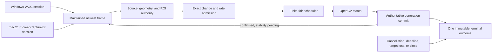

# Native template watching from Rust

MadoPilot can wait for stable template presence on maintained Windows Graphics Capture or ScreenCaptureKit sessions through the Rust facade. The caller starts one bounded query and receives one immutable terminal outcome; no caller frame-polling loop, target activation, input injection, callback, or permission prompt is involved.

This support statement is narrow. It covers the production Rust session boundary qualified by [ADR 0057](adr/0057-native-template-watch-rust-support.md) on the approved Windows and Apple Silicon hosts. It does not certify every application, template, region, display layout, or timing requirement.

## Supported boundary

| Surface | State |
|---|---|
| Rust `Session::start_template_watch` over replay/OpenCV | Supported and budget-qualified |
| Rust `Session::start_template_watch` over Windows WGC window/display sessions | Supported on the qualified Windows floor |
| Rust `Session::start_template_watch` over macOS ScreenCaptureKit window/display sessions | Supported on the qualified Apple Silicon floor |
| Non-blocking `TemplateQuery::poll`, blocking `wait`, explicit `cancel`, and immutable terminal results | Supported |
| OCR predicates or wait-for-text | Not implemented |
| Watcher callbacks or subscriptions | Not implemented |
| C ABI or C++ watcher start/query APIs | Not implemented; ABI 1.5 remains unchanged |
| Automatic input, target activation, or watcher-triggered actions | Not implemented |
| Tokio/futures integration or real-time guarantees | Not implemented |
| Packaged libraries, crates.io publication, static artifacts, installers, tags, or a `v0.4.0` release | Not available |

The accepted native matrices use repository-owned fixtures and a fixed marker to prove source identity, state transitions, geometry resets, deadlines, cancellation, target loss, ownership, cleanup, and finite resource behavior. Those fixtures are qualification apparatus, not a compatibility claim for arbitrary applications or caller content.

## Prerequisites

Build from the repository with its pinned Rust toolchain and a compatible OpenCV 4 development/runtime installation. Native watcher use does not require the private `native-template-watch-qualification` feature; that feature exposes only repository benchmark instrumentation and fixtures.

The supported platform floors remain:

- `x86_64-pc-windows-msvc`: Windows 11 25H2 build family 26200 on a currently serviced x64 desktop installation.
- `aarch64-apple-darwin`: Apple Silicon macOS 26.5.2 or newer under the current deployment contract.

On macOS, grant Screen Recording to the application hosting MadoPilot before starting capture. MadoPilot checks capture authorization without presenting UI or calling a permission-request API. Accessibility and event-post authorization are input concerns and are neither required nor used by a template watcher.

Windows exposes no capture permission prompt or permission-probe API. Unsupported capture, target loss, device failure, and integrity-sensitive input remain typed outcomes; the watcher never elevates privileges or falls back to input.

The caller must also supply:

- an asset package accepted by the existing asset loader;
- a prepared template and explicit match options;
- a target selected from the same engine's current discovery result;
- a query-lifetime deadline and, when blocking, a separate wait deadline;
- stability, rate, region, and change-detection policies appropriate for the caller's content.

## Rust flow

`crates/mado-pilot/examples/native-template-watch.rs` demonstrates the complete public flow:

```text
cargo run --locked --package mado-pilot --example native-template-watch -- \
  <asset-package-directory> <template-name> <target-index>
```

The numeric index selects one entry from that invocation's discovery snapshot. The example deliberately does not print window titles or native identifiers. Production callers should present their own explicit target-selection UI or policy and retain the returned provider-qualified `TargetId`; they must not synthesize or reuse an identifier from another engine.



The request owns query authority. `TemplateQuery::wait` accepts another `OperationContext`; a wait timeout or cancellation ends only that wait and does not cancel or extend the query. `TemplateQuery::cancel` and dropping the sole query handle cancel the query idempotently.

A successful `TemplateTerminalOutcome::Matched` retains the exact satisfying frame, frame-time transform, effective region, match result, backend facts, and confirmed-observation count. The result remains readable after query, session, and engine teardown without pinning capture producer slots.

Other terminal outcomes are explicit: `Cancelled`, `DeadlineExceeded`, `SessionClosed`, `SchedulerClosed`, `TargetLost`, `Overloaded`, or `Failed`. Late capture or backend work cannot replace a terminal outcome or publish a stale success.

## Scheduling and performance

The production watcher uses fixed finite engine/session/query limits, two engine-wide analysis slots, one latest pending frame per query, a bounded shared mapping cache, and a 30-second eligible-queue residence bound. Capture publication never waits for OpenCV matching. Superseded, coalesced, deferred, rejected, expired, completed, and failed work remains observable through query results or bounded diagnostics.

[ADR 0053](adr/0053-native-template-watch-budgets.md) fixes independent Windows and Apple Silicon regression ceilings. Five fresh final processes per host enforced the identical 24-workload semantic matrix: 16 rows with three warmups and 20 measured samples, plus eight single-run gates. Correctness, source authority, lifecycle, ownership, cleanup, and privacy fail qualification regardless of latency.

These numbers are repository-fixture regression budgets, not service-level objectives. Numeric timing remains deliberately unavailable for the eight one-run gates and for cadence-dependent aggregate mapping, work, or publication rates. No cross-target limit, automatic retry, dynamic capacity tuning, or real-time guarantee is implied.

## Diagnostics and privacy

Diagnostics are disabled by default. `Normal` mode retains terminal state, final work counters, and exact loss accounting; `Debug` additionally retains bounded nonterminal dispositions and intermediate counters. Neither mode retains captured pixels or hashes, template bytes or caller template identifiers, window titles, raw native identifiers, local paths, credentials, OCR/input text, native payloads, process inventories, or unrelated desktop metadata.

Application logs remain the caller's responsibility. Avoid formatting full native errors or discovered target names into ordinary telemetry when those values may contain sensitive application or desktop data.

## Troubleshooting

- macOS refuses discovery or open: grant Screen Recording to the hosting application in system settings, then restart that application if macOS requires it. MadoPilot will not open the settings pane or request permission.
- Discovery returns no usable target: repeat discovery after the target exists and select from the new snapshot. Do not reuse an identifier from another engine or an earlier target lifetime.
- `DeadlineExceeded`: inspect the query outcome, not only the return from `wait`. A wait deadline affects the caller wait; the query deadline is fixed in `TemplateWatchRequest`.
- `Overloaded(QueueExpired)`: eligible work could not enter the fixed scheduler within 30 seconds. Repair the source rate, query deadline, rate/stability policy, or backend performance; there is no public capacity knob or hidden retry.
- `TargetLost`, `SessionClosed`, or `SchedulerClosed`: create a new discovery/session/query chain only after the owning target or engine state is valid again. A terminal query cannot be revived.
- `Failed`: inspect the structured error at the application boundary while keeping sensitive native payloads out of retained diagnostics. MadoPilot does not switch backends or inject input as fallback.
- A template works in the repository fixture but not in another application: treat that as an unqualified compatibility case. Validate the application's pixels, scale, region, occlusion, animation, and timing under its real topology before relying on it.

## Explicit limitations

Native qualification does not promote OCR predicates, callbacks/subscriptions, C ABI/C++, automatic input, target activation, arbitrary application/template/ROI compatibility or timing, real-time behavior, packaging, crates.io/static artifacts, a release tag, or `v0.4.0`. Existing C and C++ compilation, ownership, diagnostics, and frozen-prefix checks remain regression proof only; they are not watcher API checks.
