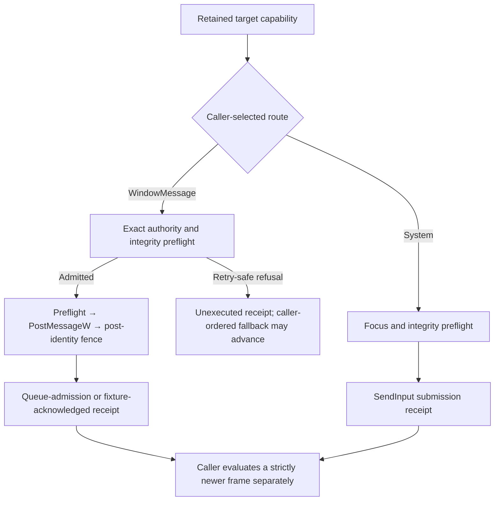

# Windows Input Adapter and Verification

The Windows platform package implements input at the Adapter boundary.
`mado_pilot::windows_engine` wires it into the public Rust facade, and C ABI 1.2
plus the header-only C++ wrapper expose the same negotiated workflow. `System`
and `WindowMessage` remain separate caller-selected routes. Ordinary retained
top-level windows expose `WindowMessage` as unknown-but-attemptable with
target-queue evidence; only the dedicated acknowledged fixture raises that
evidence to target-protocol acknowledgement. Neither receipt proves application
consumption or visual effect.

## Capability boundary

Capabilities are operation-and-route pairs. Address scope, compatibility, and
submission evidence are independent fields; a target never acquires an
exact-window capability merely because it accepts the same operation through
system input.

| Discovered target | `System` | `WindowMessage` |
|---|---|---|
| Retained ordinary top-level window | Pointer, keyboard, text; supported; focus required | Pointer, keyboard, text; `Unknown`; exact-window, focus-preserving, target-queue-admission evidence |
| Exact class `MadoPilotInputFixture` | Pointer, keyboard, text; supported; focus required | Pointer, keyboard, text; `Supported`; exact-window, focus-preserving, target-protocol acknowledgement |
| Display | Pointer only; no focusable target is implied | Unsupported |
| Child, lost, replaced, or unrevalidatable window | Not admitted as a retained top-level target | Unsupported or refused before posting |

The caller explicitly selects or orders routes. There is no default
`WindowMessage` choice and no implicit fallback to `System`:



[ADR 0022](adr/0022-windows-ordinary-background-input-qualification.md)
remains the evidence for the stronger claim it tested. Its ordinary/game-like
consumers observed legacy messages, while Raw Input and asynchronous
state-polling consumers did not; queue admission and a generic procedure return
could not establish application consumption. [ADR 0027](adr/0027-windows-window-message-queue-submission.md)
therefore supersedes only ADR 0022's system-only consequence. The current
contract reports ordinary compatibility as `Unknown`, caps evidence at
`TargetQueueAdmission`, and requires a separate newer-frame observation when a
caller needs effect evidence. It makes no Raw Input, DirectInput, XInput,
asynchronous-state, raw-HID, helper, hook, anti-cheat, or arbitrary-game claim.

### Exact target authority

Immediately before and after every normal or cleanup `PostMessageW`, the Adapter
checks the retained `HWND`, owner process creation identity, owning thread, root
relationship, class, provider identity, capture-item liveness, operation bound,
integrity, and required geometry. Mutable title and geometry never grant target
authority. A failed preflight posts nothing. An accepted post followed by changed
or unavailable authority is a possible native effect and stops the sequence.

This fence is intentionally not described as atomic. Win32 has no
generation-bearing compare-and-post API, and a foreign window can be destroyed
and its same-value handle recycled between validation and `PostMessageW`.
Bounded reuse stress can detect a recurrence in that run but cannot prove the
race absent.

### Ordinary message profile

Ordinary delivery uses asynchronous `PostMessageW` only:

| Logical event | Native profile | Native units and bounds |
|---|---|---|
| Pointer move | `WM_MOUSEMOVE`; signed client coordinates and current `MK_*` state | One unit |
| Primary/secondary/middle button down/up | Unconditional positioning `WM_MOUSEMOVE`, then matching `WM_*BUTTONDOWN/UP` | Exactly two units; requires a previously established pointer position |
| Vertical/horizontal scroll | `WM_MOUSEWHEEL`, then `WM_MOUSEHWHEEL`; signed screen coordinates, checked `WHEEL_DELTA` multiples and `MK_*` state | Zero to two units in that order; requires a previously established pointer position |
| Key down/up | `WM_KEYDOWN/WM_KEYUP`; target-layout virtual key and scan code, extended, previous-state, and transition bits | One unit |
| Text | Ordered direct `WM_CHAR` UTF-16; no `TranslateMessage` dependency | `1..=8192` units for at most 4,096 public scalars |
| Delay | Bounded wait with operation checks | Zero units |

The public input vocabulary contains only primary, secondary, and middle
buttons, so there is no X-button translation. Every packed client or screen
coordinate must fit signed `i16`; the Adapter refuses an unrepresentable event
instead of truncating, wrapping, or clamping it. A combined scroll posts vertical
before horizontal, and failure after the first component is partial.

All five shared pointer spaces are advertised because Windows capture publishes
an authoritative target placement. `ReprojectCurrent` reads current extent,
placement, and scale. `RequireUnchanged` compares the retained source transform
with current authority. `UseFrameSnapshot` requires that exact stream, epoch, and
geometry revision to remain retained; the Adapter does not reconstruct an
evicted revision from current DPI.

The route never synthesizes `WM_INPUT`, mutates global asynchronous key state,
activates the target, moves the physical cursor, calls `SendInput`,
`SendMessageTimeoutW`, or `BlockInput`, attaches queues, changes message filters,
broadcasts, installs hooks, injects a helper, or elevates.

## Focus, integrity, receipts, and cleanup

Window `System` input revalidates focus before every irreversible event.
`Preserve` cannot satisfy a focus-requiring system path. `RequireFocused` never
activates a window. `ActivateIfRequired` makes one ordinary
[`SetForegroundWindow`](https://learn.microsoft.com/en-us/windows/win32/api/winuser/nf-winuser-setforegroundwindow)
attempt and then re-reads the foreground window; Windows may refuse it under its
foreground-lock rules. `WindowMessage` instead invokes neither focus activation
nor physical-cursor mutation APIs. External input or the target's own message
handling can still change global state, so a receipt does not certify immutable
foreground/cursor values; controlled native rows assert unchanged observations
as a separate fixture oracle.

Before either route submits input, the Adapter compares the caller and selected
window process integrity levels. A proven higher target reports
`PolicyRefused`. When
[`SendInput`](https://learn.microsoft.com/en-us/windows/win32/api/winuser/nf-winuser-sendinput)
returns zero and integrity inspection does not prove UIPI, the system route
reports `DeliveryFailed`; it does not infer UIPI from last error. For
`PostMessageW`, access denial maps to `PolicyRefused`, an invalid window to
`TargetLost`, and queue quota or another posting failure to
`SubmissionFailed`.

`submitted` counts complete logical events admitted to the selected native
route. System `SendInput` yields `SystemInputAdmission`; ordinary
`WindowMessage` yields `TargetQueueAdmission`; the dedicated fixture yields
`TargetProtocolAcknowledgement`. These remain submission facts. A complete
ordinary receipt may coexist with no consumer or visual change.

Once a route enters event submission, fallback closes even if the first
`PostMessageW` accepts no unit. A partial native representation, any accepted
unit followed by failure, or an indeterminate post-identity fence is `Partial`
with possible effect; it is never retry-safe `Unexecuted`. Only a separately
reported preflight refusal may let an explicitly ordered fallback advance.

Pressed buttons and keys belong only to the sequence that successfully posted
their complete press representation. On a stop, cleanup releases them newest
first through the same route and retained authority. It admits no more than 256
release events and starts no new release after 250 milliseconds. Cleanup cannot
switch to `System`, revive a lost target, or turn queue admission into proof of
application state.

## Repository-owned fixtures

`mado-pilot-windows-window-message-fixture` creates ordinary top-level windows
through the production discovery class path. Its default title is
`MadoPilot Ordinary WindowMessage Fixture [<token>]`. Controlled modes model
ordinary and game-like legacy consumers, Raw Input, asynchronous state polling,
duplicate descriptive metadata, sibling/child/reparent/replacement/restarted
ownership, queue pressure, target loss, and bounded repaint. Its painted
condition is an observation oracle, not acknowledgement hidden in the receipt.

`mado-pilot-windows-input-fixture` creates the one acknowledged top-level window:

- class `MadoPilotInputFixture`;
- exact title `MadoPilot Input Fixture [<pid>]`;
- a versioned and size-bounded `WM_COPYDATA` vocabulary;
- synchronous acknowledgement for each accepted event; and
- at most 1,024 retained summaries containing only event kind and UTF-16 unit
  count.

The acknowledged fixture validates packet length, scalar fields, key and button
codes, and UTF-16. It neither retains nor prints input text. Both fixture kinds
are selected by exact title and retained target identity; zero or multiple
matches stop before input. Only the exact acknowledged class reports
`TargetProtocolAcknowledgement`.

## Automated Windows checks

Run the focused checks from the repository root:

```sh
cargo check --locked -p mado-pilot-platform-windows --all-targets
cargo test --locked -p mado-pilot-input
cargo test --locked -p mado-pilot-platform-windows --lib
cargo test --locked -p mado-pilot-platform-windows --test native_input
cargo test --locked -p mado-pilot-platform-windows --test window_message_native -- --nocapture --test-threads=1
```

The ordinary native matrix runs the public production route against
repository-owned legacy and negative-consumer modes while an unrelated owned
window remains foreground. It fails on foreground, physical-cursor,
sibling/child/replacement, or wrong-process effects and records queue,
consumer/visual, lifecycle, topology, and cleanup observations separately. The
acknowledged native test remains a distinct protocol check. Deterministic suites
cover capability admission, exact authority, all message translations, immediate
post errors, partial native effects, fallback closure, cleanup, target loss,
cancellation/deadline races, diagnostics, and close.

## Explicit system-input check

The system path is ignored by the default suite because successful keyboard input
requires a real foreground window. Run it only on an interactive Windows desktop:

```sh
cargo test --locked -p mado-pilot-platform-windows --test native_input interactive_system_delivery_targets_only_the_exact_fixture -- --ignored --exact --nocapture --test-threads=1
```

The test opens the PID-qualified fixture and waits 15 seconds. Click that exact
fixture window when prompted. Only after it is foreground does the test use
`RequireFocused` to move the pointer to the fixture center, send Enter down/up, and
send the fixed text `system-probe`. It sends no click. A guard restores the previous
cursor position and foreground window on exit when Windows permits restoration.

If the fixture is not focused or target selection is ambiguous, the test stops
before system input. If focus changes after that authorization, integrity blocks
submission, or a native record count is short, execution fails with typed
submission evidence. Do not replace either failure with `AttachThreadInput`,
elevation, or input intended to defeat foreground policy.

## Explicit facade check

The Adapter tests above do not replace the public Rust composition path.
`crates/mado-pilot/examples/windows-native-input.rs` builds the Windows engine
with bounded diagnostics, selects one exact ordinary window, captures and maps a
source frame, requires the unknown-but-attemptable `WindowMessage` route, submits
one frame-bound sequence with focus preservation, inspects queue-admission
evidence, evaluates an expected condition only on a strictly newer frame, drains
diagnostics, and closes.

Start the ordinary target fixture, then pass its exact full title. The example
launches, activates, and monitors a second repository-owned fixture as the
unrelated foreground application:

```sh
cargo run --locked --package mado-pilot-platform-windows --bin mado-pilot-windows-window-message-fixture -- --title-token=example
cargo run --locked --package mado-pilot --example windows-native-input -- "MadoPilot Ordinary WindowMessage Fixture [example]"
```

The explicit foreground-fixture setup can use one balanced temporary input-queue
attachment before readiness when an unattended host's foreground lock rejects a
direct request. That setup ends before discovery or delivery and never activates
the input target. The input request never selects `System`, activation, elevation,
a helper, or a privileged identity. It refuses zero or multiple title matches.
Its receipt and newer-frame result are printed as independent facts; neither
titles, pixels, nor typed payloads enter diagnostics.

## Explicit C and C++ boundary checks

The ABI check compiles and runs both native common-flow examples in `--check`
mode by default. That mode creates the real Windows engine, verifies ABI 1.2
route-capability and diagnostic surfaces, confirms that no permission-probe
capability is advertised, and stops before discovery or input:

```bat
cargo run --locked --package mado-pilot-capi --example c-abi-check -- --label "<host>"
```

The unattended Windows matrix owns both fixture lifecycles. Build them first,
then let `c-abi-check` pass the ordinary and acknowledged exact titles to each C
and C++ flow:

```bat
cargo build --locked --package mado-pilot-platform-windows --bin mado-pilot-windows-input-fixture --bin mado-pilot-windows-window-message-fixture
cargo build --locked --package mado-pilot-capi
cargo run --locked --package mado-pilot-capi --example c-abi-check -- --label "<host>" --windows-native-fixture
```

The C flow independently performs engine construction, discovery, capture,
mapping, a bounded four-event request, immutable receipt/attempt inspection, a
strictly newer expected-condition search, diagnostic drain, and explicit close
for both contracts. The Windows C++ flow performs the same lifecycle with a
16-event request covering pointer movement, every button, both wheel axes, a
function key, an ordered modifier chord, Unicode text, and an observed delay;
the harness also checks the complete redacted fixture-event order. The ordinary
flow requires `Unknown` capability and `TargetQueueAdmission`; the dedicated
flow requires `Supported` and `TargetProtocolAcknowledgement`. Both preserve
focus and permit no system fallback. Frozen ABI 1.0 layout and negotiation, ABI
1.2 wrapper ownership, and the independent CMake consumer run in the same check.

When the caller owns a fixture lifecycle, pass `--ordinary "<full title>"` or
`--acknowledged "<full title>"` directly to `windows-native-input.exe` or
`windows-native-input-cpp.exe`. Output excludes the title, captured bytes, and
typed text.

## Native evidence and limitations

The revision-bound Windows 11 Pro 26200 run covers ordinary pointer, button,
wheel, key, text, delay, drag, and chord rows; duplicate metadata;
reparent/replacement/destroy/restarted ownership; negative Raw Input and
state-polling consumers; cancellation, deadline, cleanup, queue-full and partial
outcomes; a hung target; same-DPI signed-origin topology; unrelated foreground
activity; and facade visual/no-visual observations.

The same host did not execute the mandatory single-display, mixed-DPI, or
higher-integrity/UIPI rows. A bounded 4,096-attempt handle-reuse stress run
observed no same-value recurrence, which is not proof of generation-atomic
safety. These are explicit limitations, not inferred passes. Unknown
compatibility also remains exactly that: evidence for one legacy consumer does
not establish support for an arbitrary game or another input family.

## Redaction review

Production input and diagnostic code emits no event payload, key, text, window
title, desktop content, captured bytes, native identifier, free-form native
message, platform namespace, path, signing identity, or backend name. It records
bounded public identities, route/scope/support, operation kinds and counts,
queue or protocol evidence, typed outcomes/faults, cleanup counts, and loss
counts.

The native verifier may retain only repository-fixture roles, bounded counts and
statuses, host/topology facts, commands, source/executable hashes, and hashes of
bounded raw output. It must not retain typed text, captured pixels, unrelated
window titles, or unrelated desktop payload. Fixture protocol observations,
queue admission, and visual search results remain separate columns so no report
can silently promote one into another.
